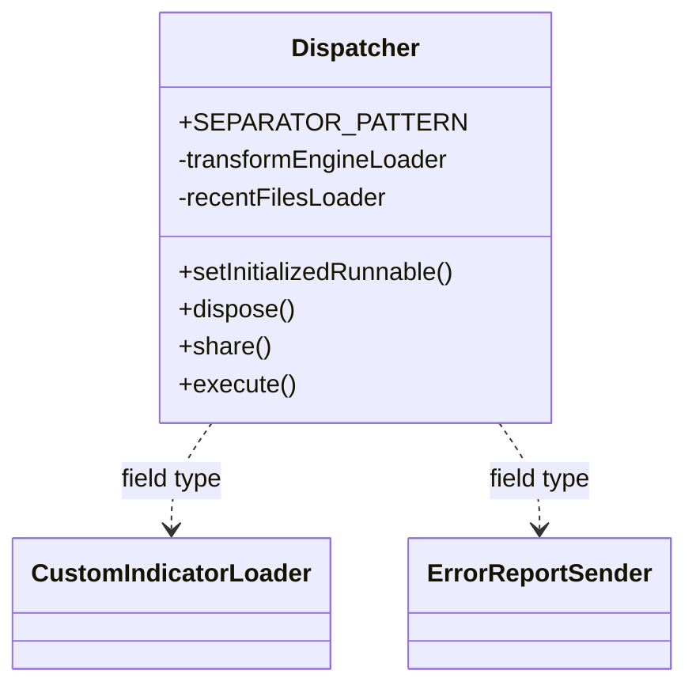
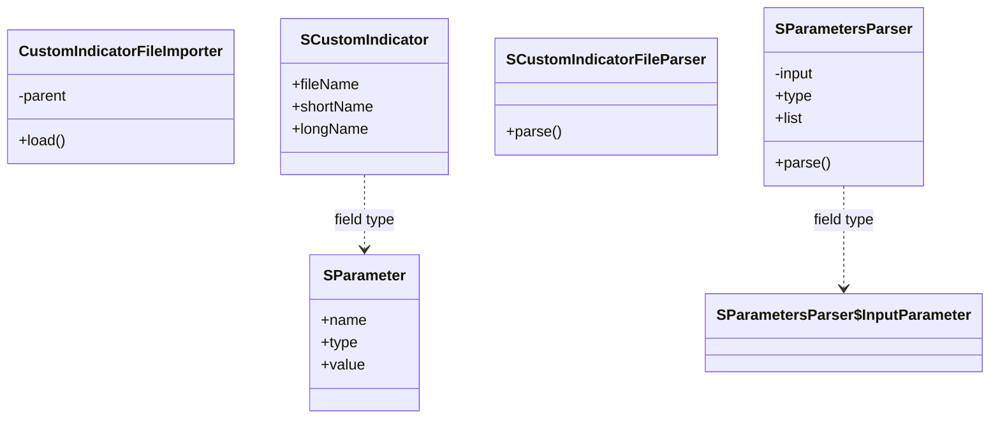
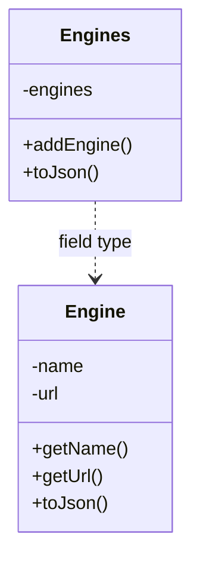
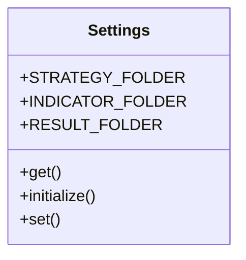
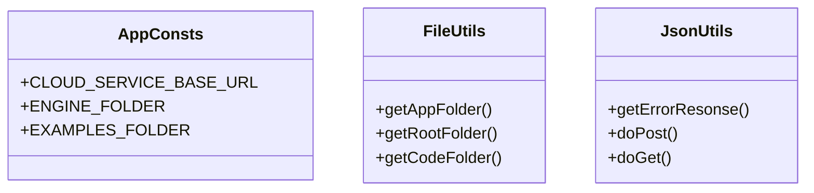

# SQWizardBusiness.jar

[Workspace/group index](README.md)  |  [All workspaces](../README.md)

## Scope and provenance

- Artifact: `SQX_REFERENCE_ROOT/internal/libs/SQWizardBusiness.jar`.
- SHA-256: `3f908f6dc5c057d204e7688d093f89f9c0cf6bc5f55891e044993cb7098d71ee`.
- Inspected: 2026-10-05; generation timestamp `2026-10-05T19:04:16.344170+00:00`.
- Archive class entries: **24**; non-nested: **22**; nested/anonymous: **2**.
- Inspection: ZIP entry/manifest enumeration and `javap -p` declarations for every listed class.
- Repository source HEAD: `8a92c705183a6702eaf62037ccb202ed028aa899`; review state: generated, pending owner review.
- Installed SQX build number is unverified. No method bodies are reproduced.
- Confidence: high for declared structure; workspace ownership inferred except where registration evidence is separately stated. Runtime reachability, call order, formulas and parity remain unverified.

Shared component: a single canonical document is linked from relevant workspace indexes. Its presence here does not establish which workspaces load it at runtime.

Target mapping: no verified owning HaruQuantAI feature/requirement/decision IDs are assigned by this document. Register or resolve ownership through the normal repository plan before implementation.

## Diagram reading guide

`Parent <|-- Child` means declared inheritance; `Interface <|.. Class` means declared implementation. Interface extension uses the inheritance arrow. `A ..> B : field type` is a declared type dependency, not composition, object ownership or a runtime call. External nodes are referenced types, not fabricated local implementations. Selected fields/method names aid navigation: `+` is public, `#` protected and `-` private. Diagram method names omit parameter/return types and collapse overloads; use the exact inspected declarations below before implementing an API.

Detailed graphs include non-nested classes in package-sized groups of at most 12. Nested/anonymous classes are inventoried and their declarations/relationships are retained below, but omitted from overview graphs. Relationships not drawn for readability remain in the complete declaration-relationship table. Constructors, synthetic bridges and overloads may be collapsed in diagram member lists only. Standard `java.lang.Object` inheritance is omitted from diagrams.

## UML class diagrams

### 1. `com.strategyquant.wizard.desktop`



| Diagram identifier | Exact type | Location |
| --- | --- | --- |
| `C0406e5294c16` | `com.strategyquant.wizard.desktop.Dispatcher` (this JAR) | this diagram |
| `Ca30029e9b2bb` | `com.strategyquant.wizard.desktop.loader.CustomIndicatorLoader` (this JAR) | another group in this JAR |
| `Cba965d7b0d54` | `com.strategyquant.wizard.desktop.loader.ErrorReportSender` (this JAR) | another group in this JAR |

### 2. `com.strategyquant.wizard.desktop.indicators`



| Diagram identifier | Exact type | Location |
| --- | --- | --- |
| `Cd08ec24e518b` | `com.strategyquant.wizard.desktop.indicators.CustomIndicatorFileImporter` (this JAR) | this diagram |
| `C72b13ed401c4` | `com.strategyquant.wizard.desktop.indicators.SCustomIndicator` (this JAR) | this diagram |
| `Ce0896af02a3f` | `com.strategyquant.wizard.desktop.indicators.SCustomIndicatorFileParser` (this JAR) | this diagram |
| `C016e3554262f` | `com.strategyquant.wizard.desktop.indicators.SParameter` (this JAR) | this diagram |
| `Ca72bca52d4e6` | `com.strategyquant.wizard.desktop.indicators.SParametersParser` (this JAR) | this diagram |
| `C2a49be1308d0` | `com.strategyquant.wizard.desktop.indicators.SParametersParser$InputParameter` (this JAR) | another group in this JAR |

### 3. `com.strategyquant.wizard.desktop.loader`

```mermaid
classDiagram
    class Ca30029e9b2bb["CustomIndicatorLoader"] {
        -parent
        +loadFile()
        +dispose()
    }
    class Cba965d7b0d54["ErrorReportSender"] {
        -parent
        +send()
        +dispose()
    }
    class C0d343e740622["Example"] {
        -name
        -desc
        -file
        +getName()
        +setName()
        +getDesc()
        +setDesc()
    }
    class Cf6afdc10980c["FavoriteItemsLoader"] {
        +getFavoriteItems()
    }
    class C1d81a68b1316["LicenceLoader"] {
        +loadLicense()
    }
    class C864dc8046249["RecentFilesLoader"] {
        -RECENT_FILE_NAME
        -DEFAULT_RECENT
        -netFailed
        +loadRecentFiles()
        +saveRecentFiles()
    }
    class C8ef086580d69["ShareLoader"] {
        +share()
        +verifyShare()
        +notifyShare()
        +loadShared()
        +saveShared()
    }
    class C5727d9810bc9["StrategyLoader"] {
        -STRATEGY_IN_ZIP
        -parent
        +loadFileWithName()
        +loadFile()
        +saveFile()
        +loadCloudFileList()
        +loadCloudFile()
    }
    class C0ba6b82c8bf9["Template"] {
        -id
        -name
        -descriptions
        +getName()
        +setName()
        +getDescriptions()
        +setDescriptions()
    }
    class C203684e9638b["TransformEngineLoader"] {
        -parent
        +load()
        +transformCode()
        +performTransformCode()
        +save()
        +dispose()
    }
```



| Diagram identifier | Exact type | Location |
| --- | --- | --- |
| `Ca30029e9b2bb` | `com.strategyquant.wizard.desktop.loader.CustomIndicatorLoader` (this JAR) | this diagram |
| `Cba965d7b0d54` | `com.strategyquant.wizard.desktop.loader.ErrorReportSender` (this JAR) | this diagram |
| `C0d343e740622` | `com.strategyquant.wizard.desktop.loader.Example` (this JAR) | this diagram |
| `Cf6afdc10980c` | `com.strategyquant.wizard.desktop.loader.FavoriteItemsLoader` (this JAR) | this diagram |
| `C1d81a68b1316` | `com.strategyquant.wizard.desktop.loader.LicenceLoader` (this JAR) | this diagram |
| `C864dc8046249` | `com.strategyquant.wizard.desktop.loader.RecentFilesLoader` (this JAR) | this diagram |
| `C8ef086580d69` | `com.strategyquant.wizard.desktop.loader.ShareLoader` (this JAR) | this diagram |
| `C5727d9810bc9` | `com.strategyquant.wizard.desktop.loader.StrategyLoader` (this JAR) | this diagram |
| `C0ba6b82c8bf9` | `com.strategyquant.wizard.desktop.loader.Template` (this JAR) | this diagram |
| `C203684e9638b` | `com.strategyquant.wizard.desktop.loader.TransformEngineLoader` (this JAR) | this diagram |

### 4. `com.strategyquant.wizard.desktop.loader.engines`



| Diagram identifier | Exact type | Location |
| --- | --- | --- |
| `C666ed95b7d9a` | `com.strategyquant.wizard.desktop.loader.engines.Engine` (this JAR) | this diagram |
| `Cfd6fa28e35c9` | `com.strategyquant.wizard.desktop.loader.engines.Engines` (this JAR) | this diagram |

### 5. `com.strategyquant.wizard.desktop.settings`



| Diagram identifier | Exact type | Location |
| --- | --- | --- |
| `Cbb05d9e90d18` | `com.strategyquant.wizard.desktop.settings.Settings` (this JAR) | this diagram |

### 6. `com.strategyquant.wizard.desktop.utils`



| Diagram identifier | Exact type | Location |
| --- | --- | --- |
| `Cea90dfddc0e3` | `com.strategyquant.wizard.desktop.utils.AppConsts` (this JAR) | this diagram |
| `Cc388ac3422af` | `com.strategyquant.wizard.desktop.utils.FileUtils` (this JAR) | this diagram |
| `C85098c9b5ed5` | `com.strategyquant.wizard.desktop.utils.JsonUtils` (this JAR) | this diagram |

## Complete class inventory

| Fully qualified class | Kind | Entry |
| --- | --- | --- |
| `com.strategyquant.wizard.desktop.Dispatcher` | class | non-nested |
| `com.strategyquant.wizard.desktop.indicators.CustomIndicatorFileImporter` | class | non-nested |
| `com.strategyquant.wizard.desktop.indicators.SCustomIndicator` | class | non-nested |
| `com.strategyquant.wizard.desktop.indicators.SCustomIndicatorFileParser` | class | non-nested |
| `com.strategyquant.wizard.desktop.indicators.SParameter` | class | non-nested |
| `com.strategyquant.wizard.desktop.indicators.SParametersParser` | class | non-nested |
| `com.strategyquant.wizard.desktop.indicators.SParametersParser$InputParameter` | class | nested/anonymous |
| `com.strategyquant.wizard.desktop.loader.CustomIndicatorLoader` | class | non-nested |
| `com.strategyquant.wizard.desktop.loader.ErrorReportSender` | class | non-nested |
| `com.strategyquant.wizard.desktop.loader.Example` | class | non-nested |
| `com.strategyquant.wizard.desktop.loader.FavoriteItemsLoader` | class | non-nested |
| `com.strategyquant.wizard.desktop.loader.LicenceLoader` | class | non-nested |
| `com.strategyquant.wizard.desktop.loader.RecentFilesLoader` | class | non-nested |
| `com.strategyquant.wizard.desktop.loader.ShareLoader` | class | non-nested |
| `com.strategyquant.wizard.desktop.loader.StrategyLoader` | class | non-nested |
| `com.strategyquant.wizard.desktop.loader.Template` | class | non-nested |
| `com.strategyquant.wizard.desktop.loader.TransformEngineLoader` | class | non-nested |
| `com.strategyquant.wizard.desktop.loader.TransformEngineLoader$BlockFileExistsDirectivaModel` | class | nested/anonymous |
| `com.strategyquant.wizard.desktop.loader.engines.Engine` | class | non-nested |
| `com.strategyquant.wizard.desktop.loader.engines.Engines` | class | non-nested |
| `com.strategyquant.wizard.desktop.settings.Settings` | class | non-nested |
| `com.strategyquant.wizard.desktop.utils.AppConsts` | class | non-nested |
| `com.strategyquant.wizard.desktop.utils.FileUtils` | class | non-nested |
| `com.strategyquant.wizard.desktop.utils.JsonUtils` | class | non-nested |

## Declared relationships and evidence locations

Every row is supported by the named class declaration/member in `javap -p`, inside the artifact recorded above. Signature dependencies may include return, parameter, generic-argument and throws types; they do not imply execution.

| Declaring class | Referenced type | Relationship | Narrow inspection location |
| --- | --- | --- | --- |
| `com.strategyquant.wizard.desktop.Dispatcher` | `java.lang.String` (not resolved in scoped archives) | type dependency | `com.strategyquant.wizard.desktop.Dispatcher` / field declaration: `public static final java.lang.String SEPARATOR_PATTERN;` |
| `com.strategyquant.wizard.desktop.Dispatcher` | `java.lang.String` (not resolved in scoped archives) | type dependency | `com.strategyquant.wizard.desktop.Dispatcher` / method signature: `public java.lang.String share(java.lang.String, java.lang.String, java.lang.String, java.lang.String);`<br>`public java.lang.String execute(java.lang.String) throws java.io.UnsupportedEncodingException, java.io.IOException, java.awt.datatransfer.UnsupportedFlavorException;`<br>`public java.lang.String verifyShare(java.lang.String);`<br>`public java.lang.String notifyShare(java.lang.String, java.lang.String);`<br>`public java.lang.String loadShared(java.lang.String, java.lang.String);`<br>`public java.lang.String saveShared(java.lang.String, java.lang.String, java.lang.String);`<br>`public java.lang.String transformCode(java.lang.String, java.lang.String);`<br>`public java.lang.String loadTransformEngines();`<br>`public void saveTransformedCode(java.lang.String, java.lang.String, java.lang.String);`<br>`public java.lang.String loadFavorites();`<br>`public java.lang.String saveRecentFiles(java.lang.String, java.lang.String, java.lang.String);`<br>`public java.lang.String loadRecentFiles(java.lang.String);`<br>`public boolean errorReport(java.lang.String, java.lang.String);`<br>`public java.lang.String loadLicense(java.lang.String);`<br>`public java.lang.String loadFile(java.lang.String);`<br>`public java.lang.String showDialogAndLoadFile();`<br>`public java.lang.String saveFile(java.lang.String, java.lang.String, boolean);`<br>`public java.lang.String loadCloudFileList(java.lang.String, java.lang.String);`<br>`public java.lang.String createFolder(java.lang.String, java.lang.String);`<br>`public java.lang.String loadCloudFileContent(java.lang.String, java.lang.String);`<br>`public java.lang.String saveCloudFileContent(java.lang.String, java.lang.String, java.lang.String);`<br>`public java.lang.String importCustomIndicator();`<br>`public java.lang.String importCustomIndicator(java.lang.String);`<br>`public void copyToClipboard(java.lang.String);`<br>`public java.lang.String paste(java.lang.String) throws java.awt.datatransfer.UnsupportedFlavorException, java.io.IOException;`<br>`public java.lang.String getVersion();` |
| `com.strategyquant.wizard.desktop.Dispatcher` | `com.strategyquant.wizard.desktop.loader.TransformEngineLoader` (this JAR) | type dependency | `com.strategyquant.wizard.desktop.Dispatcher` / field declaration: `private com.strategyquant.wizard.desktop.loader.TransformEngineLoader transformEngineLoader;` |
| `com.strategyquant.wizard.desktop.Dispatcher` | `com.strategyquant.wizard.desktop.loader.RecentFilesLoader` (this JAR) | type dependency | `com.strategyquant.wizard.desktop.Dispatcher` / field declaration: `private com.strategyquant.wizard.desktop.loader.RecentFilesLoader recentFilesLoader;` |
| `com.strategyquant.wizard.desktop.Dispatcher` | `com.strategyquant.wizard.desktop.loader.StrategyLoader` (this JAR) | type dependency | `com.strategyquant.wizard.desktop.Dispatcher` / field declaration: `private com.strategyquant.wizard.desktop.loader.StrategyLoader strategyLoader;` |
| `com.strategyquant.wizard.desktop.Dispatcher` | `com.strategyquant.wizard.desktop.loader.LicenceLoader` (this JAR) | type dependency | `com.strategyquant.wizard.desktop.Dispatcher` / field declaration: `private com.strategyquant.wizard.desktop.loader.LicenceLoader licenceLoader;` |
| `com.strategyquant.wizard.desktop.Dispatcher` | `com.strategyquant.wizard.desktop.loader.CustomIndicatorLoader` (this JAR) | type dependency | `com.strategyquant.wizard.desktop.Dispatcher` / field declaration: `private com.strategyquant.wizard.desktop.loader.CustomIndicatorLoader customIndicatorLoader;` |
| `com.strategyquant.wizard.desktop.Dispatcher` | `com.strategyquant.wizard.desktop.loader.FavoriteItemsLoader` (this JAR) | type dependency | `com.strategyquant.wizard.desktop.Dispatcher` / field declaration: `private com.strategyquant.wizard.desktop.loader.FavoriteItemsLoader favoriteItemsLoader;` |
| `com.strategyquant.wizard.desktop.Dispatcher` | `com.strategyquant.wizard.desktop.loader.ErrorReportSender` (this JAR) | type dependency | `com.strategyquant.wizard.desktop.Dispatcher` / field declaration: `private com.strategyquant.wizard.desktop.loader.ErrorReportSender errorReportSender;` |
| `com.strategyquant.wizard.desktop.Dispatcher` | `com.strategyquant.wizard.desktop.loader.ShareLoader` (this JAR) | type dependency | `com.strategyquant.wizard.desktop.Dispatcher` / field declaration: `private com.strategyquant.wizard.desktop.loader.ShareLoader shareLoader;` |
| `com.strategyquant.wizard.desktop.Dispatcher` | `java.lang.Runnable` (not resolved in scoped archives) | type dependency | `com.strategyquant.wizard.desktop.Dispatcher` / field declaration: `private java.lang.Runnable initializedRunnable;` |
| `com.strategyquant.wizard.desktop.Dispatcher` | `java.lang.Runnable` (not resolved in scoped archives) | type dependency | `com.strategyquant.wizard.desktop.Dispatcher` / method signature: `public void setInitializedRunnable(java.lang.Runnable);` |
| `com.strategyquant.wizard.desktop.Dispatcher` | `java.io.UnsupportedEncodingException` (not resolved in scoped archives) | type dependency | `com.strategyquant.wizard.desktop.Dispatcher` / method signature: `public java.lang.String execute(java.lang.String) throws java.io.UnsupportedEncodingException, java.io.IOException, java.awt.datatransfer.UnsupportedFlavorException;` |
| `com.strategyquant.wizard.desktop.Dispatcher` | `java.io.IOException` (not resolved in scoped archives) | type dependency | `com.strategyquant.wizard.desktop.Dispatcher` / method signature: `public java.lang.String execute(java.lang.String) throws java.io.UnsupportedEncodingException, java.io.IOException, java.awt.datatransfer.UnsupportedFlavorException;`<br>`public java.lang.String paste(java.lang.String) throws java.awt.datatransfer.UnsupportedFlavorException, java.io.IOException;` |
| `com.strategyquant.wizard.desktop.Dispatcher` | `java.awt.datatransfer.UnsupportedFlavorException` (not resolved in scoped archives) | type dependency | `com.strategyquant.wizard.desktop.Dispatcher` / method signature: `public java.lang.String execute(java.lang.String) throws java.io.UnsupportedEncodingException, java.io.IOException, java.awt.datatransfer.UnsupportedFlavorException;`<br>`public java.lang.String paste(java.lang.String) throws java.awt.datatransfer.UnsupportedFlavorException, java.io.IOException;` |
| `com.strategyquant.wizard.desktop.indicators.CustomIndicatorFileImporter` | `java.awt.Component` (not resolved in scoped archives) | type dependency | `com.strategyquant.wizard.desktop.indicators.CustomIndicatorFileImporter` / field declaration: `private java.awt.Component parent;` |
| `com.strategyquant.wizard.desktop.indicators.CustomIndicatorFileImporter` | `java.awt.Component` (not resolved in scoped archives) | type dependency | `com.strategyquant.wizard.desktop.indicators.CustomIndicatorFileImporter` / method signature: `public com.strategyquant.wizard.desktop.indicators.CustomIndicatorFileImporter(java.awt.Component);` |
| `com.strategyquant.wizard.desktop.indicators.CustomIndicatorFileImporter` | `java.lang.String` (not resolved in scoped archives) | type dependency | `com.strategyquant.wizard.desktop.indicators.CustomIndicatorFileImporter` / method signature: `public java.lang.String load(java.io.File);` |
| `com.strategyquant.wizard.desktop.indicators.CustomIndicatorFileImporter` | `java.io.File` (not resolved in scoped archives) | type dependency | `com.strategyquant.wizard.desktop.indicators.CustomIndicatorFileImporter` / method signature: `public java.lang.String load(java.io.File);` |
| `com.strategyquant.wizard.desktop.indicators.CustomIndicatorFileImporter` | `org.jdom2.Element` (not resolved in scoped archives) | type dependency | `com.strategyquant.wizard.desktop.indicators.CustomIndicatorFileImporter` / method signature: `private org.jdom2.Element getCustomIndicatorNode(com.strategyquant.wizard.desktop.indicators.SCustomIndicator) throws java.lang.Exception;` |
| `com.strategyquant.wizard.desktop.indicators.CustomIndicatorFileImporter` | `com.strategyquant.wizard.desktop.indicators.SCustomIndicator` (this JAR) | type dependency | `com.strategyquant.wizard.desktop.indicators.CustomIndicatorFileImporter` / method signature: `private org.jdom2.Element getCustomIndicatorNode(com.strategyquant.wizard.desktop.indicators.SCustomIndicator) throws java.lang.Exception;` |
| `com.strategyquant.wizard.desktop.indicators.CustomIndicatorFileImporter` | `java.lang.Exception` (not resolved in scoped archives) | type dependency | `com.strategyquant.wizard.desktop.indicators.CustomIndicatorFileImporter` / method signature: `private org.jdom2.Element getCustomIndicatorNode(com.strategyquant.wizard.desktop.indicators.SCustomIndicator) throws java.lang.Exception;` |
| `com.strategyquant.wizard.desktop.indicators.SCustomIndicator` | `java.lang.String` (not resolved in scoped archives) | type dependency | `com.strategyquant.wizard.desktop.indicators.SCustomIndicator` / field declaration: `public java.lang.String fileName;`<br>`public java.lang.String shortName;`<br>`public java.lang.String longName;`<br>`public java.lang.String returnType;`<br>`public java.util.ArrayList<java.lang.String> outputList;` |
| `com.strategyquant.wizard.desktop.indicators.SCustomIndicator` | `java.util.ArrayList` (not resolved in scoped archives) | type dependency | `com.strategyquant.wizard.desktop.indicators.SCustomIndicator` / field declaration: `public java.util.ArrayList<com.strategyquant.wizard.desktop.indicators.SParameter> parameterList;`<br>`public java.util.ArrayList<java.lang.String> outputList;` |
| `com.strategyquant.wizard.desktop.indicators.SCustomIndicator` | `com.strategyquant.wizard.desktop.indicators.SParameter` (this JAR) | type dependency | `com.strategyquant.wizard.desktop.indicators.SCustomIndicator` / field declaration: `public java.util.ArrayList<com.strategyquant.wizard.desktop.indicators.SParameter> parameterList;` |
| `com.strategyquant.wizard.desktop.indicators.SCustomIndicatorFileParser` | `com.strategyquant.wizard.desktop.indicators.SCustomIndicator` (this JAR) | type dependency | `com.strategyquant.wizard.desktop.indicators.SCustomIndicatorFileParser` / method signature: `public static com.strategyquant.wizard.desktop.indicators.SCustomIndicator parse(java.io.File) throws java.lang.Exception;` |
| `com.strategyquant.wizard.desktop.indicators.SCustomIndicatorFileParser` | `java.io.File` (not resolved in scoped archives) | type dependency | `com.strategyquant.wizard.desktop.indicators.SCustomIndicatorFileParser` / method signature: `public static com.strategyquant.wizard.desktop.indicators.SCustomIndicator parse(java.io.File) throws java.lang.Exception;` |
| `com.strategyquant.wizard.desktop.indicators.SCustomIndicatorFileParser` | `java.lang.Exception` (not resolved in scoped archives) | type dependency | `com.strategyquant.wizard.desktop.indicators.SCustomIndicatorFileParser` / method signature: `public static com.strategyquant.wizard.desktop.indicators.SCustomIndicator parse(java.io.File) throws java.lang.Exception;` |
| `com.strategyquant.wizard.desktop.indicators.SParameter` | `java.lang.String` (not resolved in scoped archives) | type dependency | `com.strategyquant.wizard.desktop.indicators.SParameter` / field declaration: `public java.lang.String name;`<br>`public java.lang.String type;`<br>`public java.lang.String value;` |
| `com.strategyquant.wizard.desktop.indicators.SParameter` | `java.lang.String` (not resolved in scoped archives) | type dependency | `com.strategyquant.wizard.desktop.indicators.SParameter` / method signature: `public com.strategyquant.wizard.desktop.indicators.SParameter(java.lang.String, java.lang.String, java.lang.String, int);` |
| `com.strategyquant.wizard.desktop.indicators.SParametersParser` | `java.lang.String` (not resolved in scoped archives) | type dependency | `com.strategyquant.wizard.desktop.indicators.SParametersParser` / field declaration: `private java.lang.String input;`<br>`public java.lang.String type;` |
| `com.strategyquant.wizard.desktop.indicators.SParametersParser` | `java.lang.String` (not resolved in scoped archives) | type dependency | `com.strategyquant.wizard.desktop.indicators.SParametersParser` / method signature: `public com.strategyquant.wizard.desktop.indicators.SParametersParser(java.lang.String);`<br>`private void parseValues(java.lang.String);` |
| `com.strategyquant.wizard.desktop.indicators.SParametersParser` | `java.util.ArrayList` (not resolved in scoped archives) | type dependency | `com.strategyquant.wizard.desktop.indicators.SParametersParser` / field declaration: `public java.util.ArrayList<com.strategyquant.wizard.desktop.indicators.SParametersParser$InputParameter> list;` |
| `com.strategyquant.wizard.desktop.indicators.SParametersParser` | `com.strategyquant.wizard.desktop.indicators.SParametersParser$InputParameter` (this JAR) | type dependency | `com.strategyquant.wizard.desktop.indicators.SParametersParser` / field declaration: `public java.util.ArrayList<com.strategyquant.wizard.desktop.indicators.SParametersParser$InputParameter> list;` |
| `com.strategyquant.wizard.desktop.indicators.SParametersParser` | `java.lang.Exception` (not resolved in scoped archives) | type dependency | `com.strategyquant.wizard.desktop.indicators.SParametersParser` / method signature: `public void parse() throws java.lang.Exception;` |
| `com.strategyquant.wizard.desktop.indicators.SParametersParser$InputParameter` | `java.lang.String` (not resolved in scoped archives) | type dependency | `com.strategyquant.wizard.desktop.indicators.SParametersParser$InputParameter` / field declaration: `public java.lang.String name;`<br>`public java.lang.String value;` |
| `com.strategyquant.wizard.desktop.indicators.SParametersParser$InputParameter` | `java.lang.String` (not resolved in scoped archives) | type dependency | `com.strategyquant.wizard.desktop.indicators.SParametersParser$InputParameter` / method signature: `public com.strategyquant.wizard.desktop.indicators.SParametersParser$InputParameter(com.strategyquant.wizard.desktop.indicators.SParametersParser, java.lang.String, java.lang.String);` |
| `com.strategyquant.wizard.desktop.indicators.SParametersParser$InputParameter` | `com.strategyquant.wizard.desktop.indicators.SParametersParser` (this JAR) | type dependency | `com.strategyquant.wizard.desktop.indicators.SParametersParser$InputParameter` / field declaration: `final com.strategyquant.wizard.desktop.indicators.SParametersParser this$0;` |
| `com.strategyquant.wizard.desktop.indicators.SParametersParser$InputParameter` | `com.strategyquant.wizard.desktop.indicators.SParametersParser` (this JAR) | type dependency | `com.strategyquant.wizard.desktop.indicators.SParametersParser$InputParameter` / method signature: `public com.strategyquant.wizard.desktop.indicators.SParametersParser$InputParameter(com.strategyquant.wizard.desktop.indicators.SParametersParser, java.lang.String, java.lang.String);` |
| `com.strategyquant.wizard.desktop.loader.CustomIndicatorLoader` | `java.awt.Component` (not resolved in scoped archives) | type dependency | `com.strategyquant.wizard.desktop.loader.CustomIndicatorLoader` / field declaration: `private java.awt.Component parent;` |
| `com.strategyquant.wizard.desktop.loader.CustomIndicatorLoader` | `java.awt.Component` (not resolved in scoped archives) | type dependency | `com.strategyquant.wizard.desktop.loader.CustomIndicatorLoader` / method signature: `public com.strategyquant.wizard.desktop.loader.CustomIndicatorLoader(java.awt.Component);` |
| `com.strategyquant.wizard.desktop.loader.CustomIndicatorLoader` | `java.lang.String` (not resolved in scoped archives) | type dependency | `com.strategyquant.wizard.desktop.loader.CustomIndicatorLoader` / method signature: `public java.lang.String loadFile(java.lang.String);`<br>`public java.lang.String loadFile();` |
| `com.strategyquant.wizard.desktop.loader.ErrorReportSender` | `java.awt.Component` (not resolved in scoped archives) | type dependency | `com.strategyquant.wizard.desktop.loader.ErrorReportSender` / field declaration: `private java.awt.Component parent;` |
| `com.strategyquant.wizard.desktop.loader.ErrorReportSender` | `java.awt.Component` (not resolved in scoped archives) | type dependency | `com.strategyquant.wizard.desktop.loader.ErrorReportSender` / method signature: `public com.strategyquant.wizard.desktop.loader.ErrorReportSender(java.awt.Component);` |
| `com.strategyquant.wizard.desktop.loader.ErrorReportSender` | `java.lang.String` (not resolved in scoped archives) | type dependency | `com.strategyquant.wizard.desktop.loader.ErrorReportSender` / method signature: `public boolean send(java.lang.String, java.lang.String);` |
| `com.strategyquant.wizard.desktop.loader.Example` | `java.lang.String` (not resolved in scoped archives) | type dependency | `com.strategyquant.wizard.desktop.loader.Example` / field declaration: `private java.lang.String name;`<br>`private java.lang.String desc;`<br>`private java.lang.String file;`<br>`private java.lang.String image;` |
| `com.strategyquant.wizard.desktop.loader.Example` | `java.lang.String` (not resolved in scoped archives) | type dependency | `com.strategyquant.wizard.desktop.loader.Example` / method signature: `public java.lang.String getName();`<br>`public void setName(java.lang.String);`<br>`public java.lang.String getDesc();`<br>`public void setDesc(java.lang.String);`<br>`public java.lang.String getFile();`<br>`public void setFile(java.lang.String);`<br>`public java.lang.String getImage();`<br>`public void setImage(java.lang.String);`<br>`public java.lang.String toJson();`<br>`private java.lang.String getImageJson();` |
| `com.strategyquant.wizard.desktop.loader.FavoriteItemsLoader` | `java.lang.String` (not resolved in scoped archives) | type dependency | `com.strategyquant.wizard.desktop.loader.FavoriteItemsLoader` / method signature: `public java.lang.String getFavoriteItems();` |
| `com.strategyquant.wizard.desktop.loader.LicenceLoader` | `java.lang.String` (not resolved in scoped archives) | type dependency | `com.strategyquant.wizard.desktop.loader.LicenceLoader` / method signature: `public java.lang.String loadLicense(java.lang.String);` |
| `com.strategyquant.wizard.desktop.loader.RecentFilesLoader` | `java.lang.String` (not resolved in scoped archives) | type dependency | `com.strategyquant.wizard.desktop.loader.RecentFilesLoader` / field declaration: `private static final java.lang.String RECENT_FILE_NAME;`<br>`private static final java.lang.String DEFAULT_RECENT;` |
| `com.strategyquant.wizard.desktop.loader.RecentFilesLoader` | `java.lang.String` (not resolved in scoped archives) | type dependency | `com.strategyquant.wizard.desktop.loader.RecentFilesLoader` / method signature: `public java.lang.String loadRecentFiles(java.lang.String);`<br>`public java.lang.String saveRecentFiles(java.lang.String, java.lang.String, java.lang.String);`<br>`private java.lang.String loadFromCloud(java.lang.String);`<br>`private java.lang.String saveToCloud(java.lang.String, java.lang.String);` |
| `com.strategyquant.wizard.desktop.loader.ShareLoader` | `java.lang.String` (not resolved in scoped archives) | type dependency | `com.strategyquant.wizard.desktop.loader.ShareLoader` / method signature: `public java.lang.String share(java.lang.String, java.lang.String, java.lang.String, java.lang.String);`<br>`public java.lang.String verifyShare(java.lang.String);`<br>`public java.lang.String notifyShare(java.lang.String, java.lang.String);`<br>`public java.lang.String loadShared(java.lang.String, java.lang.String);`<br>`public java.lang.String saveShared(java.lang.String, java.lang.String, java.lang.String);` |
| `com.strategyquant.wizard.desktop.loader.StrategyLoader` | `java.lang.String` (not resolved in scoped archives) | type dependency | `com.strategyquant.wizard.desktop.loader.StrategyLoader` / field declaration: `private static final java.lang.String STRATEGY_IN_ZIP;` |
| `com.strategyquant.wizard.desktop.loader.StrategyLoader` | `java.lang.String` (not resolved in scoped archives) | type dependency | `com.strategyquant.wizard.desktop.loader.StrategyLoader` / method signature: `public java.lang.String loadFileWithName();`<br>`public java.lang.String loadFile(java.lang.String);`<br>`private java.lang.String getUnzippedStrategy(byte[]) throws java.io.IOException;`<br>`private boolean isZip(java.lang.String);`<br>`private boolean hasExtension(java.lang.String);`<br>`public java.lang.String saveFile(java.lang.String, java.lang.String, boolean) throws java.io.IOException;`<br>`private void saveToZip(java.io.File, java.io.File, java.lang.String) throws java.io.IOException;`<br>`private void saveToZip(java.io.File, java.lang.String) throws java.io.IOException;`<br>`private void saveFile(java.lang.String, java.io.File) throws java.io.IOException;`<br>`public java.lang.String loadCloudFileList(java.lang.String, java.lang.String);`<br>`public java.lang.String loadCloudFile(java.lang.String, java.lang.String);`<br>`public java.lang.String saveCloudFile(java.lang.String, java.lang.String, java.lang.String);`<br>`public java.lang.String createCloudFolder(java.lang.String, java.lang.String);` |
| `com.strategyquant.wizard.desktop.loader.StrategyLoader` | `java.awt.Component` (not resolved in scoped archives) | type dependency | `com.strategyquant.wizard.desktop.loader.StrategyLoader` / field declaration: `private java.awt.Component parent;` |
| `com.strategyquant.wizard.desktop.loader.StrategyLoader` | `java.awt.Component` (not resolved in scoped archives) | type dependency | `com.strategyquant.wizard.desktop.loader.StrategyLoader` / method signature: `public com.strategyquant.wizard.desktop.loader.StrategyLoader(java.awt.Component);` |
| `com.strategyquant.wizard.desktop.loader.StrategyLoader` | `java.io.IOException` (not resolved in scoped archives) | type dependency | `com.strategyquant.wizard.desktop.loader.StrategyLoader` / method signature: `private java.lang.String getUnzippedStrategy(byte[]) throws java.io.IOException;`<br>`public java.lang.String saveFile(java.lang.String, java.lang.String, boolean) throws java.io.IOException;`<br>`private void saveToZip(java.io.File, java.io.File, java.lang.String) throws java.io.IOException;`<br>`private void saveToZip(java.io.File, java.lang.String) throws java.io.IOException;`<br>`private void saveFile(java.lang.String, java.io.File) throws java.io.IOException;` |
| `com.strategyquant.wizard.desktop.loader.StrategyLoader` | `java.io.File` (not resolved in scoped archives) | type dependency | `com.strategyquant.wizard.desktop.loader.StrategyLoader` / method signature: `private void saveToZip(java.io.File, java.io.File, java.lang.String) throws java.io.IOException;`<br>`private void saveToZip(java.io.File, java.lang.String) throws java.io.IOException;`<br>`private boolean isZip(java.io.File);`<br>`private void saveFile(java.lang.String, java.io.File) throws java.io.IOException;` |
| `com.strategyquant.wizard.desktop.loader.Template` | `java.lang.String` (not resolved in scoped archives) | type dependency | `com.strategyquant.wizard.desktop.loader.Template` / field declaration: `private java.lang.String id;`<br>`private java.lang.String name;`<br>`private java.lang.String descriptions;`<br>`private java.lang.String extension;`<br>`private java.lang.String form;` |
| `com.strategyquant.wizard.desktop.loader.Template` | `java.lang.String` (not resolved in scoped archives) | type dependency | `com.strategyquant.wizard.desktop.loader.Template` / method signature: `public java.lang.String getName();`<br>`public void setName(java.lang.String);`<br>`public java.lang.String getDescriptions();`<br>`public void setDescriptions(java.lang.String);`<br>`public java.lang.String getExtension();`<br>`public void setExtension(java.lang.String);`<br>`public java.lang.String toJson();`<br>`public java.lang.String getId();`<br>`public void setId(java.lang.String);`<br>`public java.lang.String getForm();`<br>`public void setForm(java.lang.String);` |
| `com.strategyquant.wizard.desktop.loader.TransformEngineLoader` | `java.awt.Component` (not resolved in scoped archives) | type dependency | `com.strategyquant.wizard.desktop.loader.TransformEngineLoader` / field declaration: `private java.awt.Component parent;` |
| `com.strategyquant.wizard.desktop.loader.TransformEngineLoader` | `java.awt.Component` (not resolved in scoped archives) | type dependency | `com.strategyquant.wizard.desktop.loader.TransformEngineLoader` / method signature: `public com.strategyquant.wizard.desktop.loader.TransformEngineLoader(java.awt.Component);` |
| `com.strategyquant.wizard.desktop.loader.TransformEngineLoader` | `java.lang.String` (not resolved in scoped archives) | type dependency | `com.strategyquant.wizard.desktop.loader.TransformEngineLoader` / method signature: `public java.lang.String load();`<br>`private java.lang.String getResult(boolean, java.lang.String);`<br>`public java.lang.String transformCode(java.lang.String, java.lang.String);`<br>`public java.lang.String performTransformCode(java.lang.String, java.lang.String);`<br>`public void transformCode(java.lang.String, java.lang.String, java.lang.String) throws org.jdom2.JDOMException, java.lang.Exception;`<br>`private java.lang.String getInformationsXml(java.io.File, java.lang.String);`<br>`public void save(java.lang.String, java.lang.String, java.lang.String);`<br>`private void saveFile(java.lang.String, java.io.File) throws java.io.IOException;`<br>`private java.lang.String getStringBetween(java.lang.String, java.lang.String, java.lang.String);` |
| `com.strategyquant.wizard.desktop.loader.TransformEngineLoader` | `java.io.File` (not resolved in scoped archives) | type dependency | `com.strategyquant.wizard.desktop.loader.TransformEngineLoader` / method signature: `private boolean dirContainsMainTpl(java.io.File);`<br>`private java.lang.String getInformationsXml(java.io.File, java.lang.String);`<br>`private void saveFile(java.lang.String, java.io.File) throws java.io.IOException;`<br>`private com.strategyquant.wizard.desktop.loader.Template createTemplate(java.io.File) throws java.io.IOException;` |
| `com.strategyquant.wizard.desktop.loader.TransformEngineLoader` | `org.jdom2.JDOMException` (not resolved in scoped archives) | type dependency | `com.strategyquant.wizard.desktop.loader.TransformEngineLoader` / method signature: `public void transformCode(java.lang.String, java.lang.String, java.lang.String) throws org.jdom2.JDOMException, java.lang.Exception;` |
| `com.strategyquant.wizard.desktop.loader.TransformEngineLoader` | `java.lang.Exception` (not resolved in scoped archives) | type dependency | `com.strategyquant.wizard.desktop.loader.TransformEngineLoader` / method signature: `public void transformCode(java.lang.String, java.lang.String, java.lang.String) throws org.jdom2.JDOMException, java.lang.Exception;` |
| `com.strategyquant.wizard.desktop.loader.TransformEngineLoader` | `java.io.IOException` (not resolved in scoped archives) | type dependency | `com.strategyquant.wizard.desktop.loader.TransformEngineLoader` / method signature: `private void saveFile(java.lang.String, java.io.File) throws java.io.IOException;`<br>`private com.strategyquant.wizard.desktop.loader.Template createTemplate(java.io.File) throws java.io.IOException;` |
| `com.strategyquant.wizard.desktop.loader.TransformEngineLoader` | `com.strategyquant.wizard.desktop.loader.Template` (this JAR) | type dependency | `com.strategyquant.wizard.desktop.loader.TransformEngineLoader` / method signature: `private com.strategyquant.wizard.desktop.loader.Template createTemplate(java.io.File) throws java.io.IOException;` |
| `com.strategyquant.wizard.desktop.loader.TransformEngineLoader$BlockFileExistsDirectivaModel` | `freemarker.template.TemplateMethodModel` (not resolved in scoped archives) | implements | `com.strategyquant.wizard.desktop.loader.TransformEngineLoader$BlockFileExistsDirectivaModel` / class declaration: `public class com.strategyquant.wizard.desktop.loader.TransformEngineLoader$BlockFileExistsDirectivaModel implements freemarker.template.TemplateMethodModel` |
| `com.strategyquant.wizard.desktop.loader.TransformEngineLoader$BlockFileExistsDirectivaModel` | `java.lang.String` (not resolved in scoped archives) | type dependency | `com.strategyquant.wizard.desktop.loader.TransformEngineLoader$BlockFileExistsDirectivaModel` / field declaration: `private java.lang.String engine;` |
| `com.strategyquant.wizard.desktop.loader.TransformEngineLoader$BlockFileExistsDirectivaModel` | `java.lang.String` (not resolved in scoped archives) | type dependency | `com.strategyquant.wizard.desktop.loader.TransformEngineLoader$BlockFileExistsDirectivaModel` / method signature: `public com.strategyquant.wizard.desktop.loader.TransformEngineLoader$BlockFileExistsDirectivaModel(java.lang.String);` |
| `com.strategyquant.wizard.desktop.loader.TransformEngineLoader$BlockFileExistsDirectivaModel` | `java.lang.Object` (not resolved in scoped archives) | type dependency | `com.strategyquant.wizard.desktop.loader.TransformEngineLoader$BlockFileExistsDirectivaModel` / method signature: `public java.lang.Object exec(java.util.List) throws freemarker.template.TemplateModelException;` |
| `com.strategyquant.wizard.desktop.loader.TransformEngineLoader$BlockFileExistsDirectivaModel` | `java.util.List` (not resolved in scoped archives) | type dependency | `com.strategyquant.wizard.desktop.loader.TransformEngineLoader$BlockFileExistsDirectivaModel` / method signature: `public java.lang.Object exec(java.util.List) throws freemarker.template.TemplateModelException;` |
| `com.strategyquant.wizard.desktop.loader.TransformEngineLoader$BlockFileExistsDirectivaModel` | `freemarker.template.TemplateModelException` (not resolved in scoped archives) | type dependency | `com.strategyquant.wizard.desktop.loader.TransformEngineLoader$BlockFileExistsDirectivaModel` / method signature: `public java.lang.Object exec(java.util.List) throws freemarker.template.TemplateModelException;` |
| `com.strategyquant.wizard.desktop.loader.engines.Engine` | `java.lang.String` (not resolved in scoped archives) | type dependency | `com.strategyquant.wizard.desktop.loader.engines.Engine` / field declaration: `private java.lang.String name;`<br>`private java.lang.String url;` |
| `com.strategyquant.wizard.desktop.loader.engines.Engine` | `java.lang.String` (not resolved in scoped archives) | type dependency | `com.strategyquant.wizard.desktop.loader.engines.Engine` / method signature: `public com.strategyquant.wizard.desktop.loader.engines.Engine(java.lang.String, java.lang.String);`<br>`public java.lang.String getName();`<br>`public java.lang.String getUrl();`<br>`public java.lang.String toJson();` |
| `com.strategyquant.wizard.desktop.loader.engines.Engines` | `java.util.List` (not resolved in scoped archives) | type dependency | `com.strategyquant.wizard.desktop.loader.engines.Engines` / field declaration: `private java.util.List<com.strategyquant.wizard.desktop.loader.engines.Engine> engines;` |
| `com.strategyquant.wizard.desktop.loader.engines.Engines` | `com.strategyquant.wizard.desktop.loader.engines.Engine` (this JAR) | type dependency | `com.strategyquant.wizard.desktop.loader.engines.Engines` / field declaration: `private java.util.List<com.strategyquant.wizard.desktop.loader.engines.Engine> engines;` |
| `com.strategyquant.wizard.desktop.loader.engines.Engines` | `com.strategyquant.wizard.desktop.loader.engines.Engine` (this JAR) | type dependency | `com.strategyquant.wizard.desktop.loader.engines.Engines` / method signature: `public void addEngine(com.strategyquant.wizard.desktop.loader.engines.Engine);` |
| `com.strategyquant.wizard.desktop.loader.engines.Engines` | `java.lang.String` (not resolved in scoped archives) | type dependency | `com.strategyquant.wizard.desktop.loader.engines.Engines` / method signature: `public java.lang.String toJson();` |
| `com.strategyquant.wizard.desktop.settings.Settings` | `java.lang.String` (not resolved in scoped archives) | type dependency | `com.strategyquant.wizard.desktop.settings.Settings` / field declaration: `public static final java.lang.String STRATEGY_FOLDER;`<br>`public static final java.lang.String INDICATOR_FOLDER;`<br>`public static final java.lang.String RESULT_FOLDER;` |
| `com.strategyquant.wizard.desktop.settings.Settings` | `java.lang.String` (not resolved in scoped archives) | type dependency | `com.strategyquant.wizard.desktop.settings.Settings` / method signature: `public java.lang.String get(java.lang.String);`<br>`public void set(java.lang.String, java.lang.String);` |
| `com.strategyquant.wizard.desktop.settings.Settings` | `java.util.logging.Logger` (not resolved in scoped archives) | type dependency | `com.strategyquant.wizard.desktop.settings.Settings` / field declaration: `private static final java.util.logging.Logger logger;` |
| `com.strategyquant.wizard.desktop.settings.Settings` | `java.util.Properties` (not resolved in scoped archives) | type dependency | `com.strategyquant.wizard.desktop.settings.Settings` / field declaration: `private java.util.Properties properties;` |
| `com.strategyquant.wizard.desktop.utils.AppConsts` | `java.lang.String` (not resolved in scoped archives) | type dependency | `com.strategyquant.wizard.desktop.utils.AppConsts` / field declaration: `public static final java.lang.String CLOUD_SERVICE_BASE_URL;`<br>`public static final java.lang.String ENGINE_FOLDER;`<br>`public static final java.lang.String EXAMPLES_FOLDER;`<br>`public static final java.lang.String TRANSLATE_ENGINE_FOLDER;`<br>`public static final java.lang.String WEB_EXAMPLE_PATH;`<br>`public static final java.lang.String WEBAPP_FOLDER;` |
| `com.strategyquant.wizard.desktop.utils.FileUtils` | `java.lang.String` (not resolved in scoped archives) | type dependency | `com.strategyquant.wizard.desktop.utils.FileUtils` / method signature: `public static java.lang.String getAppFolder();`<br>`public static java.lang.String getRootFolder();`<br>`public static java.lang.String getCodeFolder();` |
| `com.strategyquant.wizard.desktop.utils.JsonUtils` | `java.lang.String` (not resolved in scoped archives) | type dependency | `com.strategyquant.wizard.desktop.utils.JsonUtils` / method signature: `public static java.lang.String getErrorResonse(java.lang.String);`<br>`public static java.lang.String doPost(java.lang.String, java.lang.String) throws java.io.IOException;`<br>`public static java.lang.String doGet(java.lang.String) throws java.io.IOException;` |
| `com.strategyquant.wizard.desktop.utils.JsonUtils` | `java.io.IOException` (not resolved in scoped archives) | type dependency | `com.strategyquant.wizard.desktop.utils.JsonUtils` / method signature: `public static java.lang.String doPost(java.lang.String, java.lang.String) throws java.io.IOException;`<br>`public static java.lang.String doGet(java.lang.String) throws java.io.IOException;` |

## Inspected declaration reference

These are structural API/member declarations, not proprietary implementation bodies. Private members and nested classes are retained to make diagram omissions explicit; declarations do not prove behavior.

<details>
<summary>com.strategyquant.wizard.desktop.Dispatcher</summary>

```text
public class com.strategyquant.wizard.desktop.Dispatcher
    public static final java.lang.String SEPARATOR_PATTERN;
    private com.strategyquant.wizard.desktop.loader.TransformEngineLoader transformEngineLoader;
    private com.strategyquant.wizard.desktop.loader.RecentFilesLoader recentFilesLoader;
    private com.strategyquant.wizard.desktop.loader.StrategyLoader strategyLoader;
    private com.strategyquant.wizard.desktop.loader.LicenceLoader licenceLoader;
    private com.strategyquant.wizard.desktop.loader.CustomIndicatorLoader customIndicatorLoader;
    private com.strategyquant.wizard.desktop.loader.FavoriteItemsLoader favoriteItemsLoader;
    private com.strategyquant.wizard.desktop.loader.ErrorReportSender errorReportSender;
    private com.strategyquant.wizard.desktop.loader.ShareLoader shareLoader;
    private java.lang.Runnable initializedRunnable;
    public com.strategyquant.wizard.desktop.Dispatcher();
    public void setInitializedRunnable(java.lang.Runnable);
    public void dispose();
    public java.lang.String share(java.lang.String, java.lang.String, java.lang.String, java.lang.String);
    public java.lang.String execute(java.lang.String) throws java.io.UnsupportedEncodingException, java.io.IOException, java.awt.datatransfer.UnsupportedFlavorException;
    public java.lang.String verifyShare(java.lang.String);
    public java.lang.String notifyShare(java.lang.String, java.lang.String);
    public java.lang.String loadShared(java.lang.String, java.lang.String);
    public java.lang.String saveShared(java.lang.String, java.lang.String, java.lang.String);
    public java.lang.String transformCode(java.lang.String, java.lang.String);
    public void initializationOver();
    public java.lang.String loadTransformEngines();
    public void saveTransformedCode(java.lang.String, java.lang.String, java.lang.String);
    public java.lang.String loadFavorites();
    public java.lang.String saveRecentFiles(java.lang.String, java.lang.String, java.lang.String);
    public java.lang.String loadRecentFiles(java.lang.String);
    public boolean errorReport(java.lang.String, java.lang.String);
    public java.lang.String loadLicense(java.lang.String);
    public void exit();
    public java.lang.String loadFile(java.lang.String);
    public java.lang.String showDialogAndLoadFile();
    public java.lang.String saveFile(java.lang.String, java.lang.String, boolean);
    public java.lang.String loadCloudFileList(java.lang.String, java.lang.String);
    public java.lang.String createFolder(java.lang.String, java.lang.String);
    public java.lang.String loadCloudFileContent(java.lang.String, java.lang.String);
    public java.lang.String saveCloudFileContent(java.lang.String, java.lang.String, java.lang.String);
    public java.lang.String importCustomIndicator();
    public java.lang.String importCustomIndicator(java.lang.String);
    public void copyToClipboard(java.lang.String);
    public java.lang.String paste(java.lang.String) throws java.awt.datatransfer.UnsupportedFlavorException, java.io.IOException;
    public java.lang.String getVersion();
```

</details>

<details>
<summary>com.strategyquant.wizard.desktop.indicators.CustomIndicatorFileImporter</summary>

```text
public class com.strategyquant.wizard.desktop.indicators.CustomIndicatorFileImporter
    private java.awt.Component parent;
    public com.strategyquant.wizard.desktop.indicators.CustomIndicatorFileImporter(java.awt.Component);
    public java.lang.String load(java.io.File);
    private org.jdom2.Element getCustomIndicatorNode(com.strategyquant.wizard.desktop.indicators.SCustomIndicator) throws java.lang.Exception;
```

</details>

<details>
<summary>com.strategyquant.wizard.desktop.indicators.SCustomIndicator</summary>

```text
public class com.strategyquant.wizard.desktop.indicators.SCustomIndicator
    public java.lang.String fileName;
    public java.lang.String shortName;
    public java.lang.String longName;
    public java.lang.String returnType;
    public java.util.ArrayList<com.strategyquant.wizard.desktop.indicators.SParameter> parameterList;
    public java.util.ArrayList<java.lang.String> outputList;
    public com.strategyquant.wizard.desktop.indicators.SCustomIndicator();
```

</details>

<details>
<summary>com.strategyquant.wizard.desktop.indicators.SCustomIndicatorFileParser</summary>

```text
public class com.strategyquant.wizard.desktop.indicators.SCustomIndicatorFileParser
    public com.strategyquant.wizard.desktop.indicators.SCustomIndicatorFileParser();
    public static com.strategyquant.wizard.desktop.indicators.SCustomIndicator parse(java.io.File) throws java.lang.Exception;
```

</details>

<details>
<summary>com.strategyquant.wizard.desktop.indicators.SParameter</summary>

```text
public class com.strategyquant.wizard.desktop.indicators.SParameter
    public java.lang.String name;
    public java.lang.String type;
    public java.lang.String value;
    public int index;
    public com.strategyquant.wizard.desktop.indicators.SParameter(java.lang.String, java.lang.String, java.lang.String, int);
    private void adjustParameterData();
```

</details>

<details>
<summary>com.strategyquant.wizard.desktop.indicators.SParametersParser</summary>

```text
public class com.strategyquant.wizard.desktop.indicators.SParametersParser
    private java.lang.String input;
    public java.lang.String type;
    public java.util.ArrayList<com.strategyquant.wizard.desktop.indicators.SParametersParser$InputParameter> list;
    private static final int STATE_READ_NAME;
    private static final int STATE_WAIT_READ_NEW_VALUE;
    private static final int STATE_READ_VALUE;
    private static final int STATE_READ_STRING_VALUE;
    public com.strategyquant.wizard.desktop.indicators.SParametersParser(java.lang.String);
    public void parse() throws java.lang.Exception;
    private void parseValues(java.lang.String);
```

</details>

<details>
<summary>com.strategyquant.wizard.desktop.indicators.SParametersParser$InputParameter</summary>

```text
public class com.strategyquant.wizard.desktop.indicators.SParametersParser$InputParameter
    public java.lang.String name;
    public java.lang.String value;
    final com.strategyquant.wizard.desktop.indicators.SParametersParser this$0;
    public com.strategyquant.wizard.desktop.indicators.SParametersParser$InputParameter(com.strategyquant.wizard.desktop.indicators.SParametersParser, java.lang.String, java.lang.String);
```

</details>

<details>
<summary>com.strategyquant.wizard.desktop.loader.CustomIndicatorLoader</summary>

```text
public class com.strategyquant.wizard.desktop.loader.CustomIndicatorLoader
    private java.awt.Component parent;
    public com.strategyquant.wizard.desktop.loader.CustomIndicatorLoader(java.awt.Component);
    public java.lang.String loadFile(java.lang.String);
    public java.lang.String loadFile();
    public void dispose();
```

</details>

<details>
<summary>com.strategyquant.wizard.desktop.loader.ErrorReportSender</summary>

```text
public class com.strategyquant.wizard.desktop.loader.ErrorReportSender
    private java.awt.Component parent;
    public com.strategyquant.wizard.desktop.loader.ErrorReportSender(java.awt.Component);
    public boolean send(java.lang.String, java.lang.String);
    public void dispose();
```

</details>

<details>
<summary>com.strategyquant.wizard.desktop.loader.Example</summary>

```text
public class com.strategyquant.wizard.desktop.loader.Example
    private java.lang.String name;
    private java.lang.String desc;
    private java.lang.String file;
    private java.lang.String image;
    private boolean cloud;
    public com.strategyquant.wizard.desktop.loader.Example();
    public java.lang.String getName();
    public void setName(java.lang.String);
    public java.lang.String getDesc();
    public void setDesc(java.lang.String);
    public java.lang.String getFile();
    public void setFile(java.lang.String);
    public java.lang.String getImage();
    public void setImage(java.lang.String);
    public java.lang.String toJson();
    private java.lang.String getImageJson();
    public boolean isCloud();
    public void setCloud(boolean);
```

</details>

<details>
<summary>com.strategyquant.wizard.desktop.loader.FavoriteItemsLoader</summary>

```text
public class com.strategyquant.wizard.desktop.loader.FavoriteItemsLoader
    public com.strategyquant.wizard.desktop.loader.FavoriteItemsLoader();
    public java.lang.String getFavoriteItems();
```

</details>

<details>
<summary>com.strategyquant.wizard.desktop.loader.LicenceLoader</summary>

```text
public class com.strategyquant.wizard.desktop.loader.LicenceLoader
    public com.strategyquant.wizard.desktop.loader.LicenceLoader();
    public java.lang.String loadLicense(java.lang.String);
```

</details>

<details>
<summary>com.strategyquant.wizard.desktop.loader.RecentFilesLoader</summary>

```text
public class com.strategyquant.wizard.desktop.loader.RecentFilesLoader
    private static final java.lang.String RECENT_FILE_NAME;
    private static final java.lang.String DEFAULT_RECENT;
    private boolean netFailed;
    public com.strategyquant.wizard.desktop.loader.RecentFilesLoader();
    public java.lang.String loadRecentFiles(java.lang.String);
    public java.lang.String saveRecentFiles(java.lang.String, java.lang.String, java.lang.String);
    private java.lang.String loadFromCloud(java.lang.String);
    private java.lang.String saveToCloud(java.lang.String, java.lang.String);
```

</details>

<details>
<summary>com.strategyquant.wizard.desktop.loader.ShareLoader</summary>

```text
public class com.strategyquant.wizard.desktop.loader.ShareLoader
    public com.strategyquant.wizard.desktop.loader.ShareLoader();
    public java.lang.String share(java.lang.String, java.lang.String, java.lang.String, java.lang.String);
    public java.lang.String verifyShare(java.lang.String);
    public java.lang.String notifyShare(java.lang.String, java.lang.String);
    public java.lang.String loadShared(java.lang.String, java.lang.String);
    public java.lang.String saveShared(java.lang.String, java.lang.String, java.lang.String);
```

</details>

<details>
<summary>com.strategyquant.wizard.desktop.loader.StrategyLoader</summary>

```text
public class com.strategyquant.wizard.desktop.loader.StrategyLoader
    private static final java.lang.String STRATEGY_IN_ZIP;
    private java.awt.Component parent;
    public com.strategyquant.wizard.desktop.loader.StrategyLoader(java.awt.Component);
    public java.lang.String loadFileWithName();
    public java.lang.String loadFile(java.lang.String);
    private java.lang.String getUnzippedStrategy(byte[]) throws java.io.IOException;
    private boolean isZip(java.lang.String);
    private boolean hasExtension(java.lang.String);
    public java.lang.String saveFile(java.lang.String, java.lang.String, boolean) throws java.io.IOException;
    private void saveToZip(java.io.File, java.io.File, java.lang.String) throws java.io.IOException;
    private void saveToZip(java.io.File, java.lang.String) throws java.io.IOException;
    private boolean isZip(java.io.File);
    private void saveFile(java.lang.String, java.io.File) throws java.io.IOException;
    public java.lang.String loadCloudFileList(java.lang.String, java.lang.String);
    public java.lang.String loadCloudFile(java.lang.String, java.lang.String);
    public java.lang.String saveCloudFile(java.lang.String, java.lang.String, java.lang.String);
    public java.lang.String createCloudFolder(java.lang.String, java.lang.String);
    public void dispose();
```

</details>

<details>
<summary>com.strategyquant.wizard.desktop.loader.Template</summary>

```text
public class com.strategyquant.wizard.desktop.loader.Template
    private java.lang.String id;
    private java.lang.String name;
    private java.lang.String descriptions;
    private java.lang.String extension;
    private java.lang.String form;
    public com.strategyquant.wizard.desktop.loader.Template();
    public java.lang.String getName();
    public void setName(java.lang.String);
    public java.lang.String getDescriptions();
    public void setDescriptions(java.lang.String);
    public java.lang.String getExtension();
    public void setExtension(java.lang.String);
    public java.lang.String toJson();
    public java.lang.String getId();
    public void setId(java.lang.String);
    public java.lang.String getForm();
    public void setForm(java.lang.String);
```

</details>

<details>
<summary>com.strategyquant.wizard.desktop.loader.TransformEngineLoader</summary>

```text
public class com.strategyquant.wizard.desktop.loader.TransformEngineLoader
    private java.awt.Component parent;
    public com.strategyquant.wizard.desktop.loader.TransformEngineLoader(java.awt.Component);
    public java.lang.String load();
    private boolean dirContainsMainTpl(java.io.File);
    private java.lang.String getResult(boolean, java.lang.String);
    public java.lang.String transformCode(java.lang.String, java.lang.String);
    public java.lang.String performTransformCode(java.lang.String, java.lang.String);
    public void transformCode(java.lang.String, java.lang.String, java.lang.String) throws org.jdom2.JDOMException, java.lang.Exception;
    private java.lang.String getInformationsXml(java.io.File, java.lang.String);
    public void save(java.lang.String, java.lang.String, java.lang.String);
    private void saveFile(java.lang.String, java.io.File) throws java.io.IOException;
    private com.strategyquant.wizard.desktop.loader.Template createTemplate(java.io.File) throws java.io.IOException;
    private java.lang.String getStringBetween(java.lang.String, java.lang.String, java.lang.String);
    public void dispose();
```

</details>

<details>
<summary>com.strategyquant.wizard.desktop.loader.TransformEngineLoader$BlockFileExistsDirectivaModel</summary>

```text
public class com.strategyquant.wizard.desktop.loader.TransformEngineLoader$BlockFileExistsDirectivaModel implements freemarker.template.TemplateMethodModel
    private java.lang.String engine;
    public com.strategyquant.wizard.desktop.loader.TransformEngineLoader$BlockFileExistsDirectivaModel(java.lang.String);
    public java.lang.Object exec(java.util.List) throws freemarker.template.TemplateModelException;
```

</details>

<details>
<summary>com.strategyquant.wizard.desktop.loader.engines.Engine</summary>

```text
public class com.strategyquant.wizard.desktop.loader.engines.Engine
    private java.lang.String name;
    private java.lang.String url;
    public com.strategyquant.wizard.desktop.loader.engines.Engine(java.lang.String, java.lang.String);
    public java.lang.String getName();
    public java.lang.String getUrl();
    public java.lang.String toJson();
```

</details>

<details>
<summary>com.strategyquant.wizard.desktop.loader.engines.Engines</summary>

```text
public class com.strategyquant.wizard.desktop.loader.engines.Engines
    private java.util.List<com.strategyquant.wizard.desktop.loader.engines.Engine> engines;
    public com.strategyquant.wizard.desktop.loader.engines.Engines();
    public void addEngine(com.strategyquant.wizard.desktop.loader.engines.Engine);
    public java.lang.String toJson();
```

</details>

<details>
<summary>com.strategyquant.wizard.desktop.settings.Settings</summary>

```text
public class com.strategyquant.wizard.desktop.settings.Settings
    public static final java.lang.String STRATEGY_FOLDER;
    public static final java.lang.String INDICATOR_FOLDER;
    public static final java.lang.String RESULT_FOLDER;
    private static final java.util.logging.Logger logger;
    private static com.strategyquant.wizard.desktop.settings.Settings instance;
    private java.util.Properties properties;
    public com.strategyquant.wizard.desktop.settings.Settings();
    public static com.strategyquant.wizard.desktop.settings.Settings get();
    public void initialize();
    public java.lang.String get(java.lang.String);
    public void set(java.lang.String, java.lang.String);
    private void save();
```

</details>

<details>
<summary>com.strategyquant.wizard.desktop.utils.AppConsts</summary>

```text
public class com.strategyquant.wizard.desktop.utils.AppConsts
    public static final java.lang.String CLOUD_SERVICE_BASE_URL;
    public static final java.lang.String ENGINE_FOLDER;
    public static final java.lang.String EXAMPLES_FOLDER;
    public static final java.lang.String TRANSLATE_ENGINE_FOLDER;
    public static final java.lang.String WEB_EXAMPLE_PATH;
    public static final java.lang.String WEBAPP_FOLDER;
    public com.strategyquant.wizard.desktop.utils.AppConsts();
```

</details>

<details>
<summary>com.strategyquant.wizard.desktop.utils.FileUtils</summary>

```text
public class com.strategyquant.wizard.desktop.utils.FileUtils
    public com.strategyquant.wizard.desktop.utils.FileUtils();
    public static java.lang.String getAppFolder();
    public static java.lang.String getRootFolder();
    public static java.lang.String getCodeFolder();
```

</details>

<details>
<summary>com.strategyquant.wizard.desktop.utils.JsonUtils</summary>

```text
public class com.strategyquant.wizard.desktop.utils.JsonUtils
    public com.strategyquant.wizard.desktop.utils.JsonUtils();
    public static java.lang.String getErrorResonse(java.lang.String);
    public static java.lang.String doPost(java.lang.String, java.lang.String) throws java.io.IOException;
    public static java.lang.String doGet(java.lang.String) throws java.io.IOException;
```

</details>

## Validation and unresolved gaps

Archive hash and complete class inventory were checked against the inspected local artifact. Declaration extraction accounts for every inventoried class. Documentation/link/diagram structural verification is recorded in the master index and task walkthrough; no SQX runtime validation was performed.

The canonical reimplementation ledger/schema are absent, so no evidence IDs or validation-passed ledger claims are created. This is a donor structural reference. Exact behavior, default values, failure semantics, algorithms, runtime calls and target architectural choices require separate research. No aggregation/composition or cardinalities are inferred.
