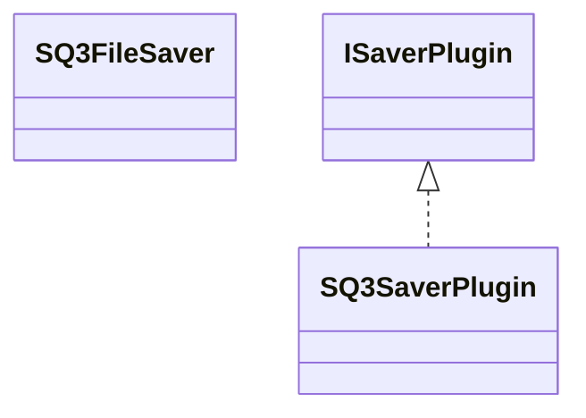

# SaverSQ3.jar

[Group index](README.md) | [All archives](../README.md)

## Scope and provenance

- **Donor:** `SQX_145_REFERENCE_ROOT/internal/plugins/SaverSQ3/SaverSQ3.jar`.
- **SHA-256:** `f8c9e0d4853ee53e732fe2fcdf057296770b79fd7a9e0aa26fc585b991b9f0cc`; accessed 2026-10-06; captured `2026-10-06T18:54:51.906614+00:00`.
- **Classes:** 2 raw entries; 2 unique entry names. Duplicate occurrence indices are zero-based.
- **Inspection:** read-only ZIP hashing and class-file structural parsing; signatures/descriptors, modifiers, hierarchy and references only. Bytecode bodies are hashed, not published.
- **Allocation:** proposed `FEAT-AUTHORING-SAVER-SQ3`, P07; [roadmap](../../dev/sqx-full-application-roadmap.md). Domain README registration remains required.
- **Repository:** `01067f00031428613c6394064ca1bcadc1ba00ee`; review state unreviewed. Download label 145-dev1; installed build/activation and runtime equivalence unverified.
- **Limit:** every class/member is inventoried; declaration coverage does not establish consumed calls, defaults, formulas, failure semantics or algorithm parity.
- **Archive/resource index:** [225.json](../../dev/evidence/sqx145/archives/145/225.json).

## Complete member declarations

Member shards contain exact JVM names/descriptors, access flags, generic signatures, throws types, declared fields/methods, superclass/interfaces and referenced class names. All classes, nested/synthetic members and overloads are retained. Code length/hash is structural evidence, not a normalized algorithm comparison.

- [001.json](../../dev/evidence/sqx145/members/225/001.json) — SHA-256 `23a1867aee5f862ec5ffb824f43746528a6c242c7f89a7c8ccfc12d2216ea528`.

## Focused structural diagram

Up to twelve non-nested classes; arrows show declared inheritance/interfaces only. External type names are not evidence of an available body or an executed dependency.

## Class inventory

| Archive entry | Occurrence | Class SHA-256 | Fields | Methods |
| --- | ---: | --- | ---: | ---: |
| `com/strategyquant/plugin/Saver/impl/SQ3/SQ3FileSaver.class` | 0 | `d254015857bbc557ffe667a961edd8274b5af03d9cd6a2ea3e4815b4c23e1c93` | 0 | 13 |
| `com/strategyquant/plugin/Saver/impl/SQ3/SQ3SaverPlugin.class` | 0 | `27d7037ad35cd95a35eb0298fa6850dad0a3677c27b29897db5c25c8423dd9e3` | 2 | 9 |
