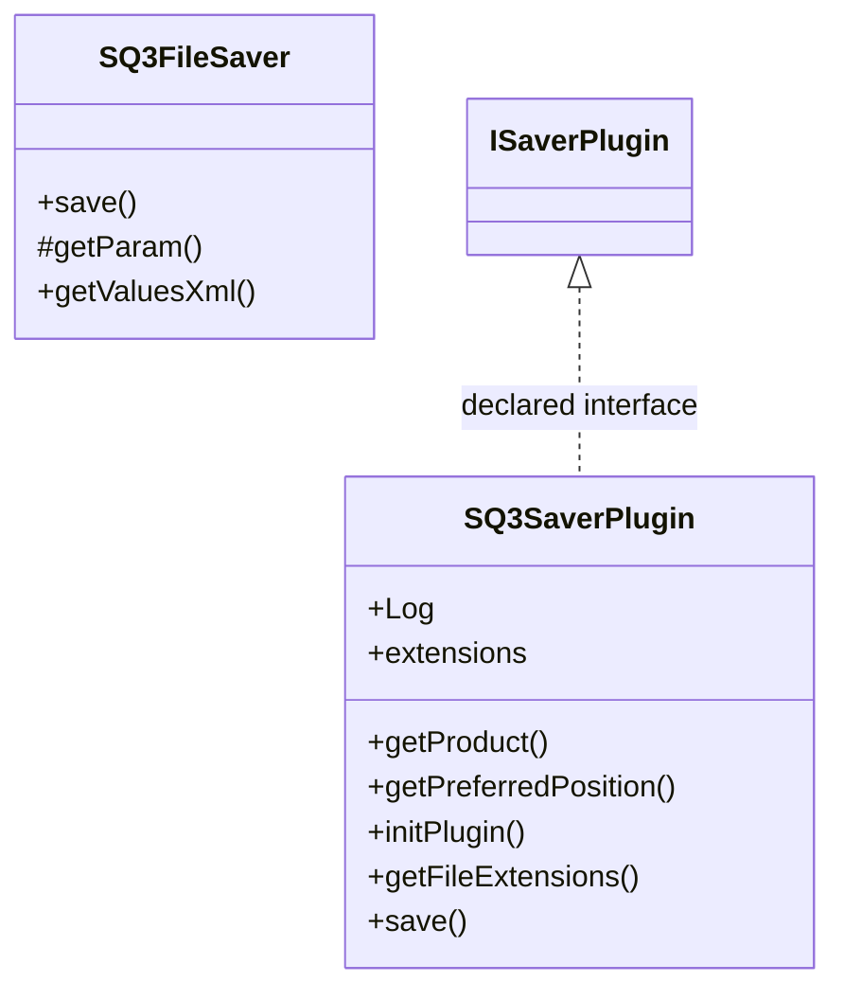

# SaverSQ3.jar

[Workspace/group index](README.md)  |  [All workspaces](../README.md)

## Scope and provenance

- Artifact: `SQX_REFERENCE_ROOT/internal/plugins/SaverSQ3/SaverSQ3.jar`.
- SHA-256: `e1e12388a0232cd9cad0615bbe2e076e01b51304230e9bcefb2b13cb1a5b666a`.
- Inspected: 2026-10-05; generation timestamp `2026-10-05T19:04:16.344170+00:00`.
- Archive class entries: **2**; non-nested: **2**; nested/anonymous: **0**.
- Inspection: ZIP entry/manifest enumeration and `javap -p` declarations for every listed class.
- Repository source HEAD: `8a92c705183a6702eaf62037ccb202ed028aa899`; review state: generated, pending owner review.
- Installed SQX build number is unverified. No method bodies are reproduced.
- Confidence: high for declared structure; workspace ownership inferred except where registration evidence is separately stated. Runtime reachability, call order, formulas and parity remain unverified.

Shared component: a single canonical document is linked from relevant workspace indexes. Its presence here does not establish which workspaces load it at runtime.

Target mapping: no verified owning HaruQuantAI feature/requirement/decision IDs are assigned by this document. Register or resolve ownership through the normal repository plan before implementation.

## Diagram reading guide

`Parent <|-- Child` means declared inheritance; `Interface <|.. Class` means declared implementation. Interface extension uses the inheritance arrow. `A ..> B : field type` is a declared type dependency, not composition, object ownership or a runtime call. External nodes are referenced types, not fabricated local implementations. Selected fields/method names aid navigation: `+` is public, `#` protected and `-` private. Diagram method names omit parameter/return types and collapse overloads; use the exact inspected declarations below before implementing an API.

Detailed graphs include non-nested classes in package-sized groups of at most 12. Nested/anonymous classes are inventoried and their declarations/relationships are retained below, but omitted from overview graphs. Relationships not drawn for readability remain in the complete declaration-relationship table. Constructors, synthetic bridges and overloads may be collapsed in diagram member lists only. Standard `java.lang.Object` inheritance is omitted from diagrams.

## UML class diagrams

### 1. `com.strategyquant.plugin.Saver.impl.SQ3`



| Diagram identifier | Exact type | Location |
| --- | --- | --- |
| `C400e4a73a17f` | `com.strategyquant.plugin.Saver.impl.SQ3.SQ3FileSaver` (this JAR) | this diagram |
| `Ce82ed06a3a95` | `com.strategyquant.plugin.Saver.impl.SQ3.SQ3SaverPlugin` (this JAR) | this diagram |
| `C28a2142c6554` | [`com.strategyquant.tradinglib.results.file.ISaverPlugin`](SQTradingLib.md) | referenced external type |

## Complete class inventory

| Fully qualified class | Kind | Entry |
| --- | --- | --- |
| `com.strategyquant.plugin.Saver.impl.SQ3.SQ3FileSaver` | class | non-nested |
| `com.strategyquant.plugin.Saver.impl.SQ3.SQ3SaverPlugin` | class | non-nested |

## Declared relationships and evidence locations

Every row is supported by the named class declaration/member in `javap -p`, inside the artifact recorded above. Signature dependencies may include return, parameter, generic-argument and throws types; they do not imply execution.

| Declaring class | Referenced type | Relationship | Narrow inspection location |
| --- | --- | --- | --- |
| `com.strategyquant.plugin.Saver.impl.SQ3.SQ3FileSaver` | [`com.strategyquant.tradinglib.ResultsGroup`](SQTradingLib.md) | type dependency | `com.strategyquant.plugin.Saver.impl.SQ3.SQ3FileSaver` / method signature: `public void save(com.strategyquant.tradinglib.ResultsGroup, java.lang.String, java.util.Map<java.lang.String, java.lang.String[]>) throws java.lang.Exception;`<br>`private org.jdom2.Element getStrategyXml(com.strategyquant.tradinglib.ResultsGroup, java.util.Map<java.lang.String, java.lang.String[]>) throws java.lang.Exception;`<br>`private org.jdom2.Element getSettingsXml(com.strategyquant.tradinglib.ResultsGroup, java.lang.String) throws java.lang.Exception;`<br>`private org.jdom2.Element getOrdersXml(com.strategyquant.tradinglib.ResultsGroup, java.lang.String) throws java.lang.Exception;`<br>`private org.jdom2.Element getResultsXml(com.strategyquant.tradinglib.ResultsGroup, java.lang.String) throws java.lang.Exception;`<br>`private org.jdom2.Element getStatsDataXml(com.strategyquant.tradinglib.ResultsGroup, java.lang.String, java.lang.String, byte, byte) throws java.lang.Exception;`<br>`private org.jdom2.Element getAdditionalData(com.strategyquant.tradinglib.ResultsGroup) throws java.lang.Exception;`<br>`private org.jdom2.Element getAdditionalDataResult(com.strategyquant.tradinglib.ResultsGroup, java.lang.String) throws java.lang.Exception;` |
| `com.strategyquant.plugin.Saver.impl.SQ3.SQ3FileSaver` | `java.lang.String` (not resolved in scoped archives) | type dependency | `com.strategyquant.plugin.Saver.impl.SQ3.SQ3FileSaver` / method signature: `public void save(com.strategyquant.tradinglib.ResultsGroup, java.lang.String, java.util.Map<java.lang.String, java.lang.String[]>) throws java.lang.Exception;`<br>`protected java.lang.String getParam(java.util.Map<java.lang.String, java.lang.String[]>, java.lang.String, java.lang.String) throws java.lang.Exception;`<br>`private org.jdom2.Element getStrategyXml(com.strategyquant.tradinglib.ResultsGroup, java.util.Map<java.lang.String, java.lang.String[]>) throws java.lang.Exception;`<br>`private org.jdom2.Element getSettingsXml(com.strategyquant.tradinglib.ResultsGroup, java.lang.String) throws java.lang.Exception;`<br>`private org.jdom2.Element getOrdersXml(com.strategyquant.tradinglib.ResultsGroup, java.lang.String) throws java.lang.Exception;`<br>`private org.jdom2.Element getResultsXml(com.strategyquant.tradinglib.ResultsGroup, java.lang.String) throws java.lang.Exception;`<br>`private org.jdom2.Element getStatsDataXml(com.strategyquant.tradinglib.ResultsGroup, java.lang.String, java.lang.String, byte, byte) throws java.lang.Exception;`<br>`private org.jdom2.Element getAdditionalDataResult(com.strategyquant.tradinglib.ResultsGroup, java.lang.String) throws java.lang.Exception;` |
| `com.strategyquant.plugin.Saver.impl.SQ3.SQ3FileSaver` | `java.util.Map` (not resolved in scoped archives) | type dependency | `com.strategyquant.plugin.Saver.impl.SQ3.SQ3FileSaver` / method signature: `public void save(com.strategyquant.tradinglib.ResultsGroup, java.lang.String, java.util.Map<java.lang.String, java.lang.String[]>) throws java.lang.Exception;`<br>`protected java.lang.String getParam(java.util.Map<java.lang.String, java.lang.String[]>, java.lang.String, java.lang.String) throws java.lang.Exception;`<br>`private org.jdom2.Element getStrategyXml(com.strategyquant.tradinglib.ResultsGroup, java.util.Map<java.lang.String, java.lang.String[]>) throws java.lang.Exception;` |
| `com.strategyquant.plugin.Saver.impl.SQ3.SQ3FileSaver` | `java.lang.Exception` (not resolved in scoped archives) | type dependency | `com.strategyquant.plugin.Saver.impl.SQ3.SQ3FileSaver` / method signature: `public void save(com.strategyquant.tradinglib.ResultsGroup, java.lang.String, java.util.Map<java.lang.String, java.lang.String[]>) throws java.lang.Exception;`<br>`protected java.lang.String getParam(java.util.Map<java.lang.String, java.lang.String[]>, java.lang.String, java.lang.String) throws java.lang.Exception;`<br>`private org.jdom2.Element getStrategyXml(com.strategyquant.tradinglib.ResultsGroup, java.util.Map<java.lang.String, java.lang.String[]>) throws java.lang.Exception;`<br>`private org.jdom2.Element getSettingsXml(com.strategyquant.tradinglib.ResultsGroup, java.lang.String) throws java.lang.Exception;`<br>`private org.jdom2.Element getOrdersXml(com.strategyquant.tradinglib.ResultsGroup, java.lang.String) throws java.lang.Exception;`<br>`private org.jdom2.Element getResultsXml(com.strategyquant.tradinglib.ResultsGroup, java.lang.String) throws java.lang.Exception;`<br>`private org.jdom2.Element getStatsDataXml(com.strategyquant.tradinglib.ResultsGroup, java.lang.String, java.lang.String, byte, byte) throws java.lang.Exception;`<br>`private org.jdom2.Element getAdditionalData(com.strategyquant.tradinglib.ResultsGroup) throws java.lang.Exception;`<br>`private org.jdom2.Element getAdditionalDataResult(com.strategyquant.tradinglib.ResultsGroup, java.lang.String) throws java.lang.Exception;` |
| `com.strategyquant.plugin.Saver.impl.SQ3.SQ3FileSaver` | `org.jdom2.Element` (not resolved in scoped archives) | type dependency | `com.strategyquant.plugin.Saver.impl.SQ3.SQ3FileSaver` / method signature: `private org.jdom2.Element getStrategyXml(com.strategyquant.tradinglib.ResultsGroup, java.util.Map<java.lang.String, java.lang.String[]>) throws java.lang.Exception;`<br>`private org.jdom2.Element getSettingsXml(com.strategyquant.tradinglib.ResultsGroup, java.lang.String) throws java.lang.Exception;`<br>`private org.jdom2.Element getOrdersXml(com.strategyquant.tradinglib.ResultsGroup, java.lang.String) throws java.lang.Exception;`<br>`private org.jdom2.Element getResultsXml(com.strategyquant.tradinglib.ResultsGroup, java.lang.String) throws java.lang.Exception;`<br>`private org.jdom2.Element getStatsDataXml(com.strategyquant.tradinglib.ResultsGroup, java.lang.String, java.lang.String, byte, byte) throws java.lang.Exception;`<br>`public org.jdom2.Element getValuesXml(int, com.strategyquant.tradinglib.SQStats);`<br>`private org.jdom2.Element orderToXml(com.strategyquant.tradinglib.Order);`<br>`private org.jdom2.Element getAdditionalData(com.strategyquant.tradinglib.ResultsGroup) throws java.lang.Exception;`<br>`private org.jdom2.Element getAdditionalDataResult(com.strategyquant.tradinglib.ResultsGroup, java.lang.String) throws java.lang.Exception;` |
| `com.strategyquant.plugin.Saver.impl.SQ3.SQ3FileSaver` | [`com.strategyquant.tradinglib.SQStats`](SQTradingLib.md) | type dependency | `com.strategyquant.plugin.Saver.impl.SQ3.SQ3FileSaver` / method signature: `public org.jdom2.Element getValuesXml(int, com.strategyquant.tradinglib.SQStats);` |
| `com.strategyquant.plugin.Saver.impl.SQ3.SQ3FileSaver` | [`com.strategyquant.tradinglib.Order`](SQTradingLib.md) | type dependency | `com.strategyquant.plugin.Saver.impl.SQ3.SQ3FileSaver` / method signature: `private org.jdom2.Element orderToXml(com.strategyquant.tradinglib.Order);`<br>`private double moneyToPips(double, com.strategyquant.datalib.DataInfo, com.strategyquant.tradinglib.Order);` |
| `com.strategyquant.plugin.Saver.impl.SQ3.SQ3FileSaver` | [`com.strategyquant.datalib.DataInfo`](SQDataLib.md) | type dependency | `com.strategyquant.plugin.Saver.impl.SQ3.SQ3FileSaver` / method signature: `private double moneyToPips(double, com.strategyquant.datalib.DataInfo, com.strategyquant.tradinglib.Order);` |
| `com.strategyquant.plugin.Saver.impl.SQ3.SQ3SaverPlugin` | [`com.strategyquant.tradinglib.results.file.ISaverPlugin`](SQTradingLib.md) | implements | `com.strategyquant.plugin.Saver.impl.SQ3.SQ3SaverPlugin` / class declaration: `public class com.strategyquant.plugin.Saver.impl.SQ3.SQ3SaverPlugin implements com.strategyquant.tradinglib.results.file.ISaverPlugin` |
| `com.strategyquant.plugin.Saver.impl.SQ3.SQ3SaverPlugin` | `org.slf4j.Logger` (not resolved in scoped archives) | type dependency | `com.strategyquant.plugin.Saver.impl.SQ3.SQ3SaverPlugin` / field declaration: `public static final org.slf4j.Logger Log;` |
| `com.strategyquant.plugin.Saver.impl.SQ3.SQ3SaverPlugin` | `java.lang.String` (not resolved in scoped archives) | type dependency | `com.strategyquant.plugin.Saver.impl.SQ3.SQ3SaverPlugin` / field declaration: `public static final java.lang.String[] extensions;` |
| `com.strategyquant.plugin.Saver.impl.SQ3.SQ3SaverPlugin` | `java.lang.String` (not resolved in scoped archives) | type dependency | `com.strategyquant.plugin.Saver.impl.SQ3.SQ3SaverPlugin` / method signature: `public java.lang.String getProduct();`<br>`public java.lang.String[] getFileExtensions();`<br>`public void save(com.strategyquant.tradinglib.ResultsGroup, java.lang.String, java.util.Map<java.lang.String, java.lang.String[]>) throws java.lang.Exception;` |
| `com.strategyquant.plugin.Saver.impl.SQ3.SQ3SaverPlugin` | `java.lang.Exception` (not resolved in scoped archives) | type dependency | `com.strategyquant.plugin.Saver.impl.SQ3.SQ3SaverPlugin` / method signature: `public void initPlugin() throws java.lang.Exception;`<br>`public void save(com.strategyquant.tradinglib.ResultsGroup, java.lang.String, java.util.Map<java.lang.String, java.lang.String[]>) throws java.lang.Exception;` |
| `com.strategyquant.plugin.Saver.impl.SQ3.SQ3SaverPlugin` | [`com.strategyquant.tradinglib.ResultsGroup`](SQTradingLib.md) | type dependency | `com.strategyquant.plugin.Saver.impl.SQ3.SQ3SaverPlugin` / method signature: `public void save(com.strategyquant.tradinglib.ResultsGroup, java.lang.String, java.util.Map<java.lang.String, java.lang.String[]>) throws java.lang.Exception;` |
| `com.strategyquant.plugin.Saver.impl.SQ3.SQ3SaverPlugin` | `java.util.Map` (not resolved in scoped archives) | type dependency | `com.strategyquant.plugin.Saver.impl.SQ3.SQ3SaverPlugin` / method signature: `public void save(com.strategyquant.tradinglib.ResultsGroup, java.lang.String, java.util.Map<java.lang.String, java.lang.String[]>) throws java.lang.Exception;` |
| `com.strategyquant.plugin.Saver.impl.SQ3.SQ3SaverPlugin` | [`com.strategyquant.tradinglib.results.file.ISaverPlugin`](SQTradingLib.md) | type dependency | `com.strategyquant.plugin.Saver.impl.SQ3.SQ3SaverPlugin` / method signature: `public com.strategyquant.tradinglib.results.file.ISaverPlugin clone();` |
| `com.strategyquant.plugin.Saver.impl.SQ3.SQ3SaverPlugin` | `java.lang.Object` (not resolved in scoped archives) | type dependency | `com.strategyquant.plugin.Saver.impl.SQ3.SQ3SaverPlugin` / method signature: `public java.lang.Object clone() throws java.lang.CloneNotSupportedException;` |
| `com.strategyquant.plugin.Saver.impl.SQ3.SQ3SaverPlugin` | `java.lang.CloneNotSupportedException` (not resolved in scoped archives) | type dependency | `com.strategyquant.plugin.Saver.impl.SQ3.SQ3SaverPlugin` / method signature: `public java.lang.Object clone() throws java.lang.CloneNotSupportedException;` |

## Inspected declaration reference

These are structural API/member declarations, not proprietary implementation bodies. Private members and nested classes are retained to make diagram omissions explicit; declarations do not prove behavior.

<details>
<summary>com.strategyquant.plugin.Saver.impl.SQ3.SQ3FileSaver</summary>

```text
public class com.strategyquant.plugin.Saver.impl.SQ3.SQ3FileSaver
    public com.strategyquant.plugin.Saver.impl.SQ3.SQ3FileSaver();
    public void save(com.strategyquant.tradinglib.ResultsGroup, java.lang.String, java.util.Map<java.lang.String, java.lang.String[]>) throws java.lang.Exception;
    protected java.lang.String getParam(java.util.Map<java.lang.String, java.lang.String[]>, java.lang.String, java.lang.String) throws java.lang.Exception;
    private org.jdom2.Element getStrategyXml(com.strategyquant.tradinglib.ResultsGroup, java.util.Map<java.lang.String, java.lang.String[]>) throws java.lang.Exception;
    private org.jdom2.Element getSettingsXml(com.strategyquant.tradinglib.ResultsGroup, java.lang.String) throws java.lang.Exception;
    private org.jdom2.Element getOrdersXml(com.strategyquant.tradinglib.ResultsGroup, java.lang.String) throws java.lang.Exception;
    private org.jdom2.Element getResultsXml(com.strategyquant.tradinglib.ResultsGroup, java.lang.String) throws java.lang.Exception;
    private org.jdom2.Element getStatsDataXml(com.strategyquant.tradinglib.ResultsGroup, java.lang.String, java.lang.String, byte, byte) throws java.lang.Exception;
    public org.jdom2.Element getValuesXml(int, com.strategyquant.tradinglib.SQStats);
    private org.jdom2.Element orderToXml(com.strategyquant.tradinglib.Order);
    private double moneyToPips(double, com.strategyquant.datalib.DataInfo, com.strategyquant.tradinglib.Order);
    private org.jdom2.Element getAdditionalData(com.strategyquant.tradinglib.ResultsGroup) throws java.lang.Exception;
    private org.jdom2.Element getAdditionalDataResult(com.strategyquant.tradinglib.ResultsGroup, java.lang.String) throws java.lang.Exception;
```

</details>

<details>
<summary>com.strategyquant.plugin.Saver.impl.SQ3.SQ3SaverPlugin</summary>

```text
public class com.strategyquant.plugin.Saver.impl.SQ3.SQ3SaverPlugin implements com.strategyquant.tradinglib.results.file.ISaverPlugin
    public static final org.slf4j.Logger Log;
    public static final java.lang.String[] extensions;
    public com.strategyquant.plugin.Saver.impl.SQ3.SQ3SaverPlugin();
    public java.lang.String getProduct();
    public int getPreferredPosition();
    public void initPlugin() throws java.lang.Exception;
    public java.lang.String[] getFileExtensions();
    public void save(com.strategyquant.tradinglib.ResultsGroup, java.lang.String, java.util.Map<java.lang.String, java.lang.String[]>) throws java.lang.Exception;
    public com.strategyquant.tradinglib.results.file.ISaverPlugin clone();
    public java.lang.Object clone() throws java.lang.CloneNotSupportedException;
```

</details>

## Validation and unresolved gaps

Archive hash and complete class inventory were checked against the inspected local artifact. Declaration extraction accounts for every inventoried class. Documentation/link/diagram structural verification is recorded in the master index and task walkthrough; no SQX runtime validation was performed.

The canonical reimplementation ledger/schema are absent, so no evidence IDs or validation-passed ledger claims are created. This is a donor structural reference. Exact behavior, default values, failure semantics, algorithms, runtime calls and target architectural choices require separate research. No aggregation/composition or cardinalities are inferred.
