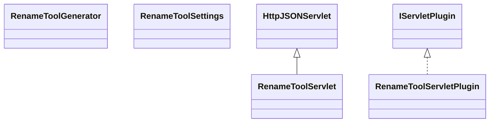

# ServletRenameTool.jar

[Group index](README.md) | [All archives](../README.md)

## Scope and provenance

- **Donor:** `SQX_145_REFERENCE_ROOT/internal/plugins/ServletRenameTool/ServletRenameTool.jar`.
- **SHA-256:** `0117bc047a4a69c16530c78b263df70f607d19bef32dcca40fda647f0e886caf`; accessed 2026-10-06; captured `2026-10-06T18:54:51.906614+00:00`.
- **Classes:** 4 raw entries; 4 unique entry names. Duplicate occurrence indices are zero-based.
- **Inspection:** read-only ZIP hashing and class-file structural parsing; signatures/descriptors, modifiers, hierarchy and references only. Bytecode bodies are hashed, not published.
- **Allocation:** proposed `FEAT-RESULTS-SERVLET-RENAME-TOOL`, P08; [roadmap](../../dev/sqx-full-application-roadmap.md). Domain README registration remains required.
- **Repository:** `01067f00031428613c6394064ca1bcadc1ba00ee`; review state unreviewed. Download label 145-dev1; installed build/activation and runtime equivalence unverified.
- **Limit:** every class/member is inventoried; declaration coverage does not establish consumed calls, defaults, formulas, failure semantics or algorithm parity.
- **Archive/resource index:** [235.json](../../dev/evidence/sqx145/archives/145/235.json).

## Complete member declarations

Member shards contain exact JVM names/descriptors, access flags, generic signatures, throws types, declared fields/methods, superclass/interfaces and referenced class names. All classes, nested/synthetic members and overloads are retained. Code length/hash is structural evidence, not a normalized algorithm comparison.

- [001.json](../../dev/evidence/sqx145/members/235/001.json) — SHA-256 `2f6cc58c6b8b365867352cad0668490696c0cb9919c169152d210dcaa5c70a33`.

## Focused structural diagram

Up to twelve non-nested classes; arrows show declared inheritance/interfaces only. External type names are not evidence of an available body or an executed dependency.

## Class inventory

| Archive entry | Occurrence | Class SHA-256 | Fields | Methods |
| --- | ---: | --- | ---: | ---: |
| `com/strategyquant/plugin/Servlet/impl/RenameTool/RenameToolGenerator.class` | 0 | `2fa8e4d7723a1183e2d2bc797d41b21a5f1714a56b43e1cf2a05a0c87e05cbb6` | 3 | 8 |
| `com/strategyquant/plugin/Servlet/impl/RenameTool/RenameToolServlet.class` | 0 | `98844c63bd1edf661c6c59f633aa534530c9980379d6eaec7245962aaf1b19a0` | 2 | 4 |
| `com/strategyquant/plugin/Servlet/impl/RenameTool/RenameToolServletPlugin.class` | 0 | `273c1c34143909ca3fda3d2e2126f8a19b5a826418131ae7e29dbc421af305cf` | 1 | 5 |
| `com/strategyquant/plugin/Servlet/impl/RenameTool/RenameToolSettings.class` | 0 | `7d0d0cff3fe2bff1fd62e8aa413cab2c12fc8a535626c92a0199929fb74901aa` | 8 | 4 |
