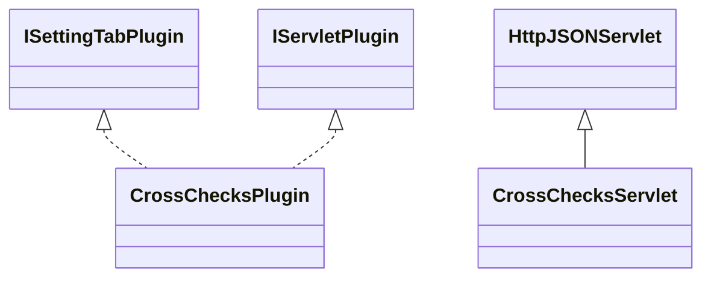

# SettingsCrossChecks.jar

[Group index](README.md) | [All archives](../README.md)

## Scope and provenance

- **Donor:** `SQX_145_REFERENCE_ROOT/internal/plugins/SettingsCrossChecks/SettingsCrossChecks.jar`.
- **SHA-256:** `12ed3ab90da9476cdd55e57d00d67ef8f913a0af4963abe3a54070c03dc3515e`; accessed 2026-10-06; captured `2026-10-06T18:54:51.906614+00:00`.
- **Classes:** 2 raw entries; 2 unique entry names. Duplicate occurrence indices are zero-based.
- **Inspection:** read-only ZIP hashing and class-file structural parsing; signatures/descriptors, modifiers, hierarchy and references only. Bytecode bodies are hashed, not published.
- **Allocation:** proposed `FEAT-ROBUSTNESS-SETTINGS-CROSS-CHECKS`, P11; [roadmap](../../dev/sqx-full-application-roadmap.md). Domain README registration remains required.
- **Repository:** `01067f00031428613c6394064ca1bcadc1ba00ee`; review state unreviewed. Download label 145-dev1; installed build/activation and runtime equivalence unverified.
- **Limit:** every class/member is inventoried; declaration coverage does not establish consumed calls, defaults, formulas, failure semantics or algorithm parity.
- **Archive/resource index:** [246.json](../../dev/evidence/sqx145/archives/145/246.json).

## Complete member declarations

Member shards contain exact JVM names/descriptors, access flags, generic signatures, throws types, declared fields/methods, superclass/interfaces and referenced class names. All classes, nested/synthetic members and overloads are retained. Code length/hash is structural evidence, not a normalized algorithm comparison.

- [001.json](../../dev/evidence/sqx145/members/246/001.json) — SHA-256 `b5bdeb7df9e74db2336d13645d9bcbdf23d509afdcaa994a9ba78c29cd2baf6d`.

## Focused structural diagram

Up to twelve non-nested classes; arrows show declared inheritance/interfaces only. External type names are not evidence of an available body or an executed dependency.

## Class inventory

| Archive entry | Occurrence | Class SHA-256 | Fields | Methods |
| --- | ---: | --- | ---: | ---: |
| `com/strategyquant/plugin/Settings/impl/CrossChecks/CrossChecksPlugin.class` | 0 | `ee376914d97a5972c4b1860b28d6a9f70db4f8266155ce508e5c90a1390cadaa` | 5 | 12 |
| `com/strategyquant/plugin/Settings/impl/CrossChecks/CrossChecksServlet.class` | 0 | `f6a2e2baa61cace98e80845b9c5204322906bcdcc7829e044295ae21b27ed9ca` | 1 | 4 |
