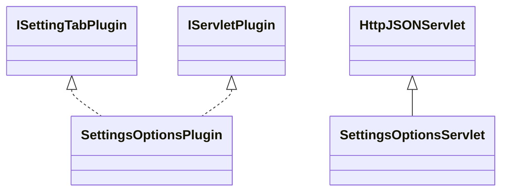

# SettingsOptions.jar

[Group index](README.md) | [All archives](../README.md)

## Scope and provenance

- **Donor:** `SQX_145_REFERENCE_ROOT/internal/plugins/SettingsOptions/SettingsOptions.jar`.
- **SHA-256:** `8d661d85eeff6aa112ef97e59b909716a7d20be8192aafa19fc3a68416dc36a2`; accessed 2026-10-06; captured `2026-10-06T18:54:51.906614+00:00`.
- **Classes:** 2 raw entries; 2 unique entry names. Duplicate occurrence indices are zero-based.
- **Inspection:** read-only ZIP hashing and class-file structural parsing; signatures/descriptors, modifiers, hierarchy and references only. Bytecode bodies are hashed, not published.
- **Allocation:** proposed `FEAT-SIMULATOR-SETTINGS-OPTIONS`, P06; [roadmap](../../dev/sqx-full-application-roadmap.md). Domain README registration remains required.
- **Repository:** `01067f00031428613c6394064ca1bcadc1ba00ee`; review state unreviewed. Download label 145-dev1; installed build/activation and runtime equivalence unverified.
- **Limit:** every class/member is inventoried; declaration coverage does not establish consumed calls, defaults, formulas, failure semantics or algorithm parity.
- **Archive/resource index:** [258.json](../../dev/evidence/sqx145/archives/145/258.json).

## Complete member declarations

Member shards contain exact JVM names/descriptors, access flags, generic signatures, throws types, declared fields/methods, superclass/interfaces and referenced class names. All classes, nested/synthetic members and overloads are retained. Code length/hash is structural evidence, not a normalized algorithm comparison.

- [001.json](../../dev/evidence/sqx145/members/258/001.json) — SHA-256 `eb876dec2d9587914e8feb741005d5f590a67ae75828b275e26a284647b58051`.

## Focused structural diagram

Up to twelve non-nested classes; arrows show declared inheritance/interfaces only. External type names are not evidence of an available body or an executed dependency.

## Class inventory

| Archive entry | Occurrence | Class SHA-256 | Fields | Methods |
| --- | ---: | --- | ---: | ---: |
| `com/strategyquant/plugin/Settings/impl/Options/SettingsOptionsPlugin.class` | 0 | `097125dfa97ad28914b498531d9fbf9edc3c5494ec9973247a044c8c36cb09f1` | 2 | 14 |
| `com/strategyquant/plugin/Settings/impl/Options/SettingsOptionsServlet.class` | 0 | `3c706e6095a4c9475c5fde7f5bd07374ff8807830c5f288aba02d87f68e283f1` | 1 | 4 |
