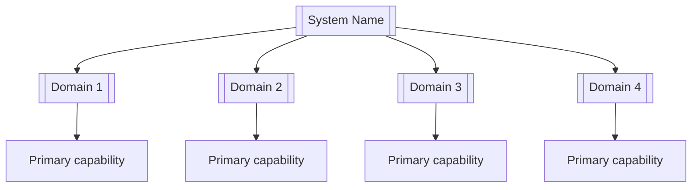
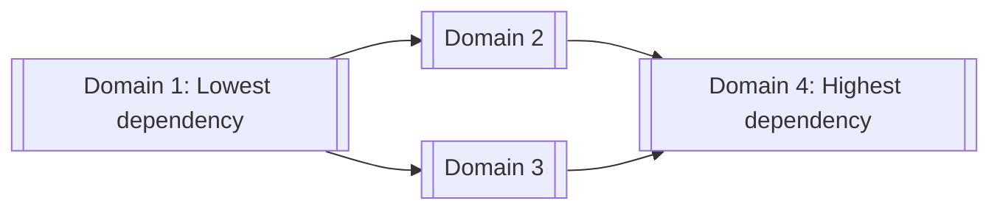
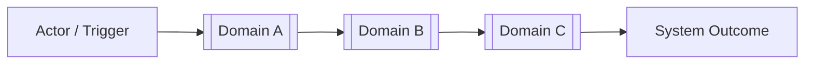
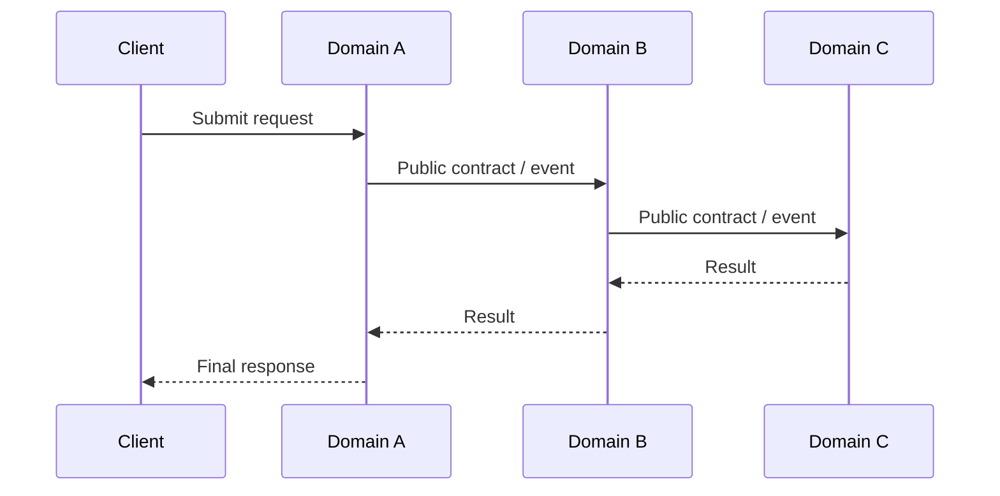
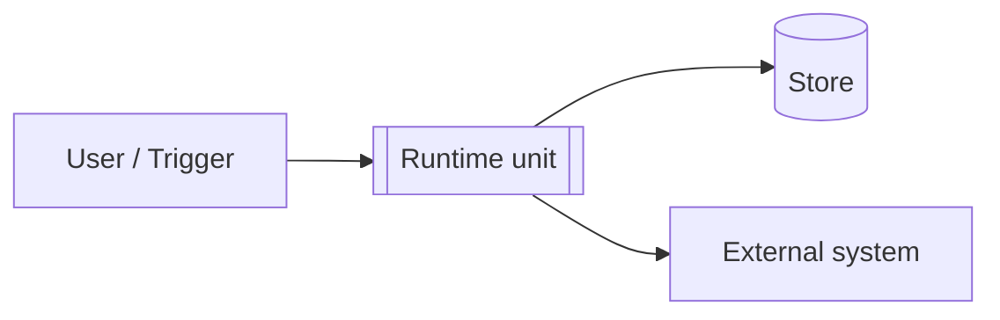

# [System Name]

> **System path:** `[repository/root]`
> **Status:** `[Missing | Partial | Completed]`
> **Last updated:** `[YYYY-MM-DD]`

> This document is the system-level source of truth.
> It defines how domains fit together, how cross-domain workflows operate, which rules apply system-wide, and how the complete system is verified.
>
> Domain internals belong in each domain's own `README.md`.
> Do not duplicate domain-level requirements, files, functions, or implementation details here.

---

## 1. System Purpose and Boundary

### Purpose

[Describe the final system outcome in 3–5 sentences.]

### System owns

- [Major responsibility]
- [Major responsibility]
- [Major system outcome]

### System does not own

- [External responsibility]
- [Third-party responsibility]
- [Explicitly unsupported behaviour]

### Primary users / actors

| Actor | Uses the system to |
|---|---|
| `[Actor]` | [Primary goal] |
| `[Service]` | [Primary goal] |
| `[Operator]` | [Primary goal] |

---

## 2. Domain Capability Map

This diagram shows the complete system and its domains at a glance.



### 2.1 Domain Registry

List domains in dependency order, from lowest dependency to highest dependency.

#### 2.1.1 [Domain 1]

* **Package**: [app/path/domain_1]
* **Responsibility**: [One-line responsibility]
* **Inputs**: [All inputs the domain ingests]
* **Outputs**: [All outputs the domain produces]
* **Owns**: [Features]
* **Boundaries**: [What it does not own or do]
* **Key Limits**: [The limits of what it can do both by design and env]
* **Documentation**: [app/path/domain_1/README.md]

#### 2.1.2 [Domain 2]

* **Package**: [app/path/domain_2]
* **Responsibility**: [One-line responsibility]
* **Inputs**: [All inputs the domain ingests]
* **Outputs**: [All outputs the domain produces]
* **Owns**: [Features]
* **Boundaries**: [What it does not own or do]
* **Key Limits**: [The limits of what it can do both by design and env]
* **Documentation**: [app/path/domain_2/README.md]

#### 2.1.3 [Domain 3]

* **Package**: [app/path/domain_3]
* **Responsibility**: [One-line responsibility]
* **Inputs**: [All inputs the domain ingests]
* **Outputs**: [All outputs the domain produces]
* **Owns**: [Features]
* **Boundaries**: [What it does not own or do]
* **Key Limits**: [The limits of what it can do both by design and env]
* **Documentation**: [app/path/domain_3/README.md]

#### 2.1.4 [Domain 4]

* **Package**: [app/path/domain_4]
* **Responsibility**: [One-line responsibility]
* **Inputs**: [All inputs the domain ingests]
* **Outputs**: [All outputs the domain produces]
* **Owns**: [Features]
* **Boundaries**: [What it does not own or do]
* **Key Limits**: [The limits of what it can do both by design and env]
* **Documentation**: [app/path/domain_4/README.md]

### 2.2 Domain ownership rule

Each responsibility must have one clear owning domain.

```text
One responsibility
→ one owning domain
→ one authoritative domain README
```

Other domains may consume the capability, but they must not duplicate its business logic.

---

## 3. Domain Dependency Diagram

This diagram is required.

It shows which domains depend on which other domains and therefore defines the system implementation order.



Rules:

- An arrow points from the required domain to the domain that consumes it.
- The diagram must match the order of the Domain Registry.
- Circular domain dependencies are not allowed.
- Cross-domain communication must use documented public exports, contracts, or events.
- A domain must not import another domain's internal files.

---

## 4. Cross-Domain Workflows

This section documents only workflows involving two or more domains.

Internal domain workflows belong in the relevant domain `README.md`.

### Status and scope

| Status | Meaning |
|---|---|
| **Missing** | Not implemented or not verified |
| **Partial** | Partly implemented or tests are incomplete |
| **Completed** | Implemented, tested, and verified |

| Status | Workflow ID | Workflow | Trigger | Domains involved | Final outcome | Integration test |
|---|---|---|---|---|---|---|
| Missing | `SYS-WF-001` | [Workflow name] | [Trigger] | `[Domain A → Domain B → Domain C]` | [Observable system result] | `tests/system/integration/test_[workflow].py` |
| Missing | `SYS-WF-002` | [Workflow name] | [Trigger] | `[Domain A → Domain D]` | [Observable system result] | `tests/system/integration/test_[workflow].py` |

---

### `SYS-WF-001` — [Cross-Domain Workflow Name]

**Purpose:** [What system-level outcome this workflow delivers.]

**Actor / trigger:** [Who or what starts it.]

**Input boundary:** [Initial request, event, command, or data.]

**Output boundary:** [Final response, event, persisted state, or external action.]

**Domains and responsibilities:**

| Order | Domain | Responsibility | Input | Output |
|---:|---|---|---|---|
| 1 | `[Domain A]` | [What this domain does] | [Input] | [Output] |
| 2 | `[Domain B]` | [What this domain does] | [Input] | [Output] |
| 3 | `[Domain C]` | [What this domain does] | [Input] | [Output] |

**Main flow:**

1. `[Domain A]` receives [input].
2. `[Domain A]` produces [contract/event].
3. `[Domain B]` consumes it and performs [responsibility].
4. `[Domain C]` completes [final responsibility].
5. The system returns, stores, or publishes [final result].

**Failure behaviour:**

- [Failure at Domain A] → [System response]
- [Failure at Domain B] → [System response]
- [Failure at Domain C] → [System response]

**Success condition:**

[Describe the observable state proving that the full workflow completed successfully.]

#### End-to-end workflow diagram

Use a flowchart when the sequence is straightforward:



Use a sequence diagram when calls, events, responses, or asynchronous interactions matter:



Rules:

- Describe each domain only at the level of its system responsibility.
- Do not repeat internal functions or file structures from domain READMEs.
- Reference the relevant domain workflow or requirement IDs when useful.
- Every important cross-domain workflow must have an integration test.

---

## 5. System Interfaces and Contracts

Document only contracts crossing domain or external-system boundaries.

| Status | Contract / Event | Version | Owner | Producer / Submitter | Consumer | Purpose | Schema / Type | Failure behaviour |
|---|---|---|---|---|---|---|---|---|
| Missing | `[ContractName]` | `v1` | `[Domain A]` | `[Domain A]` | `[Domain B]` | [Purpose] | `[Type / schema]` | [Failure handling] |
| Missing | `[EventName]` | `v1` | `[Domain B]` | `[Domain B]` | `[Domain C]` | [Purpose] | `[Type / schema]` | [Failure handling] |
| Missing | `[ExternalRequest]` | `v1` | `[Domain C]` | `[Domain C]` | `[External system]` | [Purpose] | `[Type / schema]` | [Failure handling] |

### Contract rules

- **Commands and requests are owned by the receiving domain.**
- **Events and results are owned by the producing domain.**
- **Shared context/envelope contracts are owned by the lowest common shared domain.**
- A submitting domain may create an instance of a command without owning its schema.
- External connection/channel contracts are owned by the domain that provides and controls the resource.
- Consumers depend only on the documented public contract and must not redefine it.
- Raw provider or SDK objects must not cross domain boundaries.
- Changes to shared contracts must be reflected in every affected domain README.
- Backward compatibility requirements must be stated when needed.

### Versioning and compatibility policy

- Every shared contract carries an explicit version; all contracts start at `v1`.
- The contract owner (per the rules above) owns the version.
- Additive changes (new optional fields) do not require a version bump.
- Breaking changes (removed/renamed fields, changed semantics) require a new version.
- The owner must support the previous version until every consumer has migrated; state the deprecation window per contract.
- Version bumps must update this table, the owner's README, and every consumer README in the same change.

### Data ownership

Document which domain owns each piece of persisted or long-lived state. Only the owner writes; others read through the owner's public contract.

| Status | State / Store | Owning domain | Read access | Write access | Notes |
|---|---|---|---|---|---|
| Missing | `[Table / collection / cache]` | `[Domain A]` | `[Domain B, Domain C]` | `[Domain A only]` | [Retention, consistency, or migration notes] |
| Missing | `[State / store]` | `[Domain B]` | `[Domain D]` | `[Domain B only]` | [Notes] |

Rules:

- Every persisted state has exactly one owning domain.
- No domain writes to state it does not own.
- Cross-domain reads go through the owner's documented contract, not direct store access.

---

## 6. Shared Configuration and Limits Manifest

Use this section only for settings or limits shared across multiple domains.

Feature-specific settings remain in the owning domain README.

| Status | Setting / Limit | Type | Default | Required | Used by | Description |
|---|---|---|---|---|---|---|
| Missing | `[SYSTEM_SETTING]` | `[str]` | `None` | Yes | `[Domain A, Domain B]` | [Purpose and enforced behaviour] |
| Missing | `[GLOBAL_LIMIT]` | `[Decimal]` | `[value]` | Yes | `[Domain B, Domain C]` | [System-wide limit and failure behaviour] |
| Missing | `[SYSTEM_TIMEOUT]` | `[float]` | `[value]` | No | `[All domains]` | [Shared timeout behaviour] |
| Missing | `[ENABLE_SYSTEM_FEATURE]` | `[bool]` | `False` | No | `[Affected domains]` | [Whether the capability is enabled] |

Rules:

- The setting must have one clear owner.
- `Used by` lists every consuming domain.
- Limits must state what happens when exceeded.
- Change status to `Completed` only after validation and tests exist.
- Do not repeat feature-specific configuration here.

---

## 7. System-Wide Requirements

Use this section only for requirements applying across multiple domains.

| Status | Requirement ID | Type | Responsibility | Verification |
|---|---|---|---|---|
| Missing | `SYS-NFR-001` | Architecture | Domains shall communicate only through documented public boundaries. | Dependency audit |
| Missing | `SYS-NFR-002` | Maintainability | Each responsibility shall have one owning domain. | Ownership review |
| Missing | `SYS-NFR-003` | Reliability | [System-wide failure or recovery requirement.] | Integration test |
| Missing | `SYS-NFR-004` | Security | [System-wide security requirement.] | Security test |
| Missing | `SYS-NFR-005` | Performance | [System-wide latency or throughput requirement.] | Benchmark |
| Missing | `SYS-NFR-006` | Observability | [System-wide logging, tracing, metrics, or audit requirement.] | Inspection / test |

---

## 8. External Systems

Document external dependencies at the system boundary.

| Status | External system | Used by domains | Purpose | Interaction type | Failure behaviour |
|---|---|---|---|---|---|
| Missing | `[Broker / Database / API]` | `[Domain A, Domain B]` | [Purpose] | `[Read / Write / Read-Write]` | [Expected handling] |
| Missing | `[External service]` | `[Domain C]` | [Purpose] | `[Sync / Async / Event]` | [Expected handling] |

Rules:

- Provider-specific implementation details belong in the owning domain README.
- This section documents only why the system depends on the external service.
- Every critical external dependency must have defined failure behaviour.

---

## 9. Deployment and Runtime Topology

Describe how the system runs in each environment: process model, hosting, and how domains map to running units.

**Runtime model:** [Single process / modular monolith / multiple services / scheduled jobs / event-driven workers]

| Runtime unit | Contains domains | Environment | Started by | Scaling / instances |
|---|---|---|---|---|
| `[Process / service / job]` | `[Domain A, Domain B]` | `[dev / staging / prod]` | `[command / scheduler / orchestrator]` | [Single instance, N replicas, etc.] |



Rules:

- Every domain must belong to at least one runtime unit.
- Environment-specific configuration differences belong in Section 6 or the owning domain README.
- If the topology differs between environments, show each difference explicitly.

---

## 10. System Usage

Show one minimal example of how the complete system is started or invoked.

```python
from app import [system_entry_point]

result = [system_entry_point](
    [argument]=[value],
)
```

**Expected result:**

```python
[system-level result shape]
```

For event-driven or service-based systems:

```bash
uv run [system-start-command]
```

Keep detailed feature usage examples in:

```text
tests/[domain]/usage/
```

Keep full-system usage examples in:

```text
tests/system/usage/
```

---

## 11. Verification

### Test locations

```text
tests/
├── [domain]/
│   ├── unit/
│   ├── integration/
│   └── usage/
└── system/
    ├── integration/              # Cross-domain workflows
    └── usage/                    # Complete system examples
```

### Commands

```bash
# Domain tests
uv run pytest tests/[domain]/unit
uv run pytest tests/[domain]/integration
uv run pytest tests/[domain]/usage

# System tests
uv run pytest tests/system/integration
uv run pytest tests/system/usage

# Complete test suite
uv run pytest tests

# Static quality
uv run ruff check app
uv run ruff format --check app
uv run mypy app
```

### Verification rules

- Unit tests remain inside the owning domain.
- Domain integration tests verify collaboration inside one domain.
- System integration tests verify collaboration across domains.
- System usage tests demonstrate complete, realistic system outcomes.
- Every `SYS-WF-*` workflow must have at least one system integration test.
- Every shared contract must have producer-consumer compatibility tests when needed.

---

## 12. Open Decisions

Use this section only for unresolved choices that affect more than one domain and would otherwise force an implementer to guess.

| Status | Decision | Affected domains | Options / missing evidence |
|---|---|---|---|
| Open | [Decision still required] | `[Domain A, Domain B]` | [Options, constraints, or missing information] |

Rules:

- `Open` means affected implementation must not proceed where guessing would be required.
- Domain-specific unresolved decisions belong in the relevant domain README's Open Decisions section.
- When a decision is resolved, encode its outcome in the authoritative requirements, contracts, workflows, configuration, boundaries, or exclusions, then delete the decision row and any resolved issue entry.
- Do not retain resolved, superseded, retired, or deferred-from-initial-scope decisions as history; record the documentation change in the changelog.

---

## 13. System Definition of Done

The system is complete only when:

- [ ] Every domain has a clear responsibility and owner.
- [ ] Every domain has an up-to-date README.
- [ ] The Domain Registry matches the actual package structure.
- [ ] The Domain Dependency Diagram matches real imports and dependencies.
- [ ] No circular domain dependencies exist.
- [ ] Every important cross-domain workflow has status `Completed`.
- [ ] Every `SYS-WF-*` workflow has a passing system integration test.
- [ ] Shared contracts are documented, versioned, and tested.
- [ ] Every persisted state has a documented owning domain.
- [ ] The deployment topology matches how the system actually runs.
- [ ] Shared configuration and limits are implemented and verified.
- [ ] Every system-wide requirement has status `Completed`.
- [ ] External-system failures have documented handling.
- [ ] Full-system usage examples run successfully.
- [ ] No unresolved `Open` decision affects completed work.
- [ ] Every resolved choice is represented directly in the authoritative system and domain specifications.
- [ ] No domain logic is duplicated across domains.
- [ ] All tests and quality checks pass.

---

## 14. Change Process

For every system-level change:

```text
1. Update this document first.
2. Identify the owning domain or domains.
3. Update affected cross-domain workflows.
4. Update shared contracts when boundaries change.
5. Update shared configuration or limits when needed.
6. Update each affected domain README.
7. Implement the smallest change inside the owning domain.
8. Add or update domain tests.
9. Add or update system integration tests.
10. Change Status to Completed only after verification passes.
```

This keeps the system view, domain boundaries, workflows, contracts, configuration, implementation, and tests aligned.
