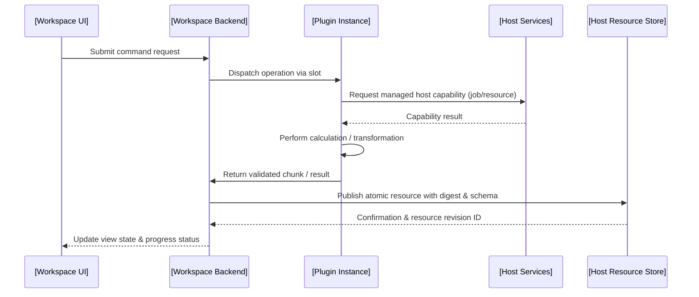

# [System Name] Project Charter

> **System path:** `[repository/root]`
> **Status:** `[Target | Candidate | Implemented | Released]`
> **Last updated:** `[YYYY-MM-DD]`
> **Authority:** This document owns product scope, user research journeys, and system-level outcomes.
> [ARCHITECTURE.md](ARCHITECTURE.md) owns structural rules, runtime topology, and the Five Laws of Spatial Composability;
> [AGENTS.md](../../AGENTS.md) owns contributor workflow and verification standards;
> the owning workspace and plugin `README.md` files own local contracts and implementation state.

---

## 1. System Purpose and Product Boundary

### Purpose

[Describe the high-level system purpose, primary workflows, and delivered user outcomes in 3–5 sentences.
Explain what users achieve, how repeatable results are produced, and how lineage and evidence are preserved.]

### System owns

- [Major workstation responsibility 1]
- [Major workstation responsibility 2]
- [Major workstation responsibility 3]
- [Host runtime coordination, session authentication, catalog discovery, and shared resource custody]

### System does not own

- [External responsibility 1]
- [Third-party responsibility 2]
- [Explicitly unsupported behavior or uncontained execution]

### Primary users / actors

| Actor | Uses the system to | Primary interface |
|---|---|---|
| `[Primary Actor]` | [Primary goal and interaction] | [Web Workstation / CLI] |
| `[Auditor / Reviewer]` | [Verification, inspection, or review goal] | [Web Workstation / Inspector] |
| `[Extension Author]` | [Contribute plugins, custom calculations, or extensions] | [Plugin API / Python Modules] |
| `[Operator / Admin]` | [Administer runtime environment, hardware, or batch jobs] | [CLI / Host Settings] |

---

## 2. Target Workstation Capability Map

The workstation is organized around **Workspaces** for interactive user workflows and **Plugins** for
focused contributions. The Structural Hierarchy and Five Laws of Spatial Composability governing their
boundaries are defined authoritatively in [ARCHITECTURE.md](ARCHITECTURE.md).

### 2.1 Workspace Capability Registry

Workspaces own interactive user workflows and expose declared extension slots.

| Workspace ID | Workspace Name | User Job & Target Outcome | Extension Slots Provided | Host Resources Ingested / Produced | Authoritative README |
|---|---|---|---|---|---|
| `workspace.[workspace_1]` | `[Workspace 1]` | [Primary user job and delivered outcome 1] | `[slot_1]@[version]`<br>`[slot_2]@[version]` | Ingests: `[Resource A]`<br>Produces: `[Resource B]` | `app/workspace/[Workspace_1]/README.md` |
| `workspace.[workspace_2]` | `[Workspace 2]` | [Primary user job and delivered outcome 2] | `[slot_3]@[version]` | Ingests: `[Resource B]`<br>Produces: `[Resource C]` | `app/workspace/[Workspace_2]/README.md` |
| `workspace.[workspace_3]` | `[Workspace 3]` | [Primary user job and delivered outcome 3] | `[slot_4]@[version]` | Ingests: `[Resource C]`<br>Produces: `[Resource D]` | `app/workspace/[Workspace_3]/README.md` |

---

### 2.2 Plugin Extension Families

Plugins contribute focused quantitative capabilities, attaching exclusively to declared workspace slots.

| Extension Family | Owning Workspace | Target Slot | Delivered Capability |
|---|---|---|---|
| `[Category 1]` | `workspace.[workspace_1]` | `[slot_1]@[version]` | [Capability contributed by plugins in this family] |
| `[Category 2]` | `workspace.[workspace_2]` | `[slot_2]@[version]` | [Capability contributed by plugins in this family] |
| `[Category 3]` | `workspace.[workspace_3]` | `[slot_3]@[version]` | [Capability contributed by plugins in this family] |

---

## 3. End-to-End User Workflows

Cross-workspace workflows trace the complete end-to-end user research journey.

### Workflow Registry

| Status | Workflow ID | Research Workflow | Trigger | Workspaces & Slots Involved | Delivered Research Artifact | Integration Test |
|---|---|---|---|---|---|---|
| `[Status]` | `SYS-WF-001` | `[Workflow 1 Name]` | `[Trigger 1]` | `[Workspace 1 → [slot_1] → Workspace 2]` | `[Artifact 1]` | `tests/system/integration/test_[workflow_1].py` |
| `[Status]` | `SYS-WF-002` | `[Workflow 2 Name]` | `[Trigger 2]` | `[Workspace 2 → [slot_2] → Workspace 3]` | `[Artifact 2]` | `tests/system/integration/test_[workflow_2].py` |

---

### `SYS-WF-001` — [Workflow 1 Name]

**Purpose:** [What system-level outcome this workflow delivers.]

**Actor / trigger:** [Who or what starts it, e.g., user action or scheduled event.]

**Input boundary:** [Initial request, command, or parameter set.]

**Output boundary:** [Final persisted resource, report, or published state.]

**Execution sequence:**


```mermaid
sequenceDiagram
    participant UI as [Workspace UI]
    participant WS as [Workspace Backend]
    participant P as [Plugin Instance]
    participant H as [Host Services]
    participant S as [Host Resource Store]

    UI->>WS: Submit command request
    WS->>P: Dispatch operation via slot
    P->>H: Request managed host capability (job/resource)
    H-->>P: Capability result
    P->>P: Perform calculation / transformation
    P->>WS: Return validated chunk / result
    WS->>S: Publish atomic resource with digest & schema
    S-->>WS: Confirmation & resource revision ID
    WS-->>UI: Update view state & progress status
```

**Failure behaviour:**
- [Failure mode 1 at Plugin or Host] $\rightarrow$ [System mitigation / retry policy]
- [Invalid input or schema failure] $\rightarrow$ [Fail closed with typed diagnostic]
- [Storage write failure] $\rightarrow$ [Rollback transaction, retain previous revision]

**Success condition:**
- [Observable state proving that the full workflow completed successfully.]

---

## 4. System-Wide Product Requirements

These requirements apply across all relevant workspaces and plugins:

- **Truthful Outcomes:** Operations distinguish absent, invalid, unsupported, denied, queued, running, partial, failed, and complete states. Missing providers report `UNAVAILABLE` rather than fabricated success.
- **Reproducibility:** A decision-grade output records pinned inputs: document AST revision, data digest, plugin versions, parameter values, execution method, numerical policy, and random seed.
- **No Hidden Substitution:** A missing provider, lower data precision, or altered execution setting cannot silently become a different successful operation.
- **Evidence Preservation:** Deleting a view or clearing a workspace databank does not delete underlying persisted records or raw data.
- **Bounded Operation:** Long-running workflows have finite admission, cancellation, recovery, and resource limits.
- **Safety Defaults:** Live execution and irreversible external mutations are disabled by default and require distinct authorization beyond research qualification.

---

## 5. System State and Persistence Ownership

Persisted state is managed across three explicit levels under the rules in [ARCHITECTURE.md](ARCHITECTURE.md):

| State / Store | Owner Level | Owning Entity | Schema / Version | Read Access | Write Access | Storage Driver | Retention Policy | Notes |
|---|---|---|---|---|---|---|---|---|
| `host_settings` | Host | Host System | `host_settings@1` | Any authorized | Host only | SQLite | Retain | Global application settings |
| `users` / `sessions` | Host | Host Security | `auth_sessions@1` | Authenticated | Host Auth only | SQLite | Session expiry | Operator authentication records |
| `[workspace]_[table]` | Workspace (Optional) | `workspace.[workspace_slug]` | `[schema]@1` | Workspace & permitted consumers | Workspace only | SQLite | Retain | Workspace-owned state |
| `[plugin]_[partition]`| Plugin (Optional) | `plugin.[workspace].[concept]`| `[schema]@1` | Plugin only | Plugin only | SQLite / File | [Policy] | Plugin-owned cache / state |
| `[Workspace]_presets` | Workspace (Optional) | `workspace.[workspace_slug]` | `[schema]@1` | Workspace | Workspace only | JSON (`data/presets/`) | Retain | Search-space & workflow presets |

---

## 6. External Systems and Providers

| External System | Target Adapter / Plugin | Interaction Type | Failure Policy |
|---|---|---|---|
| `[External System 1]` | `[Plugin or Adapter 1]` | [HTTPS / REST / WebSocket] | [Backoff, retry, and failover policy] |
| `[External Service 2]` | `[Plugin or Adapter 2]` | [File / IPC / Socket] | [Timeout, lock handling, and degradation policy] |

---

## 7. System Definition of Done

The system or candidate release is complete only when:

- [ ] Every workspace has an up-to-date `README.md` documenting workflow, actions, slots, and optional persistence.
- [ ] Every concrete plugin complies with the single-file concept rule (**SC-01**).
- [ ] Every file represents a traced feature (`FEAT-*`) and every method represents a traced requirement (`FR-*`).
- [ ] Zero peer imports exist between workspaces or between plugins (**SC-02**, **SC-03**).
- [ ] Workspaces compile and remain interactive when zero plugins are installed.
- [ ] Shared resources are exchanged exclusively via host resource custody (`host.resources@1.0.0`).
- [ ] Full two-terminal parity exists between React UI and CLI workflows.
- [ ] All architectural quality, candidate qualification, and package removal matrix checks pass.
- [ ] All resolved decisions are encoded in authoritative documentation; zero unresolved `Open` decisions block scope.

---

## 8. System Change Process

For every system modification:

```text
1. Update this Project Charter and ARCHITECTURE.md first if product boundaries or structural rules change.
2. Formulate an exact-path implementation plan under .agents/logs/<timestamp>_<task>/implementation-plan.md.
3. Obtain explicit owner approval (APPROVED: EXECUTE) before modifying any source code.
4. Update affected Workspace READMEs and Plugin READMEs.
5. Implement surgical changes strictly within ALLOWED_WRITE_PATHS.
6. Verify locally using change-scoped tests with --no-cov.
7. Run candidate qualification commands (scripts/ci_check.py, typechecks, builds).
8. Generate walkthrough.md summarizing changes, exact commands, and commit proposal.
9. Await explicit owner authorization before committing or merging.
```
