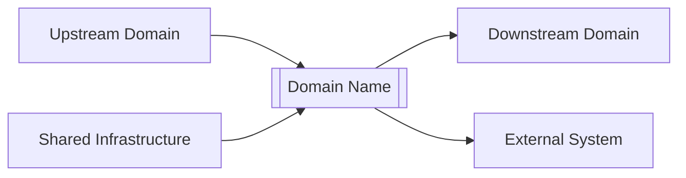
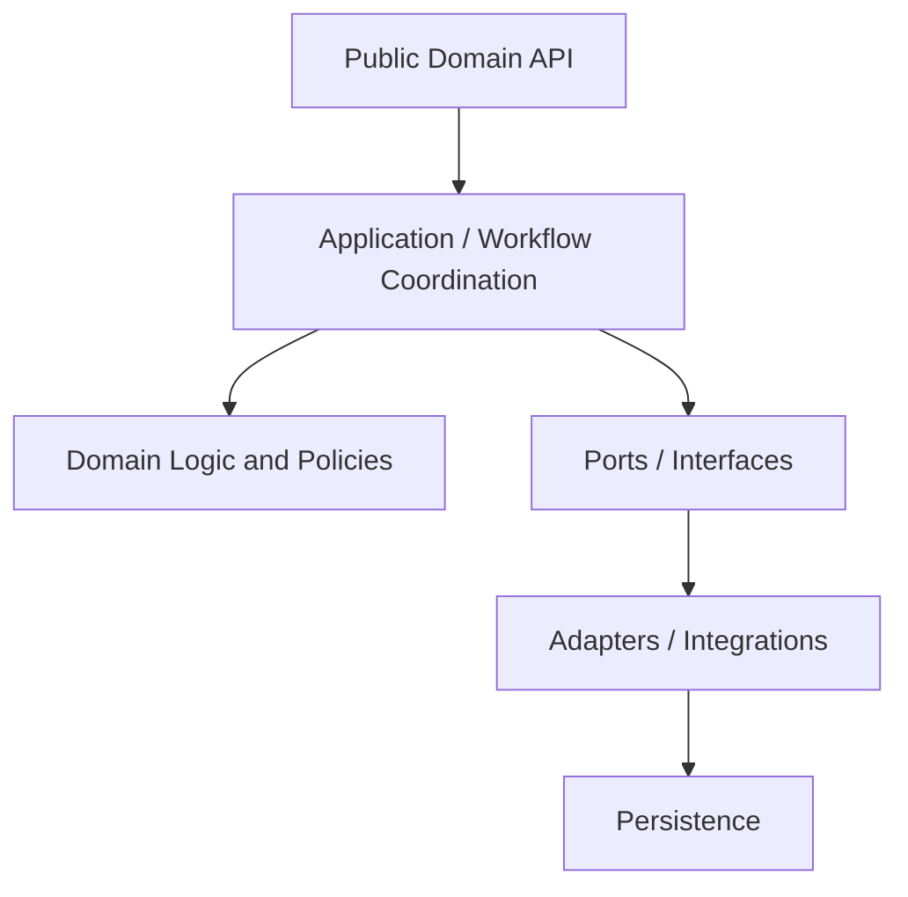
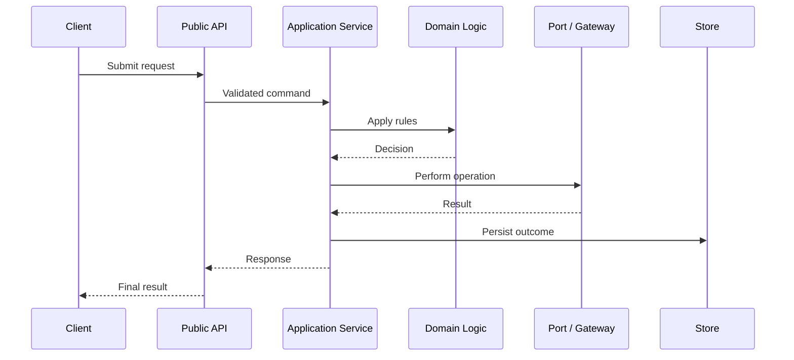
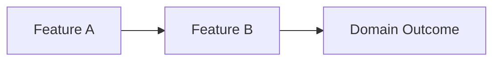

# [Domain Name]

> **Package:** `[app/path/to/domain]`
> **Domain ID:** `[DOM-XXX]`
> **Status:** `[Planned | In Development | Stable | Deprecated]`
> **Owner:** `[Team or owner]`
> **Last updated:** `[YYYY-MM-DD]`

---

## 1. Domain Overview

### 1.1 Purpose

[Explain the business or system purpose of this domain in 2–4 sentences.]

The domain is responsible for:

- [Primary responsibility]
- [Secondary responsibility]
- [Important outcome delivered to the wider system]

### 1.2 Scope

**In scope**

- [Capability owned by this domain]
- [Capability owned by this domain]
- [Data or decisions owned by this domain]

**Out of scope**

- [Responsibility owned by another domain]
- [Unsupported behaviour]
- [Explicit architectural boundary]

### 1.3 System Position

[Explain which domains call this domain and which systems or domains it depends on.]



---

## 2. Architecture and Design Rules

### 2.1 Architecture Summary

[Describe the internal design, major layers, and dependency direction.]



## 3. Feature Catalogue

Create one subsection for every feature or capability owned by this domain.

---

### 3.1 `[FEAT-001]` — [Feature Name]

#### Purpose

[Describe the value provided by this feature.]

#### Scope

**Included**

- [Included behaviour]
- [Included behaviour]

**Excluded**

- [Excluded behaviour]
- [Behaviour owned by another feature or domain]

#### Functional Requirements

| ID               | Requirement                              |
| ---------------- | ---------------------------------------- |
| `FR-[DOM]-001` | The system shall [observable behaviour]. |
| `FR-[DOM]-002` | The system shall [observable behaviour]. |
| `FR-[DOM]-003` | The system shall [observable behaviour]. |

---

#### Non-Functional Requirements

| ID                | Category        | Requirement                                                | Verification      |
| ----------------- | --------------- | ---------------------------------------------------------- | ----------------- |
| `NFR-[DOM]-001` | Performance     | [Latency, throughput, or resource requirement]             | Benchmark         |
| `NFR-[DOM]-002` | Reliability     | [Retry, recovery, durability, or availability requirement] | Integration test  |
| `NFR-[DOM]-003` | Security        | [Authorization, integrity, or confidentiality requirement] | Security test     |
| `NFR-[DOM]-004` | Observability   | [Logging, metrics, tracing, or audit requirement]          | Inspection / test |
| `NFR-[DOM]-005` | Maintainability | [Coverage, complexity, or dependency requirement]          | Static analysis   |

---

#### Workflows

| Workflow ID      | Workflow        | Trigger   | Outcome   | Requirements                       |
| ---------------- | --------------- | --------- | --------- | ---------------------------------- |
| `WF-[DOM]-001` | [Workflow name] | [Trigger] | [Outcome] | `FR-[DOM]-001`, `FR-[DOM]-002` |
| `WF-[DOM]-002` | [Workflow name] | [Trigger] | [Outcome] | `FR-[DOM]-003`                   |

#### Workflow: `[WF-[DOM]-001]` — [Workflow Name]

**Purpose:** [What this workflow accomplishes.]
**Primary actor:** [User, service, event, scheduler, or external system.]
**Trigger:** [What starts the workflow.]

**Preconditions**

- [Required state]
- [Required input, authorization, or dependency]

**Main flow**

1. `[Actor]` submits or emits `[request/event]`.
2. `[Entry point]` validates the request.
3. `[Application service]` coordinates the operation.
4. `[Domain component]` applies the business rules.
5. `[Port or gateway]` performs the external interaction when required.
6. `[Repository]` persists the result when required.
7. The domain returns or publishes `[result/event]`.

**Alternative flows**

- **A1 — [Condition]:** [Alternative behaviour.]
- **A2 — [Condition]:** [Alternative behaviour.]

**Failure flows**

- **F1 — Invalid input:** [Expected handling.]
- **F2 — Dependency failure:** [Expected handling.]
- **F3 — Unknown outcome:** [Expected recovery or reconciliation.]

**Postconditions**

- [Required state after success]
- [Events, outputs, or audit records produced]



#### Configuration and Dependencies

##### Prerequisites

- Python `[version]`
- `uv`
- [External runtime or service]

##### Dependencies

| Dependency            | Type        | Purpose   | Required? |
| --------------------- | ----------- | --------- | --------- |
| `[library]`         | Third-party | [Purpose] | Yes       |
| `[library]`         | Third-party | [Purpose] | Optional  |
| `[internal-domain]` | Internal    | [Purpose] | Yes       |

```bash
uv add [package_name]
```

##### Configuration

| Setting            | Required | Default     | Description   |
| ------------------ | -------: | ----------- | ------------- |
| `[SETTING_NAME]` |      Yes | None        | [Description] |
| `[SETTING_NAME]` |       No | `[value]` | [Description] |

---

#### Public API and Implementation Map

```python
from app.[path].[domain_name] import [PublicClass], [public_function]
```

| Step | Module / File | Type             | Class         | Function / Method | Params                             | Returns           | Raises                         | Responsibility   | Side Effects |
| ---: | ------------- | ---------------- | ------------- | ----------------- | ---------------------------------- | ----------------- | ------------------------------ | ---------------- | ------------ |
|    1 | `[file.py]` | Class            | `[Class A]` |                   |                                    |                   |                                | Responsibility A | None         |
|    2 | `[file.py]` | Function         | `[Class B]` | `[Function B]`  | `[param1: type1, param2: type2]` | `result : type` | `ValueError`: [Condition]    | Responsibility B | None         |
|    3 | `[file.py]` | Model / Protocol | `[Class C]` |                   |                                    |                   | `[DomainError]`: [Condition] | Responsibility C | None         |

---

### 3.2 `[FEAT-002]` — [Feature Name]

> Copy the complete feature structure from Section 4.1 for every additional feature.

---

## 4. Cross-Feature Workflows

Use this section for workflows that coordinate multiple features within the domain.

### 4.1 `[WF-[DOM]-100]` — [Cross-Feature Workflow Name]

**Features involved**

- `[FEAT-001]`
- `[FEAT-002]`

**Requirements covered**

- `FR-[DOM]-001`
- `FR-[DOM]-007`

**Summary**

[Explain how the features collaborate to produce an end-to-end result.]



---

## 5. Package and File Structure

```text
[domain_name]/
├── __init__.py
├── file1.py            # Single Responsibility
├── file2.py            # Single Responsibility
├── file3.py            # Single Responsibility
├── module1/
│   ├── __init__.py
│   ├── file1.py        # Single Responsibility
│   └── file2.py        # Single Responsibility
└── README.md
```

---

## 6. Tests and Usage

```bash
# Unit tests
pytest tests/[domain]/unit

# Workflow tests
pytest tests/[domain]/workflows

# Integration tests
pytest tests/[domain]/integration

# Usage examples tests
pytest tests/[domain]/usage
```

---

## 7. Known Limitations

- [Current limitation]
- [Unsupported scenario]
- [Deferred capability]

---

## 8. Related Documentation

- `[docs/PROJECT.md]`
- `[docs/ARCHITECTURE.md]`
- `[docs/MODULES.md]`
- `[domain requirements document]`
- `[workflow specification]`
- `[API documentation]`
