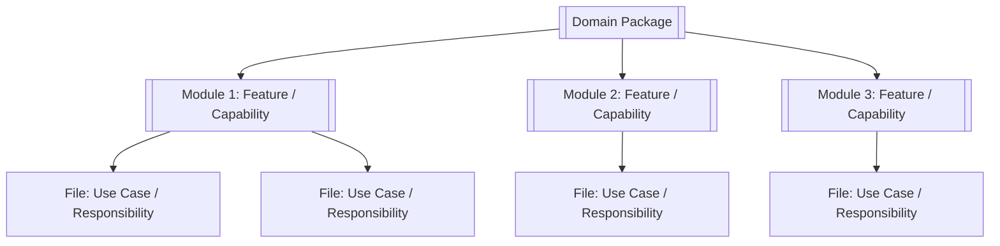
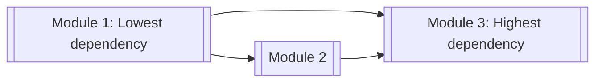
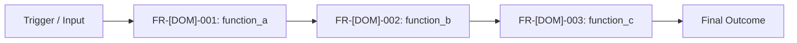
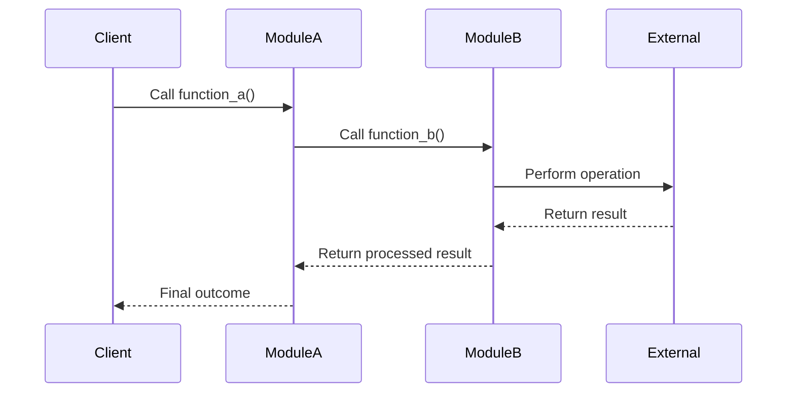

# [Domain Name]

> **Package:** `[app/path/to/package]`  
> **Status:** `[Missing | Partial | Completed]`  
> **Last updated:** `[YYYY-MM-DD]`

> This README is the package's **single source of truth** for requirements, final structure, implementation sequence, progress, usage examples, and tests.  
> Update this file before changing the code.

---

## 1. Purpose and Boundary

### Purpose

[Describe the final outcome this package must deliver in 2–4 sentences.]

### Owns

- [Responsibility owned by this package]
- [Responsibility owned by this package]

### Does not own

- [Responsibility owned by another package]
- [Explicitly unsupported behaviour]

### Shared contracts

Contract definitions must match the name, version, and owner recorded in the top-level system document.

**Owned by this domain** (commands/requests it receives, events/results it produces, channels it provides) — defined authoritatively here:

| Status | Contract | Version | Counterparty | Purpose |
|---|---|---|---|---|
| Missing | `[ContractName]` | `v1` | `[Producing or consuming domain]` | [Purpose] |

**Consumed from other domains** — referenced only, never redefined:

| Contract | Version | Owner | Used for |
|---|---|---|---|
| `[ContractName]` | `v1` | `[Owning domain]` | [How this domain uses it] |

### Persisted state

Only for domains that persist state. Must match the data ownership table in the top-level system document. Only this domain writes this state; other domains read it through this domain's public contracts.

| Status | State / Store | Read access (via contract) | Migration definitions |
|---|---|---|---|
| Missing | `[Table / artifact store]` | `[Consuming domains and contract]` | `[Path or None]` |

### Four-level structure

| Code level | Represents |
|---|---|
| **Package** | Domain |
| **Module folder** | Feature / capability |
| **File** | Use case or focused responsibility |
| **Class / function / method** | Functional requirement behaviour |

```text
Package
└── Module folder
    └── File
        └── Class / Function / Method
```


### Package capability map

This diagram shows the package and its feature modules at a glance.



Replace the placeholders with the real package, module, and file names.

---

## 2. Final Package Structure

Define the intended end state before implementation.

Arrange module folders and files from the **lowest dependency to the highest dependency**. Their order in this README is also their implementation order.

```text
[package_name]/
├── __init__.py
├── README.md
├── [module_1]/                         # Feature: [Feature name]
│   ├── __init__.py                     # Public feature exports
│   ├── [file_1].py                     # Use case: [Responsibility]
│   ├── [file_2].py                     # Use case: [Responsibility]
│   └── [file_3].py                     # Use case: [Responsibility]
└── [module_2]/                         # Feature: [Feature name]
    ├── __init__.py
    └── [file_4].py
```

### Module dependency diagram

This diagram is required. It shows the implementation and dependency direction between feature modules.



Rules:

- Dependencies point from the required module to the module that consumes it.
- The diagram must match the top-to-bottom order of module specifications in Section 4.
- Circular dependencies are not allowed.

### Structure rules

- The package root normally contains only `README.md`, `__init__.py`, and module folders.
- Each module folder represents one feature or capability.
- Each file has one focused responsibility.
- A public class, function, method, or constant represents required public behaviour or data.
- Multiple functional requirements may be implemented in one file when they belong to the same focused responsibility.
- Private helpers are implementation details and do not need requirement IDs unless they provide independently required behaviour.
- Usage examples live under `tests/[domain]/usage/`, not inside the production package.
- Add folders, files, classes, and design patterns only when a real requirement needs them.

---

## 3. Workflows

Workflows show how public functions collaborate to deliver real value. They are behaviour descriptions, not an additional structural level.

This section includes:

- **Internal workflows:** Completed entirely inside this domain.
- **Cross-domain workflows:** Workflows where this domain receives input from, or sends output to, another domain.

For cross-domain workflows, document only this domain's participation:

```text
Input boundary
→ this domain's responsibilities
→ output boundary
```

Do not duplicate the internal implementation of other domains. The full multi-domain workflow may be documented in top-level system documentation when required.

### Status values

| Status | Meaning |
|---|---|
| **Missing** | Not implemented or not verified |
| **Partial** | Partly implemented or tests are incomplete |
| **Completed** | Implemented, tested, and verified |

### Workflow scope values

| Scope | Meaning |
|---|---|
| **Internal** | The complete workflow occurs within this domain. |
| **Cross-domain** | This domain participates in a wider workflow involving other domains. |

| Status | Workflow ID | Scope | Workflow | Trigger / Input boundary | Final outcome / Output boundary | Requirement sequence |
|---|---|---|---|---|---|---|
| Missing | `WF-[DOM]-001` | Internal | [Workflow name] | [Internal trigger] | [Observable result] | `FR-[DOM]-001 → FR-[DOM]-002` |
| Missing | `WF-[DOM]-002` | Cross-domain | [Workflow name] | [Input received from another domain] | [Output returned or published to another domain] | `FR-[DOM]-003 → FR-[DOM]-004` |

### `WF-[DOM]-001` — [Workflow Name]

**Scope:** `[Internal | Cross-domain]`

**System workflow:** [`SYS-WF-*` ID(s) from the top-level system document this workflow participates in, or `None` for internal workflows.]

**Input boundary:** [What enters this domain and where it comes from. Use `Internal` when not applicable.]

**Output boundary:** [What leaves this domain and where it goes. Use `Internal` when not applicable.]

1. `[function_a()]` receives or retrieves [input].
2. `[function_b()]` validates or transforms [input].
3. `[function_c()]` performs [main action].
4. The package returns, stores, or publishes [result].

**Failure behaviour:**

- [Condition] → [Expected response]
- [Condition] → [Expected response]

**Integration test:**  
`tests/[domain]/integration/test_[workflow_name].py::test_[workflow_name]_[scenario]()`

#### End-to-end workflow diagram

Use a flowchart for a straightforward workflow:



Use a sequence diagram when interactions, responses, or external dependencies are important:



The diagram must show how the functional requirements collaborate.

For a cross-domain workflow:

- cite the `SYS-WF-*` ID(s) it participates in;
- show the external domain only at the input or output boundary;
- fully describe only this domain's functions and responsibilities;
- do not describe another domain's internal steps.

> Add detailed steps only for workflows involving multiple functions or files.  
> A simple one-function use case needs only a row in the workflow table.

---

## 4. Module and Requirement Specifications

This section is also the implementation plan.

Apply these ordering rules:

1. Arrange module sections by dependency order.
2. Inside each module, arrange file rows by dependency order.
3. Inside each file, arrange functional requirements by dependency or execution order.
4. Implement from the top of this section downward.

Copy the following module block once for every module folder.

---

### 4.1 `[module_name]/` — [Feature / Capability]

**Purpose:** [Describe the single capability this module provides.]

**Module flow:**

```text
[input]
  → [file_a.function_a()]
  → [file_b.function_b()]
  → [result]
```

### Files

List files in implementation order.

| Status | File | Responsibility | Key exports | Dependencies |
|---|---|---|---|---|
| Missing | `[file_a].py` | [Single focused responsibility] | `[function_a]`, `[ClassA]`, `[CONSTANT_A]` | **Standard library:** `[decimal, datetime]`<br>**Required third-party:** `[pandas]`<br>**Local:** None |
| Missing | `[file_b].py` | [Single focused responsibility] | `[function_b]` | **Standard library:** `[typing]`<br>**Required third-party:** `[MetaTrader5]`<br>**Local:** `[file_a].py → function_a` |
| Missing | `__init__.py` | Expose the supported public feature API | `[function_a]`, `[ClassA]`, `[function_b]` | **Standard library:** None<br>**Required third-party:** None<br>**Local:** `[file_a].py → function_a, ClassA`; `[file_b].py → function_b` |

### Dependency writing format

Always list dependencies in this order:

```text
Standard library: [library names or None]
Required third-party: [library names or None]
Local: [file/module → imported class, function, or constant]
```

Example:

```text
Standard library: decimal, dataclasses
Required third-party: pandas
Local: validation.py → validate_order; models.py → OrderRequest
```

Do not list optional or unused imports.

### Configuration and Limits Manifest

Configuration and limits belong to the feature module that owns and enforces them.

| Status | Setting / Limit | Type | Default | Required | Used by | Description |
|---|---|---|---|---|---|---|
| Missing | `[SETTING_NAME]` | `[str]` | `None` | Yes | `[Class.method()]` | [Purpose and enforced behaviour] |
| Missing | `[MAX_LIMIT]` | `[Decimal]` | `[value]` | Yes | `[function_a()]` | [Maximum permitted value and failure behaviour] |
| Missing | `[TIMEOUT_SECONDS]` | `[float]` | `[5.0]` | No | `[function_b()]` | [Operation timeout] |
| Missing | `[ENABLE_FEATURE]` | `[bool]` | `False` | No | `[PublicClass]` | [Whether this feature is enabled] |

Rules:

- Define each feature-specific setting or limit once in this manifest.
- Use the exact code constant, environment variable, or configuration field name.
- `Used by` identifies the public classes, functions, or methods that consume or enforce it.
- A limit must state what happens when it is exceeded.
- Shared settings used by several modules belong in Section 5 as package-wide requirements or configuration.
- Change a row to `Completed` only after the setting exists, is validated, and has tests.

---

#### `[file_a].py` — [Use Case / Focused Responsibility]

**File responsibility:** [One sentence describing why this file exists.]

| Status | Requirement ID | Responsibility | Class / Function / Method | Side Effects | Raises | Usage / Test |
|---|---|---|---|---|---|---|
| Missing | `FR-[DOM]-001` | The system shall [perform one observable behaviour]. | `[function_a](arg: Type) -> ResultType` | `[Side-effect label from the list below]` | `[Error]`: [condition] | **Usage:** `tests/[domain]/usage/test_usage_[module_name].py::test_usage_[file_a]_[function_a]()`<br>**Unit:** `tests/[domain]/unit/test_[file_a].py::test_[function_a]_[scenario]()` |
| Missing | `FR-[DOM]-002` | The system shall [perform one observable behaviour]. | `[ClassA.method](arg: Type) -> ResultType` | `[Side effect or None]` | `[Error]`: [condition] | **Usage:** `tests/[domain]/usage/test_usage_[module_name].py::test_usage_[file_a]_[method]()`<br>**Unit:** `tests/[domain]/unit/test_[file_a].py::test_[method]_[scenario]()` |
| Missing | `FR-[DOM]-003` | The system shall expose [required public constant or contract]. | `[CONSTANT_A]: Type` | `None` | None | **Usage:** `tests/[domain]/usage/test_usage_[module_name].py::test_usage_[file_a]_[constant_a]()`<br>**Unit:** `tests/[domain]/unit/test_[file_a].py::test_[constant_a]_[scenario]()` |

### Side-effect values

Use the smallest accurate label:

```text
None
Read-only
Local state mutation
Persistence write
External API call
Broker mutation
Event publication
```

Combine labels only when necessary, for example: `Broker mutation; persistence write`.

**Rules:**

- [Validation, business, security, or failure rule]
- [Important guarantee or side effect]
- [Boundary that this file must preserve]

**Implementation notes:**

- [Minimal technical direction needed to implement correctly]
- [Existing component that must be reused]
- [Constraint that prevents duplication or unnecessary abstraction]

---

#### `[file_b].py` — [Use Case / Focused Responsibility]

**File responsibility:** [One sentence describing why this file exists.]

| Status | Requirement ID | Responsibility | Class / Function / Method | Side Effects | Raises | Usage / Test |
|---|---|---|---|---|---|---|
| Missing | `FR-[DOM]-004` | The system shall [perform one observable behaviour]. | `[function_b](arg: Type) -> ResultType` | `[Side effect or None]` | `[Error]`: [condition] | **Usage:** `tests/[domain]/usage/test_usage_[module_name].py::test_usage_[file_b]_[function_b]()`<br>**Unit:** `tests/[domain]/unit/test_[file_b].py::test_[function_b]_[scenario]()` |

**Rules:**

- [Rule]
- [Rule]

**Implementation notes:**

- [Minimal technical direction]

---

### Feature usage examples

Keep all public feature examples under:

```text
tests/[domain]/usage/
└── test_usage_[module_name].py
```

Use one example function for each public functional requirement, named `test_usage_*` so pytest collects it:

```python
def test_usage_[file_a]_[function_a]() -> None:
    """Demonstrate FR-[DOM]-001."""
    ...


def test_usage_[file_a]_[method]() -> None:
    """Demonstrate FR-[DOM]-002."""
    ...


def test_usage_[file_b]_[function_b]() -> None:
    """Demonstrate FR-[DOM]-004."""
    ...
```

Example functions must:

- be independently runnable;
- import only the documented public feature API;
- demonstrate one functional requirement;
- show realistic input and the expected result;
- avoid duplicating implementation logic;
- be collected and executed by pytest (`test_usage_*` naming guarantees this).

---

### 4.2 `[module_name]/` — [Feature / Capability]

> Copy Section 4.1 for every additional module folder.  
> Place this module after every module it depends on.

---

## 5. Package-Wide Requirements and Shared Configuration

Use this section only for requirements, settings, or limits that apply across multiple modules.

For shared configuration, use the same manifest columns as the module-level Configuration and Limits Manifest.

| Status | Requirement ID | Type | Responsibility | Verification |
|---|---|---|---|---|
| Missing | `NFR-[DOM]-001` | Maintainability | Every file shall have one focused responsibility. | Structure review |
| Missing | `NFR-[DOM]-002` | API boundary | Other packages shall use only documented public exports. | Import tests |
| Missing | `NFR-[DOM]-003` | Testing | Automated tests shall cover every public functional requirement. | Test audit |
| Missing | `NFR-[DOM]-004` | Performance | [Performance requirement.] | Benchmark |
| Missing | `NFR-[DOM]-005` | Security | [Security requirement.] | Security test |
| Missing | `NFR-[DOM]-006` | Reliability | [Reliability requirement.] | Failure-path test |

---

## 6. Open Decisions

Use this section only for unresolved choices that would otherwise force the implementing agent to guess.

| Status | Decision | Options / Notes |
|---|---|---|
| Open | [Decision still required] | [Available options, constraints, or missing information] |
| Resolved | [Decision already made] | [Chosen approach and short reason] |

Rules:

- `Open` means implementation of the affected requirement must not begin.
- `Resolved` records the final choice briefly.
- A decision affecting more than one domain must be escalated to the Open Decisions section of the top-level system document (where it is resolved with an ADR) — record only a reference to it here.
- Remove obsolete decisions instead of building a large historical decision log.
- Do not add an entry when the README already defines the answer clearly.

---

## 7. Tests and Definition of Done

### Test and usage locations

```text
tests/[domain]/
├── unit/                         # Individual functions, methods, classes, and files
├── integration/                  # Module and end-to-end workflow collaboration
└── usage/                        # Runnable public usage examples
```

### Commands

```bash
uv run ruff check app/[path]/[package]
uv run ruff format --check app/[path]/[package]
uv run mypy app/[path]/[package]

uv run pytest tests/[domain]/unit
uv run pytest tests/[domain]/integration
uv run pytest tests/[domain]/usage

uv run pytest tests/[domain]   --cov=app/[path]/[package]   --cov-fail-under=80
```

### Required test levels

- **Unit:** Verify each `FR-*` requirement and each file's failure paths.
- **Integration:** Verify feature workflows and important workflows across module boundaries.
- **Usage:** Run every documented public usage example as a test.

### Package completion checklist

- [ ] The actual package tree matches Section 2.
- [ ] Module sections and file rows remain arranged in dependency order.
- [ ] Every module folder represents one coherent feature.
- [ ] Every file has one focused responsibility.
- [ ] Every requirement table has a status of `Completed`.
- [ ] Every workflow has a status of `Completed` and an integration test under `tests/[domain]/integration` when collaboration is involved.
- [ ] Every package-wide requirement has a status of `Completed`.
- [ ] Every public export is listed under `Key exports`.
- [ ] Contracts owned by this domain match the top-level system document (name, version, owner).
- [ ] Persisted state matches the top-level data ownership table; no other domain's state is written.
- [ ] Every dependency is documented in the required order.
- [ ] Every public functional requirement has one example under `tests/[domain]/usage` and at least one unit test under `tests/[domain]/unit`.
- [ ] No undocumented public class, function, method, or constant exists.
- [ ] No planned file or public export is missing.
- [ ] No unresolved `Open` decision affects completed requirements.
- [ ] No unnecessary abstraction was introduced.
- [ ] All tests and quality checks pass.

---

## 8. Change Process

For every future change:

```text
1. Update this README first.
2. Add or change the workflow when system behaviour changes.
3. Resolve or record any decision that would otherwise require guessing.
4. Add or change the functional requirement row, including Side Effects.
5. Update the file's key exports and dependencies.
6. Reorder modules or files if dependency order changes.
7. Implement the smallest code change.
8. Add or update the usage example.
9. Add or update tests.
10. Change Status to Completed only after verification passes.
```

This keeps requirements, dependency order, implementation, usage examples, tests, and final documentation aligned in one file.
