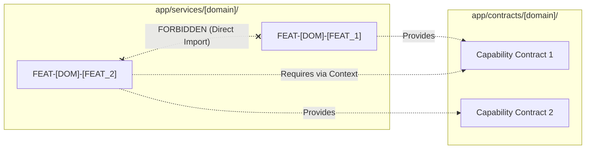
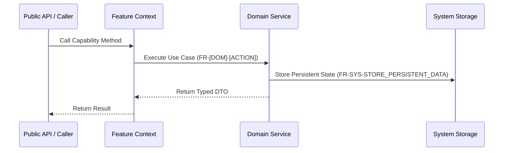

# [Domain Name]

> **Package:** `app/services/[domain]`
> **Status:** `[Missing | Partial | Completed]`
> **Last updated:** `[YYYY-MM-DD]`

> This README is the domain package's **single source of truth** for domain boundaries, composable feature capabilities, architecture invariants, implementation sequence, progress, usage examples, and tests.
> Update this document before modifying or adding code.

---

## 1. Purpose and Boundary

### Purpose

[Describe the high-level purpose and business outcome this domain delivers in 2–4 sentences.]

### Owns

- [Core domain responsibility / business capability]
- [Core domain responsibility / business capability]

### Does not own

- [Responsibility owned by another domain package]
- [Explicitly unsupported behaviour or external concern]

### Shared Contracts

Contracts define the domain's public API and event types. In accordance with architectural invariants, all contracts live in `app/contracts/[domain]/` outside removable feature implementation packages:

**Owned by this domain** (interfaces, DTOs, and typed events provided by this domain):

| Status | Capability / Event | Protocol / DTO Symbol | Version | Purpose |
|---|---|---|---|---|
| Missing | `[domain].[capability-name]@1` | `[ProtocolName]` | `1` | [Primary capability purpose] |
| Missing | `[domain].[event-name]` | `[EventDTO]` | `1` | [Domain event notification] |

**Consumed from other domains** (capabilities and events required or optionally consumed from other domains):

| Capability / Event | Owning Domain | Required / Optional | Consuming Feature | Used For |
|---|---|---|---|---|
| `[domain].[capability-name]@1` | `[owning_domain]` | Required | `FEAT-[DOMAIN]-[VERB_ADJECTIVE]` | [Purpose] |
| `[domain].[capability-name]@1` | `[owning_domain]` | Optional | `FEAT-[DOMAIN]-[VERB_ADJECTIVE]` | [Purpose] |

### Persisted State Ownership

Persisted state partitions are owned exclusively by features in this domain. External domains access state only via public capability contracts:

| Status | State Namespace | Owning Feature | Driver | Retention Policy | Read Access (via Contract) |
|---|---|---|---|---|---|
| Missing | `[domain].[feature_partition]` | `FEAT-[DOMAIN]-[VERB_ADJECTIVE]` | `sqlite` | `retain` | `[Consuming domains via capability]` |

---

### Four-Level Structural Hierarchy

| Code Level | Represents | Example |
|---|---|---|
| **Package** | Domain Package | `app/services/data/` |
| **Module Folder** | Composable Feature Package | `app/services/data/historical_bars/` (`FEAT-DATA-RETRIEVE_BARS`) |
| **File** | Lifecycle / Manifest / Use Case | `manifest.py`, `feature.py`, `config.py`, `retrieve.py` |
| **Class / Function / Method** | Functional Requirement Behavior | `FR-DATA-RETRIEVE_BARS` (`HistoricalBarsService.retrieve()`) |

```text
app/services/[domain]/
├── __init__.py                                     # Pure docstring only (ARCH-001)
├── README.md                                       # Domain architecture & capability catalog
└── [feature_folder]/                              # Feature: FEAT-[DOMAIN]-[VERB_ADJECTIVE]
    ├── __init__.py                                 # Pure docstring only (ARCH-001)
    ├── README.md                                   # Feature-level specification (Section 24)
    ├── manifest.py                                 # FeatureSpec (SPEC) declaration
    ├── config.py                                   # Typed config schema with .from_dict()
    ├── feature.py                                  # Feature lifecycle (mount/unmount)
    ├── [use_case_1].py                             # Focused business use case / responsibility
    └── [use_case_2].py                             # Focused business use case / responsibility
```

### Domain Capability Map

```mermaid
flowchart TD
    DOMAIN[[Domain: app/services/[domain]]]

    DOMAIN --> FEAT1[["FEAT-[DOM]-[FEAT_1]<br>(Provides: dom.cap1@1)"]]
    DOMAIN --> FEAT2[["FEAT-[DOM]-[FEAT_2]<br>(Provides: dom.cap2@1)"]]

    FEAT1 --> M1[manifest.py / config.py / feature.py]
    FEAT1 --> F1[use_case_a.py: FR-[DOM]-[VERB_1]]
    FEAT1 --> F2[use_case_b.py: FR-[DOM]-[VERB_2]]

    FEAT2 --> M2[manifest.py / config.py / feature.py]
    FEAT2 --> F3[use_case_c.py: FR-[DOM]-[VERB_3]]
```

---

## 2. Final Package Structure & Feature Independence

Feature modules inside a domain must be **completely independent and physically removable**:

1. **No Inter-Feature Imports:** Feature A must never import Feature B directly (enforced by `ARCH-006` and Import Linter).
2. **Contract-Only Communication:** If Feature A needs capabilities from Feature B, it declares a dependency on `FeatureSpec.requires` and resolves it via `context.require(CAPABILITY_KEY)`.
3. **Init Purity:** All `__init__.py` files contain docstrings only — no executable code or imports (`ARCH-001`).

```text
app/services/[domain]/
├── __init__.py
├── README.md
├── [feature_1]/                                    # FEAT-[DOMAIN]-[FEAT_1]
│   ├── __init__.py
│   ├── README.md
│   ├── manifest.py
│   ├── config.py
│   ├── feature.py
│   └── [use_case_1].py
└── [feature_2]/                                    # FEAT-[DOMAIN]-[FEAT_2]
    ├── __init__.py
    ├── README.md
    ├── manifest.py
    ├── config.py
    ├── feature.py
    └── [use_case_2].py
```

### Feature Capability Dependency Direction

Feature dependencies are resolved at runtime through the Composition Engine and Service Registry, pointing strictly towards contracts:


```mermaid
flowchart LR
    subgraph Contracts ["app/contracts/[domain]/"]
        CAP1["Capability Contract 1"]
        CAP2["Capability Contract 2"]
    end

    subgraph Domain ["app/services/[domain]/"]
        FEAT1["FEAT-[DOM]-[FEAT_1]"]
        FEAT2["FEAT-[DOM]-[FEAT_2]"]
    end

    FEAT1 -.->|"Provides"| CAP1
    FEAT2 -.->|"Provides"| CAP2
    FEAT2 -.->|"Requires via Context"| CAP1
    FEAT2 x-.-x|"FORBIDDEN (Direct Import)"| FEAT1
```

---

## 3. Workflows

Workflows describe how functional requirements collaborate to deliver end-to-end domain outcomes.

### Workflow Scope Values

| Scope | Meaning |
|---|---|
| **Internal** | Complete workflow executes within this domain's features. |
| **Cross-Domain** | Initiated by external events/API and coordinates across domains via contracts. |

| Status | Workflow ID | Scope | Workflow | Input Boundary | Output Boundary | Requirement Sequence |
|---|---|---|---|---|---|---|
| Missing | `WF-[DOM]-[VERB_1]` | Internal | [Workflow name] | [Internal trigger / call] | [Observable result] | `FR-[DOM]-[ACTION_1] → FR-[DOM]-[ACTION_2]` |
| Missing | `WF-[DOM]-[VERB_2]` | Cross-Domain | [Workflow name] | [Contract invocation from external API] | [Event published / Persisted state] | `FR-[DOM]-[ACTION_3] → FR-[DOM]-[ACTION_4]` |

### `WF-[DOM]-[VERB_1]` — [Workflow Name]

**Scope:** `[Internal | Cross-Domain]`

**Input Boundary:** [What enters this domain and where it comes from]
**Output Boundary:** [What leaves this domain and where it goes]

1. `[service.method()]` receives or retrieves [input].
2. `[validate_request()]` enforces validation rules (`FR-[DOM]-[VALIDATE_INPUT]`).
3. `[use_case.execute()]` coordinates business transformation (`FR-[DOM]-[EXECUTE_ACTION]`).
4. Context publishes typed event `[DomainEventDTO]` to the event bus.

**Failure Behaviour:**
- [Invalid input condition] → Raises `ValueError`
- [Missing dependency] → Feature transitions to `BLOCKED`


```mermaid
sequenceDiagram
    participant API as Public API / Caller
    participant Feature as Feature Context
    participant Service as Domain Service
    participant Storage as System Storage

    API->>Feature: Call Capability Method
    Feature->>Service: Execute Use Case (FR-[DOM]-[ACTION])
    Service->>Storage: Store Persistent State (FR-SYS-STORE_PERSISTENT_DATA)
    Service-->>Feature: Return Typed DTO
    Feature-->>API: Return Result
```

---

## 4. Composable Feature Specifications

Every feature folder represents an isolated, composable, and physically removable unit.

Copy the following specification block for each feature module in this domain:

---

### 4.1 `[feature_folder]/` — `FEAT-[DOMAIN]-[VERB_ADJECTIVE]`

> **Feature ID:** `FEAT-[DOMAIN]-[VERB_ADJECTIVE]`
> **Domain:** `[domain]`
> **Status:** `[Missing | Partial | Completed]`

#### Purpose

[Describe the single capability and business purpose this feature provides in 2–3 sentences.]

#### Capability Declarations

- **Provides:**
  - `[domain].[capability-name]@1`
- **Required Capabilities:**
  - `[other-domain].[capability-name]@1` (or `None (root provider)`)
- **Optional Capabilities:**
  - `system.metrics@1`
  - `data.bar-cache@1`

#### Feature Configuration & Limits Manifest

Defined in `config.py` as a validated dataclass with `.from_dict()`:

| Status | Setting / Limit | Type | Default | Required | Description |
|---|---|---|---|---|---|
| Missing | `[setting_name]` | `str` | `"default_val"` | No | [Purpose and default value] |
| Missing | `[max_limit]` | `Decimal` | `[value]` | Yes | [Maximum threshold and violation rule] |

#### Runtime Effects & Scope Disposal

All runtime effects are owned by `FeatureScope` and automatically disposed upon unmount:

| Effect | Owner | Disposal Mechanism |
|---|---|---|
| `[CapabilityProtocol]` service binding | `FEAT-[DOMAIN]-[VERB_ADJECTIVE]` | Unregister capability from registry |
| Background worker task | `FEAT-[DOMAIN]-[VERB_ADJECTIVE]` | Cancel and await task completion |
| Event bus listener | `FEAT-[DOMAIN]-[VERB_ADJECTIVE]` | Unsubscribe listener from EventBus |

#### Persistent State Ownership

- **Namespace Partition:** `[domain].[feature_name]`
- **Schema Version:** `1`
- **Retention Policy:** `retain` (state remains on disk / SQLite across unmount/remount)
- **Purge Policy:** `explicit`

#### Feature Package Structure & Files

| Status | File | Responsibility | Key Exports / Implementing Symbols | Dependencies |
|---|---|---|---|---|
| Missing | `manifest.py` | Declare `FeatureSpec` (`SPEC`) | `SPEC`, `FEATURE_ID` | Standard: None<br>Contracts: `[CAPABILITY_KEY]`<br>Kernel: `FeatureSpec`, `CapabilityKey` |
| Missing | `config.py` | Validate feature configuration schema | `[FeatureConfig]` | Standard: `dataclasses`, `typing`<br>Contracts: None |
| Missing | `feature.py` | Implement `Feature` protocol (`mount`/`unmount`) | `[FeatureClass]`, `create_feature()` | Standard: `typing`<br>Kernel: `FeatureContext`, `FeatureScope` |
| Missing | `[use_case_1].py` | Execute core business logic | `[UseCaseService]` | Standard: `datetime`, `decimal`<br>Contracts: `[DTOs]` |
| Missing | `README.md` | Feature-level specification | None | Markdown documentation |

#### Functional Requirements (FR)

| Status | Requirement ID | Responsibility | Implementing Symbol | Side Effects | Raises | Usage / Test |
|---|---|---|---|---|---|---|
| Missing | `FR-[DOM]-VALIDATE_CONFIG` | Validate feature configuration parameters | `[FeatureConfig].from_dict()` | None | `ValueError`: invalid config | **Unit:** `tests/services/[domain]/[feature]/test_config.py` |
| Missing | `FR-[DOM]-[ACTION_1]` | The system shall [perform observable action] | `[function_name](...) -> DTO` | `None` (pure) | `ValueError`: invalid input | **Unit:** `tests/services/[domain]/[feature]/test_[use_case].py`<br>**Usage:** `tests/[domain]/usage/test_usage_[feature].py` |
| Missing | `FR-[DOM]-[ACTION_2]` | The system shall [persist state / coordinate] | `[Service.execute](...) -> Result` | `Persistence write` | `RuntimeError`: failed storage | **Unit:** `tests/services/[domain]/[feature]/test_[use_case].py` |

#### Failure Behaviour

- **Missing Required Dependency:** Feature fails readiness check and transitions to `BLOCKED`.
- **Optional Dependency Unavailable:** Feature operates in degraded fallback mode (e.g. bypasses caching).
- **Mount Error:** Unwinds all partial registrations immediately and transitions to `FAILED_START`.

#### Removal Behaviour

Physically removing or disabling this feature unbinds `[domain].[capability-name]@1`. Downstream consumers requiring this capability transition cleanly to `BLOCKED` without runtime crashes.

---

### Feature Usage Examples

Usage tests demonstrate public capability usage under `tests/[domain]/usage/`:

```python
# tests/[domain]/usage/test_usage_[feature].py
import pytest
from app.contracts.[domain].[contract_file] import [CapabilityKey], [RequestDTO]

@pytest.mark.asyncio
async def test_usage_[feature]_[action](api: HaruQuantAPI) -> None:
    """Demonstrate FR-[DOM]-[ACTION_1] usage through capability API."""
    service = api.[domain].get_[capability]()
    result = await service.[method]([RequestDTO](...))
    assert result is not None
```

---

## 5. Non-Functional Requirements & Architecture Invariants

| Status | Requirement ID | Category | Rule & Architectural Constraint | Verification Method |
|---|---|---|---|---|
| Missing | `ARCH-001` | Init Purity | All `__init__.py` files contain docstrings only; no imports or code. | `scripts/architecture_check.py` |
| Missing | `ARCH-002` | Managed Tasks | Coroutines are spawned exclusively via `FeatureContext.spawn()`. | `scripts/architecture_check.py` |
| Missing | `ARCH-003` | Logging Hygiene | No root `logging.basicConfig()` calls in service packages. | `scripts/architecture_check.py` |
| Missing | `ARCH-004` | Contract Purity | Contracts live exclusively in `app/contracts/` and have no service dependencies. | Import Linter & AST |
| Missing | `ARCH-005` | API Purity | Public API facade does not directly import service implementations. | Import Linter & AST |
| Missing | `ARCH-006` | Feature Independence | Features never import other features directly. | Import Linter & AST |
| Missing | `NFR-[DOM]-001` | Maintainability | Every file has exactly one focused responsibility. | Code Review & AST |
| Missing | `NFR-[DOM]-002` | Type Safety | Python 3.14 strict typing with zero `type: ignore` bypasses. | `mypy` |
| Missing | `NFR-[DOM]-003` | Test Coverage | Comprehensive branch and line test coverage $\ge 80\%$. | `pytest --cov` |

---

## 6. Open Decisions

Use this section only for unresolved architectural choices that would otherwise require guessing:

| Status | Decision ID | Decision Required | Options / Constraints | Impacted Features |
|---|---|---|---|---|
| Closed | `DEC-[DOM]-001` | [Resolved decision description] | [Chosen option and rationale] | `FEAT-[DOM]-[FEAT_1]` |

---

## 7. Tests and Definition of Done

### Test Suite Structure

```text
tests/
├── services/[domain]/[feature]/           # Feature-level unit & use case tests (Category A)
│   ├── test_config.py                     # FR-[DOM]-VALIDATE_CONFIG
│   ├── test_manifest.py                   # FeatureSpec verification
│   ├── test_feature.py                    # Mount / Unmount lifecycle
│   └── test_[use_case].py                 # Core business algorithms & failure paths
├── services/test_feature_contracts.py     # Generic feature contract test suite (Category B)
├── services/test_lifecycle_leak.py        # Lifecycle leak & 100x churn suite (Category C)
├── api/test_[domain]_api.py               # Public API facade & capability tests
└── [domain]/usage/                        # Executable usage tests
```

### Commands

```bash
# 1. Format and lint
uv run ruff format .
uv run ruff check .

# 2. Strict type check (Python 3.14)
uv run mypy

# 3. Architecture & import contracts
uv run lint-imports
uv run python scripts/architecture_check.py

# 4. Feature physical removability test (Category D)
uv run python scripts/verify_feature_removal.py FEAT-[DOMAIN]-[VERB_ADJECTIVE]

# 5. Full CI Quality Gate (all tests + coverage >= 80%)
uv run python scripts/ci_check.py
```

### Feature Definition of Done Checklist (Section 23)

A feature within this domain is not complete until all 18 criteria are verified:

- [ ] 1. **Stable Feature ID:** Declares a permanent ID conforming to `FEAT-[DOMAIN]-[VERB_ADJECTIVE]`.
- [ ] 2. **Single Domain Ownership:** Belongs to exactly one domain.
- [ ] 3. **Cohesive Capability Set:** Provides one cohesive capability or closely related capability set.
- [ ] 4. **External Contracts:** All contracts live outside feature package in `app/contracts/[domain]/`.
- [ ] 5. **Declared Dependencies:** Required and optional capabilities declared in `FeatureSpec`.
- [ ] 6. **Zero Feature Imports:** Never imports another feature implementation directly (`ARCH-006`).
- [ ] 7. **Zero Import-Time I/O:** Performs no I/O, database access, or registration during module import.
- [ ] 8. **Scoped Runtime Effects:** Every service binding, task, and listener registered through `FeatureContext`.
- [ ] 9. **Mount Rollback:** Mount failure cleanly unwinds all partial effects without leaking state.
- [ ] 10. **Idempotent Unmount:** `unmount()` and `scope.close()` are completely safe when called repeatedly.
- [ ] 11. **Required-Dependency Loss Tested:** Feature transitions to `BLOCKED` if required capability is absent.
- [ ] 12. **Optional-Dependency Loss Tested:** Feature runs in degraded mode when optional capability is absent.
- [ ] 13. **Persistent State Documented:** State namespace partition, schema version, and retention policy documented.
- [ ] 14. **Irreversible Action Safety:** Idempotency, reconciliation, and audit persistence verified.
- [ ] 15. **Starts Feature-Absent:** Application starts and operates cleanly with the feature deleted from disk.
- [ ] 16. **API / UI Degradation Handled:** Public API facade raises `CapabilityUnavailableError` when feature is absent.
- [ ] 17. **README Complete:** README documents purpose, capability, dependencies, effects, state, and removal behavior.
- [ ] 18. **Quality Gates Green:** Ruff, Mypy, Import Linter, AST Invariants, and Pytest pass with $\ge 80\%$ coverage.

---

## 8. Change Process

For any future modification:

```text
1. Update this domain README or feature specification first.
2. If contracts change, update app/contracts/[domain]/ and bump capability major version if breaking.
3. Update FeatureSpec in manifest.py (requires, optional, provides).
4. Update config schema in config.py if settings change.
5. Implement minimal code changes within the focused use case file.
6. Add or update unit tests under tests/services/[domain]/[feature]/.
7. Verify physical removability with scripts/verify_feature_removal.py.
8. Execute uv run python scripts/ci_check.py to confirm all 6 quality gates pass 100%.
```
