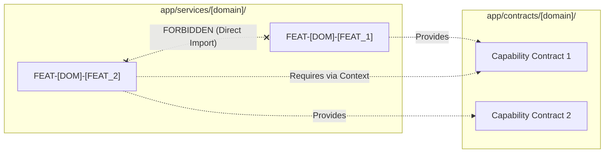
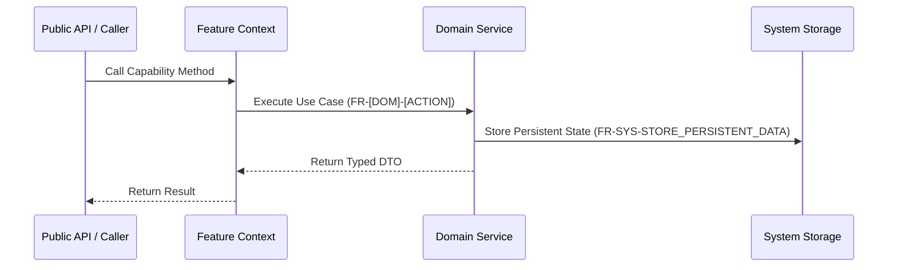

# [Domain Name]

> **Package:** `app/services/[domain]/`
> **Status:** `[Missing | Partial | Implemented]`
> **Last updated:** `[YYYY-MM-DD]`
> **Domain ID:** `D-[DOMAIN]`

> This README is the domain package's **single source of truth** for domain boundaries, composable feature capabilities, architecture invariants, implementation sequence, progress, usage examples, and tests.
> Update this document before modifying or adding code.

---

## Code-Aligned Implementation Convention

This README is the sole current target registry for the domain's feature IDs and statuses, functional requirements, domain-local workflows, semantic contract ownership, persisted-state model, acceptance evidence, and deletion behavior. `PROJECT.md` owns system scope, cross-domain behavior, system NFRs, and release gates; `ARCHITECTURE.md` owns universal package and runtime constraints. Feature-local READMEs, manifests, contract definitions, migrations, and tests provide current implementation evidence without silently changing this target registry.

For focused work, load §1 for the boundary, the affected §4 feature entry, applicable §5 package rules, §7 acceptance gates, and any applicable stable labels in §9. Load the full README only for a domain-wide change or catalogue reconciliation.

Implement each feature directly at `app/services/[domain]/[feature]/`, discover it through the `haruquantai.features` Python entry-point group, and declare one immutable `FeatureSpec` in `manifest.py`. Domain registries and YAML manifests are not used.

Every implemented feature contains a mandatory runtime-validated `README.md`, pure `__init__.py`, strict `config.py`, lifecycle `feature.py`, and focused implementation modules. Dependencies and effects flow through `FeatureContext` and `FeatureScope`; cross-feature implementation imports are forbidden. Persistent state is declared by `FeatureSpec.state`. Capability keys use `<domain>.<name>@<major>`. FR IDs remain product, acceptance, and test-trace identities rather than separate runtime registrations. A requirement `Depends` cell expresses product sequencing, traceability, or acceptance evidence only; runtime dependencies are declared separately with exact keys in `FeatureSpec.requires` or `FeatureSpec.optional`.

Feature-local automated tests live at `tests/services/[domain]/[feature]/`. Usage examples do not live under `tests/`: every core capability module documents Python and CLI usage, and exactly one designated primary domain-logic module per service feature contains the executable `if __name__ == "__main__":` demonstration. Follow the [Feature Implementation Pipeline](../dev/feature_implementation_pipeline.md).

For `D-UI`, substitute package `app/ui/`, feature path `app/ui/src/features/[feature]/`, typed `manifest.ts`, `config.ts`, lifecycle/render adapter `feature.tsx`, public `index.ts`, public contracts under `app/contracts/ui/`, and tests under `tests/ui/`. UI features follow the same Domain → Feature → Responsibility → Functional Requirement identities and removal rules, but they do not use Python entry points or Python `__main__` harnesses. Each feature README documents a bounded interactive workflow exposed through the running UI. Production UI and its documentation are not verification evidence by themselves; component, accessibility, integration, browser, and contract-parity tests are required as applicable. The UI owns presentation and interaction only, never business policy or authoritative domain state.

## 1. Purpose and Boundary

### Purpose

[Describe the high-level purpose and business outcome this domain delivers in 2–4 sentences.]

### Owns

- [Core domain responsibility / business capability]
- [Core domain responsibility / business capability]

### Does not own

- [Responsibility owned by another domain package]
- [Explicitly unsupported behaviour or external concern]

### Shared Contracts

Contracts define the domain's public API and event types. In accordance with architectural invariants, all contracts live in `app/contracts/[domain]/` outside removable feature implementation packages. Feature and FR IDs are documentation/acceptance identities; runtime bindings use exact versioned capability keys declared by contracts and `FeatureSpec`. A counterparty may be a producer, consumer, or observer and does not by itself establish import or runtime dependency direction:

**Owned by this domain** (interfaces, DTOs, and typed events provided by this domain):

| Status | Capability / Event | Protocol / DTO Symbol | Version | Purpose |
|---|---|---|---|---|
| Missing | `[domain].[capability-name]@1` | `[ProtocolName]` | `1` | [Primary capability purpose] |
| Missing | `[domain].[event-name]` | `[EventDTO]` | `1` | [Domain event notification] |

**Consumed from other domains** (capabilities and events required or optionally consumed from other domains):

| Capability / Event | Owning Domain | Required / Optional | Consuming Feature | Used For |
|---|---|---|---|---|
| `[domain].[capability-name]@1` | `[owning_domain]` | Required | `FEAT-[DOMAIN]-[VERB_ADJECTIVE]` | [Purpose] |
| `[domain].[capability-name]@1` | `[owning_domain]` | Optional | `FEAT-[DOMAIN]-[VERB_ADJECTIVE]` | [Purpose] |

### Persisted State Ownership

Persisted state partitions are owned exclusively by features in this domain. External domains access state only via public capability contracts:

| Status | State Namespace | Owning Feature | Driver | Retention Policy | Read Access (via Contract) |
|---|---|---|---|---|---|
| Missing | `[domain].[feature_partition]` | `FEAT-[DOMAIN]-[VERB_ADJECTIVE]` | `sqlite` | `retain` | `[Consuming domains via capability]` |

---

### Four-Level Structural Hierarchy

| Code Level | Represents | Example |
|---|---|---|
| **Package** | Domain Package | `app/services/data/` |
| **Module Folder** | Composable Feature Package | `app/services/data/ingest_history/` (`FEAT-DATA-INGEST_HISTORY`) |
| **File** | Lifecycle / Manifest / Use Case | `manifest.py`, `feature.py`, `config.py`, `ingest_history.py` |
| **Class / Function / Method** | Functional Requirement Behavior | `FR-DATA-IMPORT_LOCAL_FILES` (`ingest_history()`) |

```text
app/services/[domain]/
├── __init__.py                                     # Pure docstring only (ARCH-001)
├── README.md                                       # Domain architecture & capability catalog
└── [feature_folder]/                              # Feature: FEAT-[DOMAIN]-[VERB_ADJECTIVE]
    ├── __init__.py                                 # Pure docstring only (ARCH-001)
    ├── README.md                                   # Mandatory runtime mirror; use the feature template below
    ├── manifest.py                                 # FeatureSpec (SPEC) declaration
    ├── config.py                                   # Typed config schema with .from_dict()
    ├── feature.py                                  # Feature mount adapter and zero-argument factory
    ├── [use_case_1].py                             # Focused business use case / responsibility
    └── [use_case_2].py                             # Focused business use case / responsibility
```

### Domain Capability Map

```mermaid
flowchart TD
    DOMAIN[[Domain: app/services/[domain]]]

    DOMAIN --> FEAT1[["FEAT-[DOM]-[FEAT_1]<br>(Provides: dom.cap1@1)"]]
    DOMAIN --> FEAT2[["FEAT-[DOM]-[FEAT_2]<br>(Provides: dom.cap2@1)"]]

    FEAT1 --> M1[manifest.py / config.py / feature.py]
    FEAT1 --> F1[use_case_a.py: FR-[DOM]-[VERB_1]]
    FEAT1 --> F2[use_case_b.py: FR-[DOM]-[VERB_2]]

    FEAT2 --> M2[manifest.py / config.py / feature.py]
    FEAT2 --> F3[use_case_c.py: FR-[DOM]-[VERB_3]]
```

---

## 2. Final Package Structure and Feature Independence

Feature modules inside a domain must be **completely independent and physically removable**:

1. **No Inter-Feature Imports:** Feature A must never import Feature B directly (enforced by `ARCH-006` and Import Linter).
2. **Contract-Only Communication:** If Feature A needs capabilities from Feature B, it declares a dependency on `FeatureSpec.requires` and resolves it via `context.require(CAPABILITY_KEY)`.
3. **Init Purity:** All `__init__.py` files contain docstrings only — no executable code or imports (`ARCH-001`).

```text
app/services/[domain]/
├── __init__.py
├── README.md
├── [feature_1]/                                    # FEAT-[DOMAIN]-[FEAT_1]
│   ├── __init__.py
│   ├── README.md
│   ├── manifest.py
│   ├── config.py
│   ├── feature.py
│   └── [use_case_1].py
└── [feature_2]/                                    # FEAT-[DOMAIN]-[FEAT_2]
    ├── __init__.py
    ├── README.md
    ├── manifest.py
    ├── config.py
    ├── feature.py
    └── [use_case_2].py
```

### Feature Capability Dependency Direction

Feature dependencies are resolved at runtime through the Composition Engine and Service Registry, pointing strictly towards contracts:


```mermaid
flowchart LR
    subgraph Contracts ["app/contracts/[domain]/"]
        CAP1["Capability Contract 1"]
        CAP2["Capability Contract 2"]
    end

    subgraph Domain ["app/services/[domain]/"]
        FEAT1["FEAT-[DOM]-[FEAT_1]"]
        FEAT2["FEAT-[DOM]-[FEAT_2]"]
    end

    FEAT1 -.->|"Provides"| CAP1
    FEAT2 -.->|"Provides"| CAP2
    FEAT2 -.->|"Requires via Context"| CAP1
    FEAT2 x-.-x|"FORBIDDEN (Direct Import)"| FEAT1
```

---

## 3. Workflows

Workflows describe how functional requirements collaborate to deliver end-to-end domain outcomes.

### Workflow Scope Values

| Scope | Meaning |
|---|---|
| **Internal** | Complete workflow executes within this domain's features. |
| **Cross-Domain** | Initiated by external events/API and coordinates across domains via contracts. |

| Status | Workflow ID | Scope | Workflow | Input Boundary | Output Boundary | Requirement Sequence |
|---|---|---|---|---|---|---|
| Missing | `WF-[DOM]-[VERB_1]` | Internal | [Workflow name] | [Internal trigger / call] | [Observable result] | `FR-[DOM]-[ACTION_1] → FR-[DOM]-[ACTION_2]` |
| Missing | `WF-[DOM]-[VERB_2]` | Cross-Domain | [Workflow name] | [Contract invocation from external API] | [Event published / Persisted state] | `FR-[DOM]-[ACTION_3] → FR-[DOM]-[ACTION_4]` |

### `WF-[DOM]-[VERB_1]` — [Workflow Name]

**Scope:** `[Internal | Cross-Domain]`

**Input Boundary:** [What enters this domain and where it comes from]
**Output Boundary:** [What leaves this domain and where it goes]

1. `[service.method()]` receives or retrieves [input].
2. `[validate_request()]` enforces validation rules (`FR-[DOM]-[VALIDATE_INPUT]`).
3. `[use_case.execute()]` coordinates business transformation (`FR-[DOM]-[EXECUTE_ACTION]`).
4. Context publishes typed event `[DomainEventDTO]` to the event bus.

**Failure Behaviour:**
- [Invalid input condition] → Raises `ValueError`
- [Missing dependency] → Feature transitions to `BLOCKED`


```mermaid
sequenceDiagram
    participant API as Public API / Caller
    participant Feature as Feature Context
    participant Service as Domain Service
    participant Storage as System Storage

    API->>Feature: Call Capability Method
    Feature->>Service: Execute Use Case (FR-[DOM]-[ACTION])
    Service->>Storage: Store Persistent State (FR-SYS-STORE_PERSISTENT_DATA)
    Service-->>Feature: Return Typed DTO
    Feature-->>API: Return Result
```

---

## 4. Composable Feature Specifications

Every feature folder represents an isolated, composable, and physically removable unit. This domain section is authoritative for product behavior and acceptance scope; the mandatory feature-local `README.md` is its runtime-validated implementation mirror.

Copy the following specification block for each feature module in this domain:

---

### 4.1 `[feature_folder]/` — `FEAT-[DOMAIN]-[VERB_ADJECTIVE]`

> **Feature ID:** `FEAT-[DOMAIN]-[VERB_ADJECTIVE]`
> **Domain:** `[domain]`
> **Status:** `[Missing | Partial | Implemented]`

#### Purpose

[Describe the single capability and business purpose this feature provides in 2–3 sentences.]

#### Capability Declarations

- **Provides:**
  - `[domain].[capability-name]@1`
- **Required Capabilities:**
  - `[other-domain].[capability-name]@1` (or `None (root provider)`)
- **Optional Capabilities:**
  - `system.metrics@1`
  - `data.bar-cache@1`

#### Feature Configuration & Limits Manifest

Defined in `config.py` as a validated dataclass with `.from_dict()`:

| Status | Setting / Limit | Type | Default | Required | Description |
|---|---|---|---|---|---|
| Missing | `[setting_name]` | `str` | `"default_val"` | No | [Purpose and default value] |
| Missing | `[max_limit]` | `Decimal` | `[value]` | Yes | [Maximum threshold and violation rule] |

#### Runtime Effects & Scope Disposal

All runtime effects are owned by `FeatureScope` and disposed when reconciliation closes that scope. A feature-owned `unmount()` method is not mandatory:

| Effect | Owner | Disposal Mechanism |
|---|---|---|
| `[CapabilityProtocol]` service binding | `FEAT-[DOMAIN]-[VERB_ADJECTIVE]` | Unregister capability from registry |
| Background worker task | `FEAT-[DOMAIN]-[VERB_ADJECTIVE]` | Cancel and await task completion |
| Event bus listener | `FEAT-[DOMAIN]-[VERB_ADJECTIVE]` | Unsubscribe listener from EventBus |

#### Persistent State Ownership

- **Namespace Partition:** `[domain].[feature_name]`
- **Schema Version:** `1`
- **Retention Policy:** `retain` (state remains on disk / SQLite across deactivate/reactivate cycles)
- **Purge Policy:** `explicit`

#### Feature Package Structure & Files

| Status | File | Responsibility | Key Exports / Implementing Symbols | Dependencies |
|---|---|---|---|---|
| Missing | `manifest.py` | Declare `FeatureSpec` (`SPEC`) | `SPEC`, `FEATURE_ID` | Standard: None<br>Contracts: `[CAPABILITY_KEY]`<br>Kernel: `FeatureSpec`, `CapabilityKey` |
| Missing | `config.py` | Validate feature configuration schema | `[FeatureConfig]` | Standard: `dataclasses`, `typing`<br>Contracts: None |
| Missing | `feature.py` | Implement asynchronous `mount()` and the zero-argument factory | `[FeatureClass]`, `create_feature()` | Standard: `typing`<br>Kernel: `FeatureContext`, `FeatureScope` |
| Missing | `[use_case_1].py` | Execute core business logic; this designated primary module owns the feature's `__main__` usage harness | `[UseCaseService]`, `_run_usage_example()` | Standard: `datetime`, `decimal`<br>Contracts: `[DTOs]` |
| Missing | `README.md` | Feature-level specification | None | Markdown documentation |

#### Functional Requirements (FR)

| Status | Requirement ID | Responsibility | Implementing Symbol | Side Effects | Raises | Usage / Test |
|---|---|---|---|---|---|---|
| Missing | `FR-[DOM]-VALIDATE_CONFIG` | Validate feature configuration parameters | `[FeatureConfig].from_dict()` | None | `ValueError`: invalid config | **Unit:** `tests/services/[domain]/[feature]/test_config.py` |
| Missing | `FR-[DOM]-[ACTION_1]` | The system shall [perform observable action] | `[function_name](...) -> DTO` | `None` (pure) | `ValueError`: invalid input | **Unit:** `tests/services/[domain]/[feature]/test_[use_case].py`<br>**Usage:** `app/services/[domain]/[feature]/[use_case_1].py::__main__` scenario `[action_1]` |
| Missing | `FR-[DOM]-[ACTION_2]` | The system shall [persist state / coordinate] | `[Service.execute](...) -> Result` | `Persistence write` | `RuntimeError`: failed storage | **Unit:** `tests/services/[domain]/[feature]/test_[use_case].py` |

#### Failure Behaviour

- **Missing Required Dependency:** Feature fails readiness check and transitions to `BLOCKED`.
- **Optional Dependency Unavailable:** Feature operates in degraded fallback mode (e.g. bypasses caching).
- **Mount Error:** Unwinds all partial registrations immediately and transitions to `FAILED_START`.

#### Removal Behaviour

Physically removing or disabling this feature unbinds `[domain].[capability-name]@1`. Downstream consumers requiring this capability transition cleanly to `BLOCKED` without runtime crashes.

---

### Feature Usage Examples

Every core capability module starts with a comprehensive header docstring covering its purpose, key capabilities, Python API usage, and executable module command. Exactly one primary domain-logic module owns the service feature's executable demonstration:

```python
# app/services/[domain]/[feature]/[use_case_1].py
def _run_usage_example() -> None:
    """Demonstrate and verify the feature with bounded safe inputs."""
    request = [RequestDTO](...)
    result = [public_function](request)
    if result is None:
        raise RuntimeError("Usage verification failed")
    print(result)


if __name__ == "__main__":
    _run_usage_example()
```

Run it with `uv run python -m app.services.[domain].[feature].[use_case_1]`. Map every applicable FR to a named scenario in this single harness. Automated tests verify the behavior separately and are not usage examples.

---

## 5. Package-Wide Requirements, Configuration, and Architecture Invariants

| Status | Requirement ID | Category | Rule & Architectural Constraint | Verification Method |
|---|---|---|---|---|
| Missing | `ARCH-001` | Init Purity | All `__init__.py` files contain docstrings only; no imports or code. | `scripts/architecture_check.py` |
| Missing | `ARCH-002` | Managed Tasks | Coroutines are spawned exclusively via `FeatureContext.spawn()`. | `scripts/architecture_check.py` |
| Missing | `ARCH-003` | Logging Hygiene | No root `logging.basicConfig()` calls in service packages. | `scripts/architecture_check.py` |
| Missing | `ARCH-004` | Contract Purity | Contracts live exclusively in `app/contracts/` and have no service dependencies. | Import Linter & AST |
| Missing | `ARCH-005` | Interfaces Purity | D-IFACE features use public contracts and declared capabilities without importing service implementations. | Import Linter & AST |
| Missing | `ARCH-006` | Feature Independence | Features never import other features directly. | Import Linter & AST |
| Missing | `NFR-[DOM]-001` | Maintainability | Every file has exactly one focused responsibility. | Code Review & AST |
| Missing | `NFR-[DOM]-002` | Type Safety | Python 3.14 strict typing with zero `type: ignore` bypasses. | `mypy` |
| Missing | `NFR-[DOM]-003` | Test Coverage | Comprehensive branch and line test coverage $\ge 80\%$. | `pytest --cov` |

---

## 6. Open Decisions

Use this section only for unresolved architectural choices that would otherwise require guessing:

| Status | Decision ID | Decision Required | Options / Constraints | Impacted Features |
|---|---|---|---|---|
| Closed | `DEC-[DOM]-001` | [Resolved decision description] | [Chosen option and rationale] | `FEAT-[DOM]-[FEAT_1]` |

---

## 7. Tests and Definition of Done

### Test Suite Structure

```text
tests/
├── services/[domain]/[feature]/           # Feature-level automated verification (Category A)
│   ├── test_config.py                     # FR-[DOM]-VALIDATE_CONFIG
│   ├── test_manifest.py                   # FeatureSpec verification
│   ├── test_feature.py                    # Mount / scope-teardown lifecycle
│   └── test_[use_case].py                 # Core business algorithms & failure paths
├── architecture/test_registered_feature_contracts.py # Generic feature contract suite
├── composition/test_lifecycle_leak.py     # Lifecycle leak & 100x churn suite
└── services/interfaces/<feature>/         # D-IFACE gateway and parity tests
```

### Commands

```bash
# 1. Format and lint
uv run ruff format .
uv run ruff check .

# 2. Strict type check (Python 3.14)
uv run mypy

# 3. Architecture & import contracts
uv run lint-imports
uv run python scripts/architecture_check.py

# 4. Feature physical removability test (Category D)
uv run python scripts/verify_feature_removal.py --feature FEAT-[DOMAIN]-[VERB_ADJECTIVE]

# 5. Full CI Quality Gate (all tests + coverage >= 80%)
uv run python scripts/ci_check.py
```

### Feature Definition of Done Checklist

A feature within this domain is not complete until all 20 criteria are verified:

- [ ] 1. **Stable Feature ID:** Declares a permanent ID conforming to `FEAT-[DOMAIN]-[VERB_ADJECTIVE]`.
- [ ] 2. **Single Domain Ownership:** Belongs to exactly one domain.
- [ ] 3. **Cohesive Capability Set:** Provides one cohesive capability or closely related capability set.
- [ ] 4. **External Contracts:** All contracts live outside feature package in `app/contracts/[domain]/`.
- [ ] 5. **Declared Dependencies:** Required and optional capabilities declared in `FeatureSpec`.
- [ ] 6. **Zero Feature Imports:** Never imports another feature implementation directly (`ARCH-006`).
- [ ] 7. **Zero Import-Time I/O:** Performs no I/O, database access, or registration during module import.
- [ ] 8. **Scoped Runtime Effects:** Every service binding, task, and listener registered through `FeatureContext`.
- [ ] 9. **Mount Rollback:** Mount failure cleanly unwinds all partial effects without leaking state.
- [ ] 10. **Idempotent Teardown:** Reconciler-owned `scope.close()` is completely safe when called repeatedly.
- [ ] 11. **Required-Dependency Loss Tested:** Feature transitions to `BLOCKED` if required capability is absent.
- [ ] 12. **Optional-Dependency Loss Tested:** Feature runs in degraded mode when optional capability is absent.
- [ ] 13. **Persistent State Documented:** State namespace partition, schema version, and retention policy documented.
- [ ] 14. **Irreversible Action Safety:** Idempotency, reconciliation, and audit persistence verified.
- [ ] 15. **Starts Feature-Absent:** Application starts and operates cleanly with the feature deleted from disk.
- [ ] 16. **Interfaces / UI Degradation Handled:** Public gateways expose stable unavailability or withdraw affected surfaces when the feature is absent.
- [ ] 17. **README Complete:** README documents purpose, capability, dependencies, effects, state, and removal behavior.
- [ ] 18. **Module Usage Documented:** Every core capability module documents purpose, key capabilities, Python API usage, and its executable command.
- [ ] 19. **Usage Harness Green:** Exactly one primary domain-logic module owns a passing, bounded `if __name__ == "__main__":` harness covering every mapped FR scenario.
- [ ] 20. **Quality Gates Green:** Ruff, Mypy, Import Linter, AST Invariants, and Pytest pass with $\ge 80\%$ coverage.

---

## 8. Change Process

For any future modification:

```text
1. Update this domain README or feature specification first.
2. If contracts change, update app/contracts/[domain]/ and bump capability major version if breaking.
3. Update FeatureSpec in manifest.py (requires, optional, provides).
4. Update config schema in config.py if settings change.
5. Implement minimal code changes within the focused use case file.
6. Update comprehensive module documentation and the primary module's __main__ usage harness.
7. Execute the usage harness and verify every mapped FR scenario.
8. Add or update unit tests under tests/services/[domain]/[feature]/.
9. Verify physical removability with scripts/verify_feature_removal.py.
10. Execute uv run python scripts/ci_check.py to confirm all 6 quality gates pass 100%.
```

---

## 9. Normative Domain Specification

Use this section only for exact domain-owned semantics that would otherwise be duplicated in `PROJECT.md` or `ARCHITECTURE.md`: algorithms, formulas, constants, fixtures, domain schemas, state machines, parity rules, and domain-specific failure/recovery behavior. Preserve any established stable `§x.y` label when folding an older specification into this README. A label is an identifier, not this README's section number.

- Keep universal representation, serialization, lifecycle, and shared persistence rules in `app/contracts/README.md`.
- Keep package/runtime mechanics in the applicable shared-package README or `ARCHITECTURE.md`.
- Keep system workflows, NFRs, and release gates in `PROJECT.md`.
- Do not copy another owner's normative block; link to it and state only this domain's specialization.
- Every normative rule must map to one or more §4 features/FRs and §7 acceptance evidence.

---

# Feature README Template

Use this template for every implemented `app/services/[domain]/[feature]/README.md`. The level-two section names below are executable interface names consumed by `scripts/validate_feature_docs.py`; do not rename or nest them. The exact feature ID, domain, capability sets, configuration keys, and persistent-state declaration must match `FeatureSpec`.

```markdown
# [Feature Name]

> **Feature ID:** `FEAT-[DOMAIN]-[ACTION_OBJECT]`
> **Status:** `[Partial | Implemented]`
> **Package:** `app/services/[domain]/[feature]/`
> **Manifest:** `app/services/[domain]/[feature]/manifest.py`

## Domain

`[domain]`

## Purpose

[State the single independently selectable capability and business outcome owned by this feature.]

## Provides

None.

<!-- Or list every exact FeatureSpec.provides identifier, for example: -->
<!-- - `[domain].[capability]@1` -->

## Required Capabilities

None.

<!-- Or list every exact FeatureSpec.requires identifier. -->

## Optional Capabilities

None.

<!-- Or list every exact FeatureSpec.optional identifier and its named degradation behavior. -->

## Configuration

None.

<!-- When config_keys is nonempty, the first column must contain every exact key and no others: -->
<!--
| Key | Type / unit | Default | Validation and failure |
| --- | --- | --- | --- |
| `[setting_name]` | `[type]` | `[value]` | [Rule and stable failure] |
-->

## Runtime Effects

[List every capability binding, event subscription, supervised task, context-managed resource, contributor, route, or other effect acquired through `FeatureContext` and owned by `FeatureScope`. State its exact teardown behavior.]

## Persistent State

None.

<!-- If FeatureSpec.state exists, include its exact namespace plus schema, retention, migration/export, reconciliation, and explicit purge behavior. -->

## Failure Behavior

[Describe invalid configuration, missing required capabilities, optional degradation, partial mount rollback, runtime failure containment, and cleanup diagnostics as applicable.]

## Removal Behavior

[Describe capability withdrawal, dependent blocking, unrelated-graph continuity, retained state, interface degradation, reinstall behavior, and physical-removal evidence.]

## Verification

- `tests/services/[domain]/[feature]/test_config.py`
- `tests/services/[domain]/[feature]/test_feature.py`
- [Focused use-case, contract, lifecycle, replacement, and removal tests]
```

The domain README remains authoritative for the complete product catalogue, workflows, FRs, ownership, and acceptance scope. The feature-local README must remain a faithful executable mirror of the implemented slice and is updated together with `manifest.py` and `config.py`.
