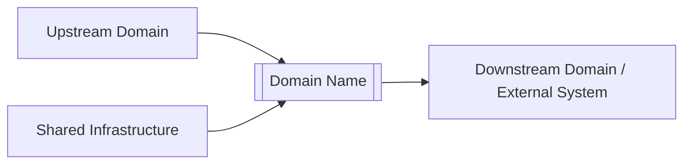
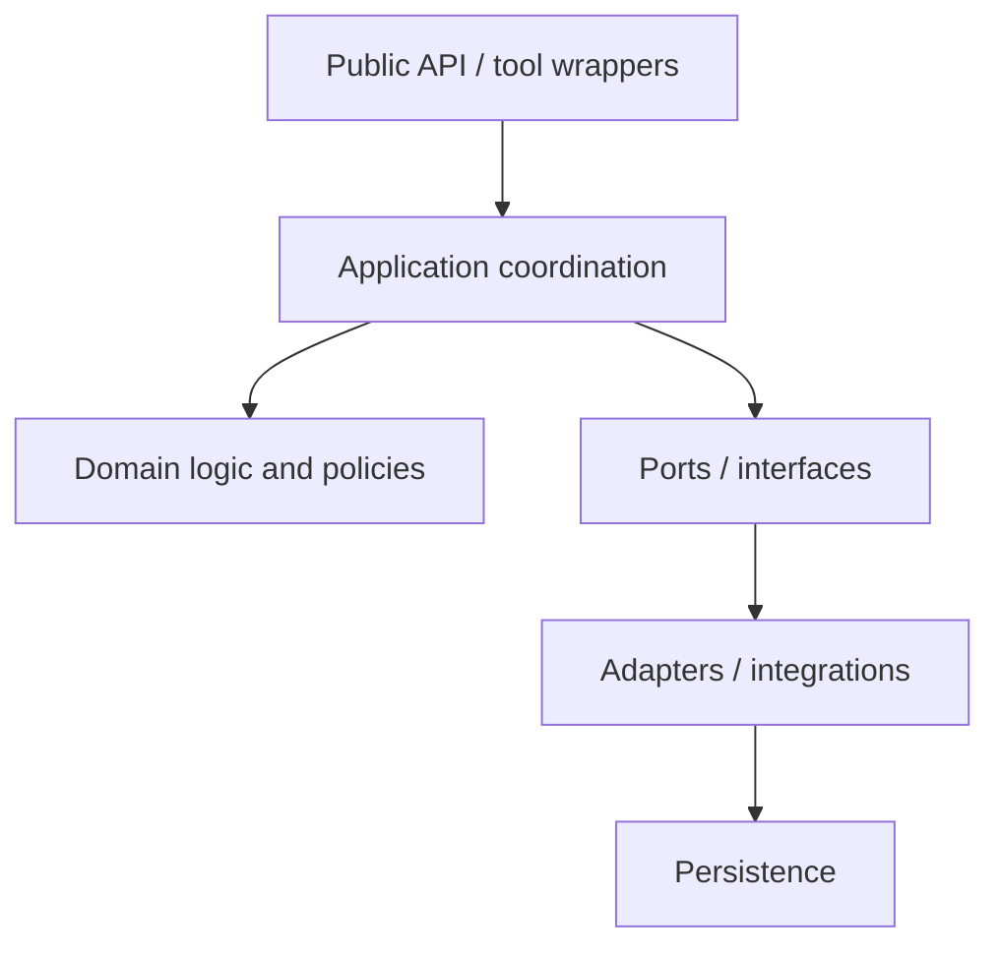
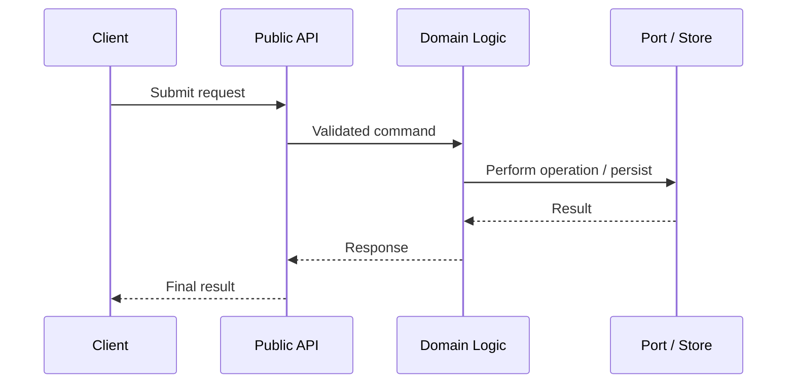
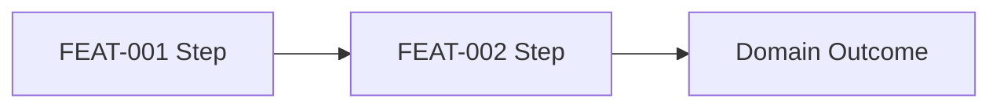

# [Domain Name]

> **Package:** `[app/path/to/domain]`
> **Domain ID:** `[DOM-XXX]`
> **Status:** `[Planned | In Development | Stable | Deprecated]`
> **Owner:** `[Team or owner]`
> **Last updated:** `[YYYY-MM-DD]`

<!--
HOW THIS DOCUMENT IS LAYERED (delete this comment in real READMEs)

The document is a strict pyramid. Each part goes exactly one level deeper
than the one before it, and no information is repeated across parts:

  Part I   — Orientation        (30 seconds: what it is, how to call it, what it contains)
  Part II  — Domain View        (5 minutes: boundaries, position, architecture, rules)
  Part III — Reference Tables   (lookup: full API surface, config, dependencies, files — ONE table each, domain-wide)
  Part IV  — Feature Deep Dives (full detail: requirements and workflows per feature)
  Part V   — Cross-Feature Workflows
  Part VI  — Verification and Operations

Rules that keep it clean:
  1. Config, dependencies, and API tables live ONLY in Part III, tagged by
     feature — never repeated inside feature sections.
  2. Feature sections (Part IV) contain ONLY what is unique to the feature:
     purpose, scope, requirements, workflows.
  3. Everything in Part IV links upward by ID (FEAT-XXX, FR-XXX, WF-XXX);
     everything in Parts I–III links downward by the same IDs.
-->

---

# Part I — Orientation

## 1. What This Domain Does

[One short paragraph — 2 to 4 sentences. What this domain is, what it owns, and the single most important rule a consumer must know. No architecture, no internals.]

## 2. Quick Start

```python
from app.[path].[domain_name] import [primary_function]

# The single most common call, runnable as-is (or with obvious substitutions)
result = [primary_function]([typical_args])
```

```bash
# Install / prerequisites in one line
uv add [packages]
```

[One or two sentences: what the call above returns and where to go next — e.g. "See §5 for the full API surface, §9.1 for the retrieval workflow in detail."]

## 3. Capability Map

One row per feature. This is the index for the whole document — every ID links to a deep dive in Part IV.

| ID         | Capability     | One-line purpose                     | Primary entry points        | Status                      | Details |
| ---------- | -------------- | ------------------------------------ | --------------------------- | --------------------------- | ------- |
| `FEAT-001` | [Feature name] | [What it does, in one sentence]      | `[function]`, `[function]`  | `[Stable / In Dev / Plan]`  | [§9.1](#91-feat-001--feature-name) |
| `FEAT-002` | [Feature name] | [What it does, in one sentence]      | `[function]`                | `[Stable / In Dev / Plan]`  | [§9.2](#92-feat-002--feature-name) |
| `FEAT-003` | [Feature name] | [What it does, in one sentence]      | `[Class]`, `[function]`     | `[Stable / In Dev / Plan]`  | [§9.3](#93-feat-003--feature-name) |

---

# Part II — Domain View

## 4. Boundaries and System Position

### 4.1 Scope

**Owns**

- [Capability owned by this domain]
- [Data or decisions owned by this domain]

**Does not own**

- [Responsibility] — owned by `[other domain]`
- [Unsupported behaviour or explicit architectural boundary]

### 4.2 System Position

[2–3 sentences: which domains call this one, and what it depends on.]



## 5. Architecture

### 5.1 Layer Diagram



[One paragraph describing the layers and the dependency direction.]

### 5.2 Design Rules (Invariants)

Non-negotiable rules that hold everywhere in the domain. Every rule gets an ID so requirements and reviews can cite it.

| ID          | Rule                                                                          |
| ----------- | ----------------------------------------------------------------------------- |
| `RULE-001`  | [e.g. Import safety: importing the package performs no I/O.]                  |
| `RULE-002`  | [e.g. Boundary: only JSON-safe primitives cross the public boundary.]         |
| `RULE-003`  | [e.g. Errors: tool wrappers never let a raw exception escape.]                |

---

# Part III — Reference Tables

> Single source of truth for lookups. Nothing in this part is repeated in the feature sections — feature deep dives cite these tables by row.

## 6. Public API Surface

The complete importable surface of the domain, in one table.

```python
from app.[path].[domain_name] import [PublicClass], [public_function]
```

| Feature    | Module        | Type     | Class / Function     | Params                    | Returns          | Raises                       | Responsibility     |
| ---------- | ------------- | -------- | -------------------- | ------------------------- | ---------------- | ---------------------------- | ------------------ |
| `FEAT-001` | `[file.py]`   | Function | `[function_a]`       | `[param: type, …]`        | `[type]`         | `[Error]`: [condition]       | [One line]         |
| `FEAT-001` | `[file.py]`   | Function | `[function_b]`       | `[param: type, …]`        | `[type]`         | `[Error]`: [condition]       | [One line]         |
| `FEAT-002` | `[file.py]`   | Class    | `[ClassA]`           | `[ctor params]`           |                  |                              | [One line]         |
| `FEAT-003` | `[file.py]`   | Protocol | `[PortProtocol]`     |                           |                  |                              | [One line]         |

## 7. Configuration, Dependencies, and Limits

### 7.1 Prerequisites

- Python `[version]`, `uv`
- [External runtime or service, if any]

### 7.2 Dependencies

| Dependency          | Type        | Used by       | Purpose   | Required? |
| ------------------- | ----------- | ------------- | --------- | --------- |
| `[library]`         | Third-party | `FEAT-001,002`| [Purpose] | Yes       |
| `[library]`         | Third-party | `FEAT-003`    | [Purpose] | Optional  |
| `[internal-domain]` | Internal    | `FEAT-001`    | [Purpose] | Yes       |

### 7.3 Configuration and Limits Manifest

All settings and hard limits, defined once. Each row names the owning constant so hardening tests can assert it.

| Setting / Limit    | Feature    | Required | Default     | Description   |
| ------------------ | ---------- | -------: | ----------- | ------------- |
| `[SETTING_NAME]`   | `FEAT-001` |      Yes | None        | [Description] |
| `[SETTING_NAME]`   | `FEAT-002` |       No | `[value]`   | [Description] |
| `[MAX_LIMIT]`      | domain     |       No | `[value]`   | [Description] |

## 8. Package and File Structure

Each file maps to the feature(s) it implements — this ties the code tree back to the capability map in §3.

```text
[domain_name]/
├── __init__.py         # Public exports                          (all)
├── file1.py            # [Single responsibility]                 (FEAT-001)
├── file2.py            # [Single responsibility]                 (FEAT-001, FEAT-002)
├── module1/
│   ├── __init__.py
│   └── file3.py        # [Single responsibility]                 (FEAT-003)
└── README.md
```

---

# Part IV — Feature Deep Dives

> One section per feature, containing only what is unique to it: purpose, scope, requirements, workflows. API rows → §6, config → §7.3, files → §8.

## 9. Feature Reference

### 9.1 `FEAT-001` — [Feature Name]

**Purpose:** [2–3 sentences on the value this feature provides.]

**Scope:** Includes [included behaviours, comma-separated or short list]. Excludes [excluded behaviour] (owned by `[FEAT-XXX / other domain]`).

#### Requirements

Functional (`FR`) and non-functional (`NFR`) in one table; the Type column separates them.

| ID              | Type              | Requirement                                                  | Verification     |
| --------------- | ----------------- | ------------------------------------------------------------ | ---------------- |
| `FR-[DOM]-001`  | Functional        | The system shall [observable behaviour].                     | Unit test        |
| `FR-[DOM]-002`  | Functional        | The system shall [observable behaviour].                     | Integration test |
| `NFR-[DOM]-001` | Performance       | [Latency, throughput, or resource requirement]               | Benchmark        |
| `NFR-[DOM]-002` | Security          | [Authorization, integrity, or confidentiality requirement]   | Security test    |
| `NFR-[DOM]-003` | Observability     | [Logging, metrics, tracing, or audit requirement]            | Inspection       |

#### Workflows

| Workflow ID     | Workflow        | Trigger   | Outcome   | Requirements                     |
| --------------- | --------------- | --------- | --------- | -------------------------------- |
| `WF-[DOM]-001`  | [Workflow name] | [Trigger] | [Outcome] | `FR-[DOM]-001`, `FR-[DOM]-002`   |
| `WF-[DOM]-002`  | [Workflow name] | [Trigger] | [Outcome] | `FR-[DOM]-002`                   |

##### `WF-[DOM]-001` — [Workflow Name]

**Purpose:** [What this workflow accomplishes.]
**Actor / Trigger:** [Who or what starts it, and how.]
**Preconditions:** [Required state, inputs, authorization.]

**Main flow**

1. `[Actor]` submits `[request/event]`.
2. `[Entry point]` validates the request.
3. `[Domain component]` applies the business rules.
4. `[Port / repository]` performs the external interaction or persistence.
5. The domain returns or publishes `[result/event]`.

**Alternative and failure flows**

| ID | Condition             | Behaviour                                        |
| -- | --------------------- | ------------------------------------------------ |
| A1 | [Alternate condition] | [Alternative behaviour]                          |
| F1 | Invalid input         | [Expected handling, error type/code]             |
| F2 | Dependency failure    | [Expected handling, error type/code]             |
| F3 | Unknown outcome       | [Expected recovery or reconciliation]            |

**Postconditions:** [State after success; events, outputs, or audit records produced.]



> Repeat the `WF-…` block above only for workflows whose flow is non-obvious.
> Simple workflows are fully described by their row in the workflow table.

---

### 9.2 `FEAT-002` — [Feature Name]

> Copy the complete structure of §9.1 for every additional feature.

---

# Part V — Cross-Feature Workflows

## 10. Cross-Feature Workflows

Workflows that coordinate multiple features within the domain.

### 10.1 `WF-[DOM]-100` — [Cross-Feature Workflow Name]

**Features involved:** `FEAT-001`, `FEAT-002`
**Requirements covered:** `FR-[DOM]-001`, `FR-[DOM]-007`

[One paragraph: how the features collaborate to produce an end-to-end result.]



---

# Part VI — Verification and Operations

## 11. Tests

```bash
# Unit tests (with coverage target)
uv run pytest tests/[domain]/unit --cov=app.[path].[domain_name]

# Workflow / integration tests
uv run pytest tests/[domain]/integration

# Usage examples (runnable, offline)
uv run pytest tests/[domain]/usage

# Static quality
uv run ruff check app/[path]/[domain_name]
uv run mypy app/[path]/[domain_name]
```

[Optional: note fixtures, offline guarantees, or coverage thresholds.]

## 12. Known Limitations

- [Current limitation]
- [Unsupported scenario]
- [Deferred capability]

## 13. Related Documentation

- `docs/PROJECT.md`
- `docs/ARCHITECTURE.md`
- `[domain requirements document]`
- `[workflow specification]`
- `docs/templates/README_v2.md` — this document's template
